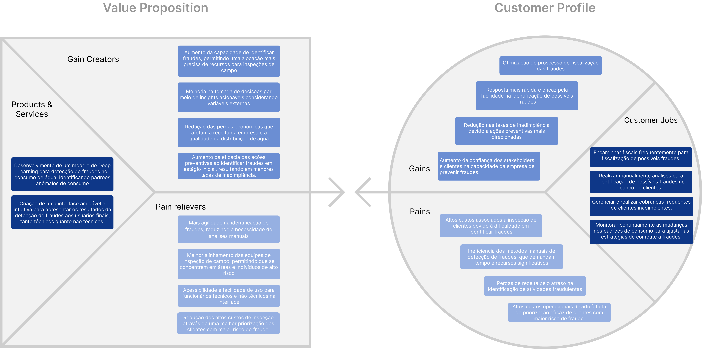
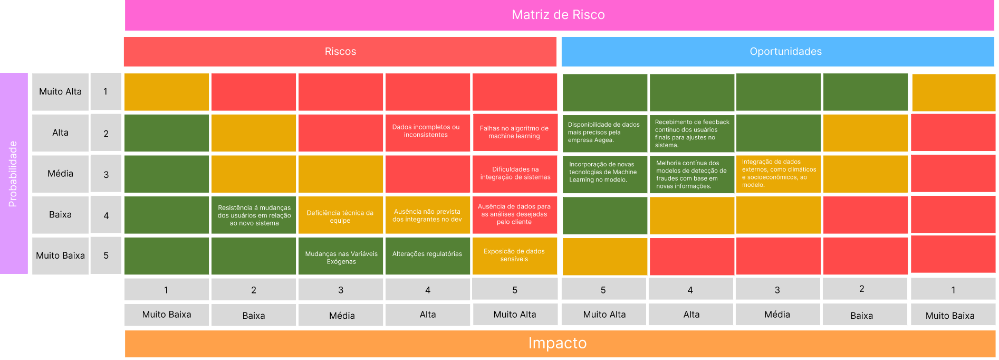
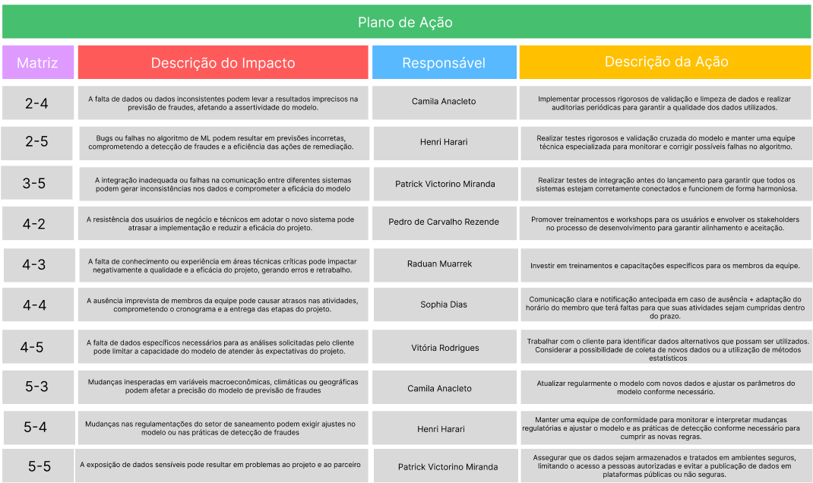

# Entendimento do Negócio

## Canvas Proposta de Valor
O Canvas de Proposta de Valor é uma ferramenta usada para descrever e analisar como uma empresa cria valor para seus clientes. Ele é parte fundamental do modelo de negócios, permitindo que a empresa alinhe suas ofertas com as necessidades e desejos dos clientes, identificando oportunidades de inovação e diferenciação no mercado. 

O canvas é dividido em dois lados principais:

### Customer Profile (Perfil do Cliente):

* **Tarefas (Costumer Jobs):** Representam as atividades que o cliente precisa ou deseja realizar.
* **Dores (Pains):** São as dificuldades, desafios ou riscos que o cliente enfrenta ao tentar realizar essas tarefas. 
* **Ganhos (Gains):** Representam os benefícios que o cliente espera ou deseja obter ao realizar suas tarefas. 
  
### Value Proposition (Proposta de Valor):
* **Produtos e Serviços (Products & Services):** São as soluções que nosso projeto desenvolve, projetadas para atender às necessidades e desejos dos clientes. 
* **Aliviadores de Dores (Pain Relievers):** Descrevem como os produtos e serviços eliminam ou reduzem as dores do cliente.
* **Geradores de Ganhos (Gain Creators):** Indicam como os produtos e serviços proporcionam os ganhos desejados pelo cliente.
 
Segue abaixo o Canvas Proposta de Valor criado para nossa solução:

Por conta da visualização, segue abaixo a descrição do Canvas Proposta de Valor:

| **Customer Job** | **Value Proposition** |
| ---------------- | --------------------- |
| **Gains** | **Gain Creators** |
| - Otimização do processo de fiscalização das fraudes. | - Aumento da capacidade de identificar fraudes, permitindo uma alocação mais precisa de recursos para inspeções de campo. |
| - Resposta mais rápida e eficaz pela facilidade na identificação de possíveis fraudes. | - Melhoria na tomada de decisões por meio de insights acionáveis considerando variáveis externas. |
| - Redução nas taxas de inadimplência devido a ações preventivas mais direcionadas. | - Redução das perdas econômicas que afetam a receita da empresa e a qualidade da distribuição de água. |
| - Aumento da confiança dos stakeholders e clientes na capacidade da empresa de prevenir fraudes. | - Aumento da eficácia das ações preventivas ao identificar fraudes em estágio inicial, resultando em menores taxas de inadimplência. |
| **Pains** | **Pain Relievers** |
| - Altos custos associados à inspeção de clientes devido à dificuldade em identificar fraudes. | - Mais agilidade na identificação de fraudes, reduzindo a necessidade de análises manuais. |
| - Ineficiência dos métodos manuais de detecção de fraudes, que demandam tempo e recursos significativos. | - Melhor alinhamento das equipes de inspeção de campo, permitindo que se concentrem em áreas e indivíduos de alto risco. |
| - Perdas de receita pelo atraso na identificação de atividades fraudulentas. | - Acessibilidade e facilidade de uso para funcionários técnicos e não técnicos na interface. |
| - Altos custos operacionais devido à falta de priorização eficaz de clientes com maior risco de fraude. | - Redução dos altos custos de inspeção através de uma melhor priorização dos clientes com maior risco de fraude. |
| **Customer Jobs** | **Products & Services** |
| - Encaminhar fiscais frequentemente para fiscalização de possíveis fraudes. | - Desenvolvimento de um modelo de Deep Learning para detecção de fraudes no consumo de água, identificando padrões anômalos de consumo. |
| - Realizar manualmente análises para identificação de possíveis fraudes no banco de clientes. | - Criação de uma interface amigável e intuitiva para apresentar os resultados da detecção de fraudes aos usuários finais, tanto técnicos quanto não técnicos. |
| - Gerenciar e realizar cobranças frequentes de clientes inadimplentes. | |
| - Monitorar continuamente as mudanças nos padrões de consumo para ajustar as estratégias de combate a fraudes. | |

## Matriz de Risco
A matriz de risco é uma ferramenta essencial no gerenciamento de projetos, utilizada para identificar, avaliar e priorizar os riscos que podem impactar o sucesso do projeto. No contexto do projeto de detecção de fraudes no consumo de água para a Aegea, a matriz de risco desempenha um papel na antecipação de possíveis desafios que possam comprometer a eficácia e a implementação do modelo de Machine Learning, bem como os processos de negócio da empresa.

Além dos riscos, a matriz também considera as oportunidades, que são situações favoráveis que podem contribuir significativamente para o sucesso do projeto. As oportunidades representam o lado positivo das incertezas e podem proporcionar vantagens competitivas ou melhorias operacionais.

Para os riscos, criamos uma tabela detalhada que inclui:

* **Descrição do Impacto:** Uma explicação clara sobre como o risco pode afetar o projeto, destacando as áreas que podem ser comprometidas.
* **Responsável pelo Risco:** A pessoa dentro do grupo de projeto que é responsável por monitorar e gerenciar esse risco.
* **Descrição da Ação:** As medidas planejadas ou executadas para mitigar, evitar ou responder ao risco, garantindo que seus impactos sejam minimizados ou eliminados.

Segue abaixo a Matriz de Risco do nosso projeto:

#### Riscos e Oportunidades:

#### Tabela de mitigação

Por conta da visualização, segue abaixo a descrição da Matriz de Risco:

| **Risco** | **Descrição do Risco** | **Probabilidade** | **Impacto** | **Ação** |
| --------- | ---------------------- | ----------------- | ----------- | -------- |
| **1 -** Dados incompletos ou inconsistentes  | A falta de dados ou dados inconsistentes podem levar a resultados imprecisos na previsão de fraudes, afetando a assertividade do modelo. | Alta - A probabilidade é alta porque a coleta de dados em grande escala e de múltiplas fontes frequentemente resulta em inconsistências.
| Muito Alto - O impacto é muito alto porque dados incorretos ou ausentes podem comprometer completamente a eficácia do modelo, resultando em previsões falhas e decisões erradas. | Implementar processos rigorosos de validação e limpeza de dados e realizar auditorias periódicas para garantir a qualidade dos dados utilizados. |
| **2 -** Falhas no algoritmo de machine learning | Bugs ou falhas no algoritmo de ML podem resultar em previsões incorretas, comprometendo a detecção de fraudes e a eficiência das ações de remediação. | Média - A probabilidade é média devido à complexidade envolvida no desenvolvimento e na implementação de algoritmos, o que pode levar a erros.
| Muito Alto - O impacto é muito alto, pois falhas no algoritmo afetariam diretamente a capacidade do modelo de detectar fraudes, comprometendo todo o projeto. | Realizar testes rigorosos e validação cruzada do modelo e manter uma equipe técnica especializada para monitorar e corrigir possíveis falhas no algoritmo. |
| **3 -** Dificuldades na integração de sistemas | A integração inadequada ou falhas na comunicação entre diferentes sistemas podem gerar inconsistências nos dados e comprometer a eficácia do modelo  | Média - A probabilidade é média, dado que a integração entre diferentes sistemas sempre apresenta desafios técnicos. | Alto - O impacto é alto porque falhas na integração podem resultar em inconsistências nos dados e na eficácia do modelo, prejudicando a operação. | Realizar testes de integração antes do lançamento para garantir que todos os sistemas estejam corretamente conectados e funcionem de forma harmoniosa.  |
| **4 -**  Resistência á mudanças dos usuários em relação ao novo sistema | A resistência dos usuários de negócio e técnicos em adotar o novo sistema pode atrasar a implementação e reduzir a eficácia do projeto. | Baixa - A probabilidade é baixa, pois treinamentos e envolvimento dos usuários podem mitigar a resistência. | Baixa - O impacto é baixo porque, mesmo que haja resistência, ela pode ser superada com o tempo e com estratégias de gerenciamento de mudanças. |
Promover treinamentos e workshops para os usuários e envolver os stakeholders no processo de desenvolvimento para garantir alinhamento e aceitação. |
| **5 -**  Deficiência técnica da equipe | A falta de conhecimento ou experiência em áreas técnicas críticas pode impactar negativamente a qualidade e a eficácia do projeto, gerando erros e retrabalho. | Média - A probabilidade é média, dado que a falta de habilidades técnicas específicas pode surgir ao longo do projeto. | Médio - O impacto é médio porque a deficiência técnica pode levar a erros e retrabalho, impactando o cronograma e a qualidade, mas não necessariamente comprometendo o projeto como um todo. |
Investir em treinamentos e capacitações específicos para os membros da equipe. |
| **6 -**  Ausência de dados para as análises desejadas pelo cliente | A ausência imprevista de membros da equipe pode causar atrasos nas atividades, comprometendo o cronograma e a entrega das etapas do projeto. | Média - A probabilidade é média, pois nem sempre os dados solicitados estão disponíveis ou acessíveis. | Muito Alto - O impacto é muito alto, uma vez que a falta de dados críticos pode limitar significativamente a capacidade do modelo de atender às expectativas do cliente. | Comunicação clara e notificação antecipada em caso de ausência + adaptação do horário do membro que terá faltas para que suas atividades sejam cumpridas dentro do prazo.|
| **7 -**  Ausência de dados para as análises desejadas pelo cliente | A falta de dados específicos necessários para as análises solicitadas pelo cliente pode limitar a capacidade do modelo de atender às expectativas do projeto. | Baixa - A probabilidade é baixa, já que mudanças significativas em variáveis como clima ou economia não são frequentes. | Baixa - O impacto é baixo, pois essas mudanças podem ser ajustadas dentro do modelo com atualizações e ajustes periódicos. | Trabalhar com o cliente para identificar dados alternativos que possam ser utilizados. Considerar a possibilidade de coleta de novos dados ou a utilização de métodos estatísticos |
| **8 -**  Mudanças nas Variáveis Exógenas | Mudanças inesperadas em variáveis macroeconômicas, climáticas ou geográficas podem afetar a precisão do modelo de previsão de fraudes |  Muito Baixa - A probabilidade é muito baixa, pois alterações regulatórias não ocorrem frequentemente. | Baixa - O impacto é baixo, já que, embora possam exigir ajustes no modelo, não causariam uma interrupção significativa no projeto. | Atualizar regularmente o modelo com novos dados e ajustar os parâmetros do modelo conforme necessário.  |
| **9 -** Alterações regulatórias | Mudanças nas regulamentações do setor de saneamento podem exigir ajustes no modelo ou nas práticas de detecção de fraudes | Média - A probabilidade é média, pois sempre há riscos associados ao manuseio de dados sensíveis, especialmente em grandes projetos. | Muito Alto - O impacto é muito alto, pois a exposição de dados sensíveis pode levar a graves consequências legais e danos à reputação da empresa. | Manter uma equipe de conformidade para monitorar e interpretar mudanças regulatórias e ajustar o modelo e as práticas de detecção conforme necessário para cumprir as novas regras. |
| **10 -**  Exposicão de dados sensíveis  | A exposição de dados sensíveis pode resultar em problemas ao projeto e ao parceiro | 
Muito Baixa - A probabilidade é muito baixa devido à implementação de rigorosas práticas de segurança e controles de acesso, minimizando a chance de exposição. | Muito Alto - O impacto é muito alto porque, caso ocorra a exposição, as consequências podem incluir graves problemas legais, danos à reputação e perda de confiança dos clientes e parceiros. | Assegurar que os dados sejam armazenados e tratados em ambientes seguros, limitando o acesso a pessoas autorizadas e evitar a publicação de dados em plataformas públicas ou não seguras. |

Segue link para melhor visualização dos artefatos realizados:
- Canvas Proposta de Valor: https://www.figma.com/design/ZBkUKcRpfgy1KZOoydAlVf/Proposta-de-valor-(dona-chica)?node-id=0-1&t=2MY26MaXcQpcuGF7-1
- Matriz de Risco: https://www.figma.com/design/o7wpGqvTrjYckL1r1J3jjM/Matriz-de-Risco-Dona-Chica?node-id=0-1&t=ejNQTNKtb3L3rOBS-1
