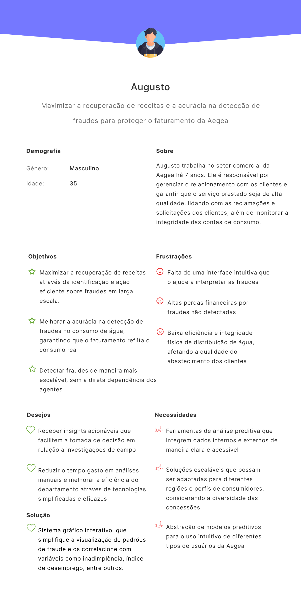
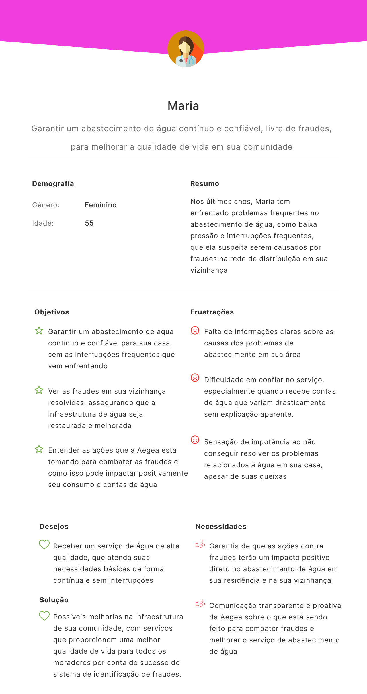
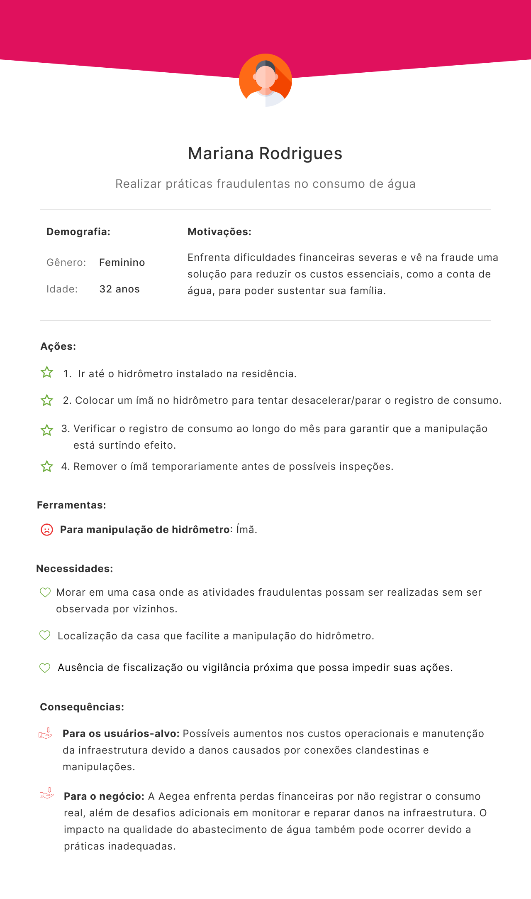
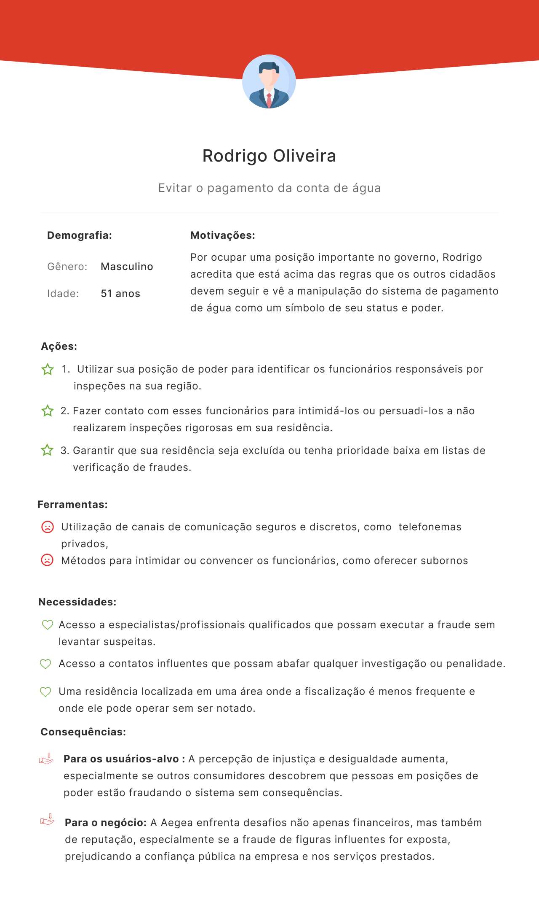
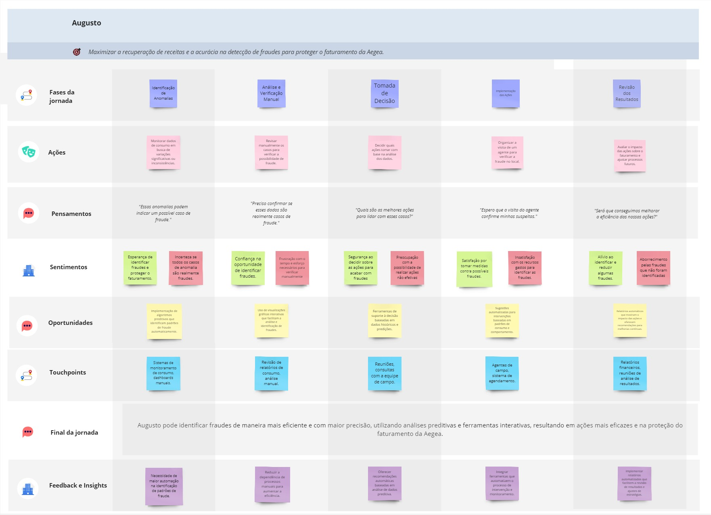

# Entendimento do Usuário 
## Personas
Personas são representações fictícias e generalizadas dos usuários-alvo de um produto ou serviço, baseadas em concepções da equipe, pesquisas quantitativas/qualitativas e/ou dados reais sobre os comportamentos, motivações e necessidades dos clientes. Elas são essenciais no desenvolvimento de projetos, pois ajudam as equipes a entender e empatizar com os usuários, guiando decisões de design e estratégia de maneira centrada no usuário. A criação de personas permite que os desenvolvedores e designers criem soluções que realmente atendam às expectativas e dores dos clientes, melhorando a experiência geral e a eficiência do produto.

### Contexto
No contexto do nosso projeto de detecção de fraudes no consumo de água para a Aegea, as personas são fundamentais para identificar os perfis de usuários que irão interagir diretamente com a solução, como os analistas de dados que precisam interpretar os resultados do modelo e os agentes de campo que atuarão com base nas previsões fornecidas. Além disso, a compreensão detalhada dessas personas ajuda a alinhar o desenvolvimento da interface e funcionalidades com as reais necessidades e habilidades dos usuários, garantindo que a solução seja intuitiva, eficiente e de fácil uso.

### Persona 1 
Augusto, atuando no setor comercial da Aegea, é o foco principal do nosso projeto. Sua principal preocupação é maximizar a recuperação de receitas e melhorar a acurácia na detecção de fraudes. As solução desenvolvida visa diretamente otimizar o trabalho de Augusto, oferecendo ferramentas que facilitem a identificação e a ação eficiente contra fraudes.

### Persona 2
Maria representa os clientes que enfrentam problemas de abastecimento de água, possivelmente relacionados a fraudes na rede de distribuição. Embora não seja o foco central do projeto, Maria será utilizada para entender o impacto indireto da solução nos clientes da Aegea que são impactados por fraudes, como conexões clandestinas e manipulação do abastecimento, que podem interromper e/ou impactar na qualidade do serviço prestado pela Aegea e da água fornecida.

|  ||
|-----------------------------------------|--------------------------------------------------------------------------------------------------------------------------------------------|

## Antipersonas
Por outro lado, as antipersonas representam os perfis de usuários que não são o foco do produto ou que podem causar problemas ou desafios. Enquanto as personas ajudam a orientar o desenvolvimento em direção ao público certo, as antipersonas servem como um alerta para evitar decisões que possam atrair usuários indesejados ou que podem usar o produto de maneira inadequada. 

### Contexto
No contexto do nosso projeto de detecção de fraudes no consumo de água para a Aegea, as antipersonas são igualmente importantes, pois representam os perfis de indivíduos que podem comprometer a integridade do sistema ou desafiar as medidas de controle. Entender as antipersonas, como aqueles que manipulam o sistema por necessidade financeira ou utilizam o poder e a influência para evitar a fiscalização, é crucial para desenvolver uma solução robusta. Essa compreensão nos ajuda a antecipar as técnicas de fraude mais comuns, prever comportamentos que podem subverter o sistema e, consequentementem desenvolver hipóteses para a análise dos dados e o posterior desenvolvimento do projeto. Assim, o desenvolvimento da solução é guiado não apenas pela necessidade de detectar fraudes, mas também pela capacidade de compreender os perfis que fraudam e o modelo deve ser capaz de identificar.

### Antipersona 1 
A primeira antipersona, Larissa, é o foco principal do nosso projeto. Ela representa indivíduos que, devido a dificuldades financeiras severas, veêm na fraude uma maneira de reduzir seus custos essenciais, como a conta de água. Larissa manipula o hidrômetro em sua residência para registrar um consumo menor de água, o que gera perdas diretas para a empresa. A compreensão de seu perfil e das suas motivações é fundamental para desenvolvermos soluções que previnam esse tipo de fraude e protejam a integridade do sistema, pois essa antipersona destaca a importância de entender não só as técnicas utilizadas para fraudar, mas também as circunstâncias que levam indivíduos a adotar tais práticas, representando oportunidades de intervenção ou mitigação por parte da Aegea. 

### Antipersona 2
Rodrigo, por outro lado, representa um tipo de fraude, em que o poder e a influência são usados para subverter o sistema. Ocupando uma posição importante no governo, Rodrigo acredita estar acima das regras e utiliza sua posição para intimidar ou subornar funcionários, evitando a fiscalização. Embora não seja o foco principal, Rodrigo servirá de guia para a interpretaçaõ da relação entre inadimplência e fraude, por mais que não sejam diretamente consequências, compreender a relação entre os dois pode demonstrar insights relevantes à Aegea. A presença de indivíduos como Rodrigo destaca os riscos reputacionais e financeiros para a Aegea, tornando essencial o desenvolvimento de estratégias robustas de compliance e auditoria.

|  |  |
|-----------------------------------------|--------------------------------------------------------------------------------------------------------------------------------------------|

## Jornada do Usuário

A jornada do usuário é uma ferramenta essencial no design e desenvolvimento de soluções que colocam o usuário no centro. Ela consiste em mapear, de maneira estruturada, todas as etapas que um usuário percorre ao interagir com um produto ou serviço, desde o primeiro contato até a resolução completa de suas necessidades. Esse mapeamento não só captura as ações realizadas, mas também os pensamentos, sentimentos, oportunidades e pontos de contato que o usuário vivencia ao longo de sua jornada.

Entender a jornada do usuário é crucial para identificar pontos de melhoria, oportunidades de inovação e para garantir que o sistema atenda de maneira eficiente às necessidades do usuário. No contexto do nosso projeto, a jornada do usuário de Augusto, que é um profissional da Aegea, nos permite compreender como ele lida com a detecção de fraudes no consumo de água e como podemos aprimorar suas ferramentas e processos para maximizar a recuperação de receitas e proteger o faturamento da empresa.

A jornada do usuário, conforme mapeada no projeto, está diretamente conectada com o objetivo de melhorar a detecção de fraudes na Aegea. Cada fase da jornada de Augusto foi analisada para identificar como as ferramentas de Machine Learning podem ser integradas e aprimoradas para apoiar suas atividades diárias. O foco está em maximizar a eficácia das ações de Augusto, garantindo que ele tenha à disposição as melhores ferramentas e dados para tomar decisões informadas e rápidas.

- Fases da Jornada: Representa as etapas principais pelas quais Augusto passa, desde a identificação de uma anomalia até a revisão dos resultados. Cada fase corresponde a uma parte do processo de detecção e combate às fraudes.
- Ações: As atividades específicas que Augusto realiza em cada fase da jornada. Essas ações são cruciais para o avanço do processo e impactam diretamente os resultados obtidos.
- Pensamentos: Refletem as preocupações e questionamentos de Augusto em cada fase. Esses pensamentos ajudam a entender as motivações por trás das ações e decisões tomadas ao longo da jornada.
- Sentimentos: São as emoções que Augusto experimenta em resposta às diferentes fases e desafios que encontra. Compreender esses sentimentos é fundamental para melhorar a experiência do usuário e reduzir frustrações.
- Oportunidades: Identificam as áreas onde melhorias podem ser implementadas, seja por meio de novas ferramentas, processos ou abordagens. Essas oportunidades indicam caminhos para otimizar a jornada de Augusto.
- Touchpoints: São os pontos de interação entre Augusto e os sistemas ou serviços da Aegea. Esses pontos de contato são cruciais para garantir que as interações sejam eficazes e que Augusto tenha os recursos necessários para realizar suas tarefas.
- Final da Jornada: Descreve o resultado final esperado após todas as fases terem sido concluídas. No caso de Augusto, o objetivo é que ele consiga identificar fraudes de maneira eficiente e precisa.
- Feedback e Insights: Representam as lições aprendidas e as melhorias sugeridas com base na experiência de Augusto. Esses insights são fundamentais para a evolução contínua do processo de detecção de fraudes.
- 
Segue abaixo a Jornada do Usuário:

A jornada de Augusto é centrada em maximizar a recuperação de receitas e a acurácia na detecção de fraudes na Aegea. Iniciando pela identificação de anomalias, Augusto passa por fases de análise manual, verificação e tomada de decisão, até a revisão dos resultados obtidos. Ao longo dessa jornada, Augusto realiza ações específicas, como monitorar dados de consumo e revisar relatórios, enquanto lida com pensamentos sobre a precisão e eficácia de suas ações. Seus sentimentos variam desde a confiança na detecção de fraudes até a preocupação com possíveis falhas.

As oportunidades identificadas indicam áreas de aprimoramento, como a implementação de novos processos de detecção e a utilização de sistemas de monitoramento avançados. Os touchpoints representam as interações de Augusto com o sistema, sendo essenciais para a condução eficiente de suas atividades. Ao final da jornada, espera-se que Augusto consiga identificar fraudes com mais eficiência e precisão, utilizando análises preditivas e ferramentas interativas, resultando em ações mais eficazes e na proteção do faturamento da Aegea.

Segue link para melhor visualização do artefato:
* Jornada do Usuário: https://miro.com/app/board/uXjVKpv55Us=/?share_link_id=756826856493
