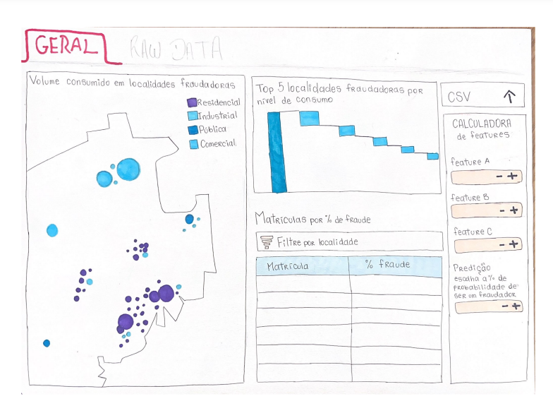
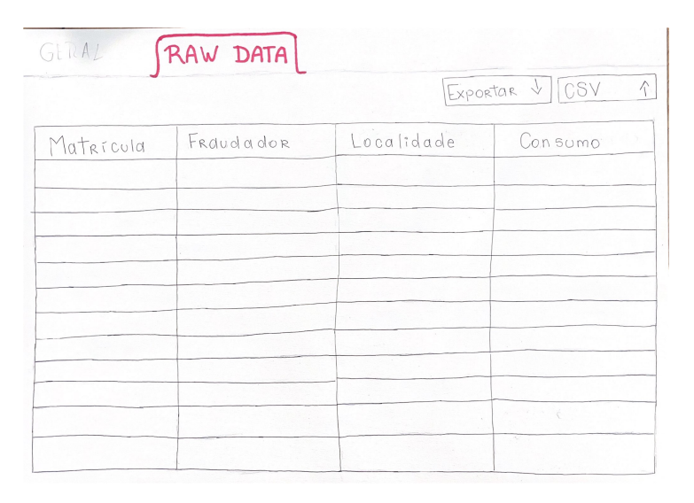
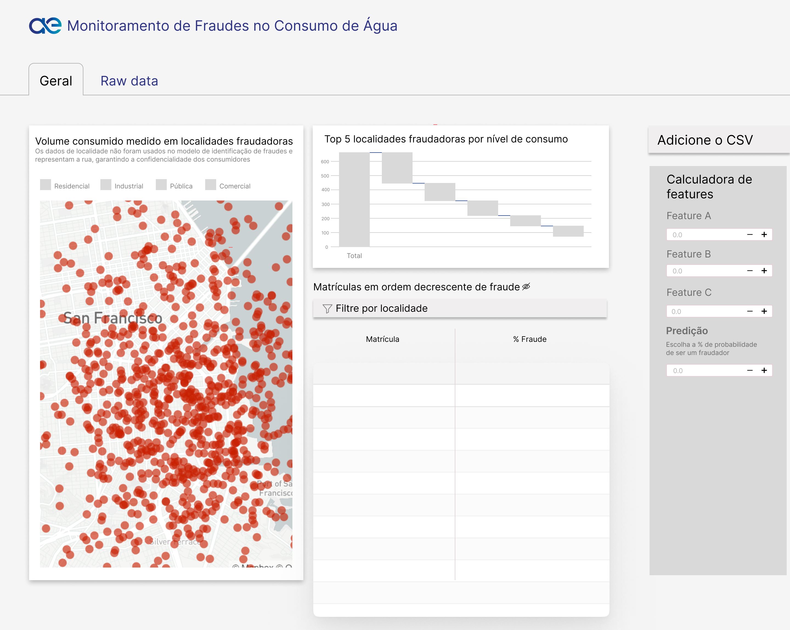
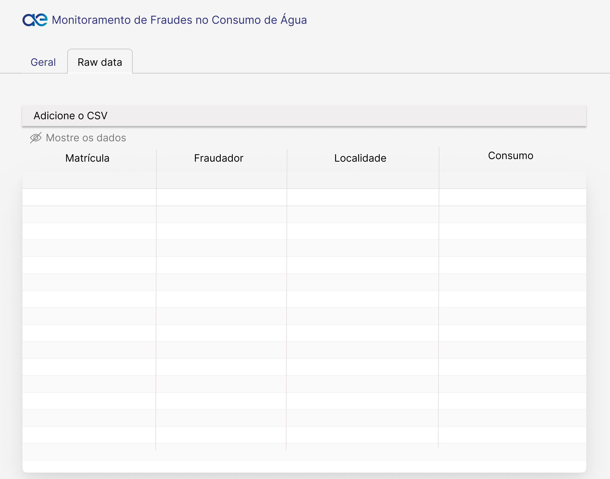

# UX - Sprint 2: User Stories e Wireframe

No contexto do desenvolvimento de uma solução de Deep Learning para a detecção de fraudes no consumo de água, enfrentado pela Aegea, as **User Stories** desempenham um papel crucial. Elas servem como descrições simplificadas das funcionalidades desejadas, focadas nas necessidades dos usuários finais e outros stakeholders. Cada user story articula claramente o que um usuário espera alcançar, fornecendo uma visão orientada para o objetivo e um ponto de referência para os desenvolvimento da solução. No projeto da Aegea, essas user stories são fundamentais para assegurar que a solução desenvolvida esteja alinhada com os objetivos de negócio e as expectativas dos usuários.

**Privacy by Design** (Privacidade desde a Concepção) é uma abordagem essencial para este projeto, dado o uso extensivo de dados pessoais dos consumidores na modelagem e detecção de fraudes. Este conceito é fundamentado em sete princípios que guiam a construção de sistemas que respeitam a privacidade dos usuários desde o início, garantindo que a proteção de dados seja integrada em todos os processos e tecnologias. Abaixo, uma breve explicação dos princípios de **Privacy by Design**:

1. **Proativo, não Reativo; Preventivo, não Corretivo:** Foca na antecipação e prevenção de problemas de privacidade antes que eles aconteçam, ao invés de remediá-los após ocorrerem.
2. **Privacidade como Configuração Padrão:** Garante que, por padrão, os dados pessoais dos usuários estejam protegidos sem a necessidade de ações adicionais por parte dos usuários.
3. **Privacidade Incorporada ao Design:** A privacidade deve ser uma parte integrante do design e da arquitetura dos sistemas, não um add-on ou uma consideração secundária.
4. **Funcionalidade Completa — Ganho Duplo:** Concilia privacidade com outros objetivos do sistema, maximizando todos os interesses sem comprometer a segurança dos dados.
5. **Segurança de Extremo a Extremo — Proteção ao Longo do Ciclo de Vida:** Assegura que os dados sejam protegidos em todo o ciclo de vida da informação, desde a coleta até a destruição final.
6. **Visibilidade e Transparência:** Todas as práticas envolvendo dados devem ser abertas e verificáveis para garantir que as partes interessadas confiem no tratamento dos dados.
7. **Respeito pela Privacidade do Usuário — Centralidade do Usuário:** Assegura que os interesses dos usuários estejam sempre no centro das preocupações de privacidade, fornecendo controles robustos sobre seus dados.

No projeto da Aegea, a aplicação desses princípios é vital para garantir que as práticas de detecção de fraudes não comprometam a privacidade dos consumidores. Cada user story é desenvolvida com esses princípios em mente, assegurando que a solução final não só atenda às necessidades funcionais e de negócios, mas também respeite e proteja os dados pessoais dos usuários de acordo com os mais altos padrões de privacidade. Abaixo, as user stories específicas foram criadas para refletir esses objetivos, com critérios de aceitação que integram os princípios de **Privacy by Design** de forma direta e prática.

| Persona  | Descrição | Prioridade | Estimativa de esforço | Critérios de aceitação |
| --- | --- | --- | --- | --- |
| Maria | Eu como moradora da área atendida pela Aegea, quero ter controle sobre os meus dados pessoais utilizados pelo sistema, para garantir minha privacidade como cliente. | Média - Essencial para a conformidade com regulamentações de privacidade e para o controle do usuário sobre seus dados, mas não crítica para a operação básica. | Médio - Requer desenvolvimento de interfaces e lógica de controle de dados, com complexidade moderada. | 1. **Transparência dos Dados:** **Teste Aceito:** O sistema exibe uma lista clara e acessível dos dados pessoais utilizados pelo modelo alinhado ao princípio de **Visibilidade e Transparência**. **Teste Rejeitado:** A lista não é exibida ou está incompleta, violando o princípio de **Visibilidade e Transparência**.   2. **Controle sobre os Dados:** **Teste Aceito:** O cliente pode contestar a utilização de seus dados através do contato do atendimento da Aegea e receber confirmação em até 24 horas, conforme o princípio de **Respeito pela Privacidade do Usuário — Centralidade do Usuário**. **Teste Rejeitado:** O cliente não possui meios claros para contestar a utilização de seus dados pessoais, contrariando o princípio de **Respeito pela Privacidade do Usuário — Centralidade do Usuário**.   3. **Não Utilização de Dados Sensíveis:** **Teste Aceito:** O modelo rejeita automaticamente dados sensíveis como a localização detalhada, exibindo uma mensagem ao usuário, conforme o princípio de **Privacidade como Configuração Padrão**. **Teste Rejeitado:** O sistema aceita dados sensíveis sem alerta, desrespeitando o princípio de **Privacidade como Configuração Padrão**.   4. **Desassociação de Matrícula e Pessoa Física:** **Teste Aceito:** O resultado fornecido pelo modelo não associa matrícula a clientes, protegendo a identidade do indivíduo conforme o princípio de **Segurança de Extremo a Extremo — Proteção ao Longo do Ciclo de Vida**. **Teste Rejeitado:** O resultado permite associar a matrícula a uma pessoa física, comprometendo a privacidade dos dados do usuário.   5. **Direito ao Esquecimento:** **Teste Aceito:** O cliente consegue solicitar a exclusão de seus dados pessoais pela Aegea, garantindo o **Respeito pela Privacidade do Usuário — Centralidade do Usuário**. **Teste Rejeitado:** O cliente não encontra uma opção clara para solicitar a exclusão de seus dados pessoais, violando o princípio de **Respeito pela Privacidade do Usuário — Centralidade do Usuário**. |
| Augusto | Eu, como gestor comercial responsável por evitar casos de fraudes, quero obter uma lista com os clientes com maior potencial de fraude, para melhorar a efetividade do processo de investigação de fraudes da empresa. | Alta - Fundamental para a eficácia na identificação de fraudes, impactando diretamente no desenvolvimento bem sucedido da solução. | Médio - Exige integração com o modelo de fraude e a criação de interfaces de visualização, mas é tecnicamente viável. | 1. **Cobertura de Dados:** **Teste Aceito:** O sistema utiliza toda a base de dados de forma segura e em conformidade com as práticas de Privacy by Design, garantindo que os dados sejam processados de acordo com os princípios de **Privacidade como Configuração Padrão**. **Teste Rejeitado:** O sistema não considera toda a base de dados ou utiliza dados de forma que compromete a privacidade dos clientes.   2. **Visualização em Tabela:** **Teste Aceito:** A lista de clientes é exibida com dados sensíveis escondidos por padrão, conforme o princípio de **Privacidade como Configuração Padrão**. **Teste Rejeitado:** A lista exibe dados sensíveis sem ocultação inicial.   3. **Ordenação Decrescente:** **Teste Aceito:** A lista é apresentada em ordem decrescente de probabilidade de fraude, garantindo que a exibição dos dados respeite a **Privacidade como Configuração Padrão** e **Segurança de Extremo a Extremo** dos clientes. **Teste Rejeitado:** A lista compromete a privacidade dos clientes ao não ordenar corretamente ou exibir dados de forma inadequada.   4. **Coerência dos Dados:** **Teste Aceito:** O output reflete precisamente os dados de entrada e as previsões, conforme o princípio de **Visibilidade e Transparência**. **Teste Rejeitado:** Há discrepâncias entre os dados de entrada e o output, violando a **Visibilidade e Transparência**.   5. **Exibição de Localidade e Consumo:** **Teste Aceito:** A lista apresenta localidade e dados de consumo inicialmente escondidos, assegurando a **Privacidade como Configuração Padrão** das informações sensíveis dos clientes. **Teste Rejeitado:** As informações de localidade e consumo são apresentadas de forma direta. |
| Augusto | Eu como gestor comercial, responsável por evitar casos de fraudes, quero poder inserir os dados sobre um registro específico, para possibilitar uma análise individual de um registro. | Média - Importante para análises detalhadas, mas não essencial para o sucesso da solução. | Alto - Complexidade elevada devido à personalização de inputs e garantia de segurança dos dados. | 1. **Input Personalizado:** **Teste Aceito:** O sistema permite ao usuário inserir manualmente todas as features necessárias, assegurando que os dados inseridos sejam minimizados e tratados conforme o princípio de **Privacidade como Configuração Padrão**. **Teste Rejeitado:** O sistema permite a inserção de dados de forma que comprometa a privacidade ou viole o princípio de **Privacidade como Configuração Padrão**.   2. **Output de Probabilidade de Fraude:** **Teste Aceito:** Após a inserção dos dados, o sistema exibe a probabilidade de fraude de forma clara, garantindo **Visibilidade e Transparência**. **Teste Rejeitado:** O sistema retorna a probabilidade de fraude sem considerar a privacidade dos dados exibidos.   3. **Feedback de Erros:** **Teste Aceito:** O sistema exibe uma mensagem de erro clara, indicando o campo a ser corrigido, alinhado ao princípio de **Segurança de Extremo a Extremo**. **Teste Rejeitado:** O sistema fornece feedback sem garantir a privacidade dos dados ou informa os erros de maneira genérica.   4. **Edição dos Dados:** **Teste Aceito:** O sistema permite ao usuário revisar e editar os dados antes de confirmar a análise, assegurando que a **Integridade dos Dados** seja mantida. **Teste Rejeitado:** O sistema não permite a edição dos dados, podendo comprometer a **Integridade dos Dados**.   5. **Segurança dos Dados:** **Teste Aceito:** O sistema protege os dados com criptografia e registra todas as tentativas de acesso. **Teste Rejeitado:** O sistema não possui medidas de segurança adequadas, expondo os dados a riscos de acessos não autorizados. |
| Augusto | Eu como gestor comercial da Aegea, quero acessar uma tela que apresente os principais dados da empresa através de gráficos claros e diretos, incluindo porcentagens de fraude e o nível de consumo fraudulento, segmentado por local, para me permitir compreender os principais indicadores relacionados à fraude. | Média - Importante para análise estratégica, mas não implica no insucesso da solução. | Alto - Requer desenvolvimento de gráficos interativos e responsivos, além de garantir segurança e anonimização. | 1. **Atualização dos Gráficos:** **Teste Aceito:** O sistema atualiza os gráficos de acordo com os últimos dados inseridos, assegurando que os dados sejam processados e exibidos de forma segura. **Teste Rejeitado:** O sistema não reflete os últimos dados inseridos pelo usuário ou compromete a privacidade dos dados.   2. **Clareza das Informações:** **Teste Aceito:** As informações estão organizadas e claras, facilitando a compreensão dos big numbers e gráficos, enquanto garantem que os dados sensíveis sejam apresentados de forma anônima. **Teste Rejeitado:** As informações são dispostas de forma que compromete a privacidade.   3. **Interatividade dos Gráficos:** **Teste Aceito:** A plataforma de visualização é intuitiva e melhora a análise dos dados, respeitando os princípios de **Confidencialidade** e **Segurança de Extremo a Extremo**. **Teste Rejeitado:** A plataforma de visualização compromete a privacidade ao permitir manipulações inseguras ou dificultam o uso.   4. **Responsividade da Interface:** **Teste Aceito:** A interface se adapta de maneira fluida a diferentes tamanhos de tela, mantendo a funcionalidade e legibilidade. **Teste Rejeitado:** A interface não se adapta corretamente a diferentes dispositivos, resultando em problemas de usabilidade.   5. **Desempenho no Carregamento dos Gráficos:** **Teste Aceito:** Os gráficos carregam rapidamente, mesmo com grandes volumes de dados, garantindo que a experiência do usuário seja fluida. **Teste Rejeitado:** Os gráficos demoram consideravelmente para carregar, afetando negativamente a experiência do usuário. |
| Augusto | Eu como gestor comercial da Aegea, quero que os dados sobre o consumo e fraudes referentes à rede de distribuição de água, sejam analisados por uma rede neural, para que seja possível utilizar os dados coletados para prevenção e combate de fraudes na rede. | Alta - Essencial para a eficácia na detecção e prevenção de fraudes. | Alto - Implementação complexa devido ao uso de redes neurais e necessidade de garantir segurança e conformidade com a privacidade. | 1. **Input dos Dados de Parceiros:** **Teste Aceito:** O sistema fornece uma resposta ao receber os dados do parceiro como input, garantindo que os dados sejam usados apenas para o propósito específico do modelo. **Teste Rejeitado:** O sistema solicita dados externos desnecessários ou utiliza dados para fins não autorizados.   2. **Explicabilidade do Modelo:** **Teste Aceito:** O modelo fornece de forma clara todas as features utilizadas no treinamento, assegurando **Visibilidade e Transparência**. **Teste Rejeitado:** O modelo omite as features utilizadas, comprometendo a **Visibilidade e Transparência**.   3. **Classificação de Múltiplas Linhas:** **Teste Aceito:** O modelo aceita inputs de múltiplas linhas e realiza a classificação para cada uma, garantindo a **Funcionalidade Completa — Ganho Duplo**. **Teste Rejeitado:** O modelo não aceita ou não classifica inputs de múltiplas linhas.   4. **Pipeline de Dados:** **Teste Aceito:** Os dados fornecidos passam por uma pipeline que os trata e os prepara para o formato de input esperado pelo modelo. **Teste Rejeitado:** A solução não oferece uma pipeline de tratamento de dados, resultando em dados potencialmente inadequados ou expostos.   5. **Garantia de Segurança dos Dados Processados:** **Teste Aceito:** O sistema implementa medidas de segurança robustas para proteger os dados processados durante a análise. **Teste Rejeitado:** O sistema não possui medidas de segurança adequadas, expondo os dados processados a riscos de acessos não autorizados. |

# Wireframes

Na criação de produtos digitais, os wireframes desempenham um papel crucial ao fornecer uma representação visual e estrutural do layout de uma interface antes que ela seja completamente desenvolvida. Eles são ferramentas essenciais no processo de design, permitindo que a equipe de desenvolvimento e os stakeholders visualizem a organização dos elementos na página e a fluidez da experiência do usuário. No entanto, à medida que a conscientização sobre a privacidade dos dados se torna cada vez mais importante, é fundamental que os wireframes não apenas foquem na usabilidade e funcionalidade, mas também incorporem os princípios de Privacy by Design desde as fases iniciais do projeto.

Ao aplicar conceitos de Privacy by Design aos wireframes, garantimos que a privacidade seja integrada ao design e à arquitetura do sistema desde o começo. Isso envolve a antecipação e prevenção de problemas de privacidade, configurando a privacidade como padrão, garantindo a segurança dos dados em todo o ciclo de vida e colocando a privacidade do usuário no centro das decisões de design.

Como demonstrado no tópico anterior, as user stories são uma forma poderosa de capturar os requisitos do usuário de maneira simples e focada nas necessidades reais. Quando essas user stories são fundamentadas nos princípios de Privacy by Design, elas garantem que o produto final respeite e proteja os dados dos usuários de forma proativa. Por exemplo, uma user story que exija que os dados sejam exibidos de maneira clara e transparente no sistema se reflete diretamente no wireframe, onde a apresentação de dados é projetada para ser intuitiva e segura, seguindo o princípio de Visibilidade e Transparência.

Além disso, ao definir os wireframes com base em user stories que exigem minimização de dados e segurança de extremo a extremo, o layout e as interações do usuário são cuidadosamente planejados para evitar a coleta e exibição desnecessária de informações sensíveis. Elementos como campos de input, gráficos, e áreas de exibição de dados são deliberadamente projetados para proteger a privacidade, refletindo diretamente as preocupações de segurança descritas nas user stories.

Os wireframes foram incremetados no processo de desenvolvimento de acordo com as necessidades de visualização explicitadas pelos stakeholders e ao longo da compreensão sobre a aplicação dos princípios de Privacy by Design.

## Versão 1

|  ||
|-----------------------------------------|--------------------------------------------------------------------------------------------------------------------------------------------|

A página "Geral" foi projetada para fornecer uma visão abrangente das informações críticas relacionadas ao consumo e possíveis fraudes. Os principais componentes incluem:

- **Gráfico de Volume Consumido em Localidades Fraudadoras:** Localizado à esquerda da página, este gráfico utiliza bolhas de diferentes tamanhos para representar o volume de consumo em diferentes localidades identificadas como potencialmente fraudulentas. A escolha por gráficos de bolhas foi feita para permitir uma comparação visual rápida e fácil, onde o tamanho da bolha facilita a identificação de áreas com maior consumo.
- **Top 5 Localidades Fraudadoras por Nível de Consumo:** Posicionado à direita, o gráfico de waterfall ilustra a contribuição de cada localidade para o consumo total, destacando as principais localidades com maior impacto. A escolha desse gráfico se deve à sua capacidade de apresentar dados de maneira cumulativa, permitindo uma análise clara e intuitiva sobre como cada localidade contribui para o problema.
- **Tabela de Matrícula por % de Fraude:** Abaixo dos gráficos, a tabela apresenta uma lista ordenada das matrículas com maior probabilidade de fraude. Essa tabela é essencial para direcionar as ações dos gestores, facilitando a priorização dos casos mais críticos para investigação.
- **Calculadora de Features:** Esta ferramenta, localizada à direita, permite que os usuários filtrem os dados antes de aplicá-los ao modelo de detecção de fraudes. A calculadora foi incluída para dar aos usuários maior controle sobre os dados analisados, permitindo que personalizem a análise conforme suas necessidades específicas e evitando a inclusão de informações irrelevantes.

A página "Raw Data" foi projetada para apresentar os dados brutos de maneira organizada e acessível:

- **Tabela de Dados Brutos:** Esta tabela exibe informações detalhadas sobre matrícula, identificação de fraude, localidade e consumo. O layout foi simplificado para permitir fácil exportação dos dados e uma análise mais detalhada. A visualização é direta, focada na clareza e eficiência.

Os tipos de visualização de dados foram escolhidos de acordo com as respostas que queremos obter com cada gráfico:

- **Gráfico de Bolhas:** Escolhido para representar visualmente volumes complexos, este gráfico permite uma análise imediata das áreas mais problemáticas.
- **Gráfico de Waterfall:** Ideal para mostrar a contribuição de cada localidade para o problema geral, este gráfico auxilia os gestores a entenderem a gravidade de cada área.
- **Tabela Detalhada:** Apresenta informações em ordem decrescente de risco, facilitando a priorização das investigações.

A partir da evolução das user stories, os wireframes foram atualizados, agora na plataforma Figma, para integrar os princípios do Privacy by Design, já pensando na Privacidade Integrada ao Design, garantindo a aplicação desses princípios antes do desenvolvimento da plataforma visual.

## Versão 2

|  ||
|-----------------------------------------|--------------------------------------------------------------------------------------------------------------------------------------------|

Nesta segunda versão do wireframe junto à evolução das user stories, ele foi atualizado para não apenas para atender às necessidades operacionais como a primeira versão, mas também para garantir que a privacidade dos usuários seja priorizada em todas as etapas do processo:

1. **Disclaimer no Gráfico de Volume Consumido Medido em Localidades Fraudadoras:** Este disclaimer foi inserido para esclarecer aos usuários que, embora o gráfico mostre dados relacionados ao volume de consumo em localidades identificadas como fraudadoras, as informações de localidade do consumidor não foram utilizadas no treinamento do modelo de deep learning. Isso reduz o risco de viés e assegura que a privacidade do consumidor seja mantida, informando ainda que os dados de localidade são abrangidos apenas em nível de rua, o que aumenta a proteção da privacidade, aderindo ao princípio de **Visibilidade e Transparência** ao garantir que os usuários tenham uma compreensão clara de como os dados estão sendo utilizados e protegidos. Também incorpora o princípio de **Proativo, não Reativo; Preventivo, não Corretivo**, antecipando possíveis preocupações com a privacidade antes que elas surjam.
2. **Hidding dos Dados:** Para proteger as informações sensíveis dos usuários, como os dados de matrícula, o wireframe implementa uma funcionalidade onde esses dados estão “escondidos” por padrão. O usuário precisa clicar em um botão com ícone de olho para visualizar esses dados, garantindo que as informações pessoais não sejam expostas de maneira desnecessária. Esta funcionalidade exemplifica o princípio de **Privacidade como Configuração Padrão**, assegurando que os dados pessoais dos usuários sejam automaticamente protegidos sem a necessidade de ações adicionais por parte do usuário.

## Técnicas Mobile Avançadas

Para garantir que a experiência do usuário seja consistente e otimizada em dispositivos móveis, implementamos técnicas avançadas de design responsivo e interação:

1. **Design Responsivo:** Elementos interativos, como botões e campos de entrada, foram dimensionados e espaçados adequadamente para facilitar o toque e evitar cliques acidentais, seguindo as diretrizes de usabilidade móvel.
2. **Navegação Hierárquica:** A estrutura de navegação segue uma hierarquia clara, permitindo que os usuários acessem informações detalhadas de forma progressiva sem sobrecarregar a interface inicial

# Conclusão

A integração dos wireframes e das user stories com os princípios de privacidade estabelece uma base sólida para os próximos passos do projeto. À medida que o desenvolvimento do modelo de Deep Learning avança, a estrutura visual e a lógica de proteção de dados, já estabelecidas, atuarão como guias essenciais para a implementação técnica, como o tratamento dos dados para o treinamento do modelo e a modelagem do output final. Essa ligação entre a visualização dos dados e a segurança da informação destaca a importância de criar um sistema robusto e confiável, que não só atenda às necessidades operacionais, mas também garanta a confiança dos consumidores da Aegea na implantação da solução.

Conforme o projeto evolui para as próximas etapas, em que a plataforma visual será desenvolvida e o modelo de Deep Learning será refinado e implementado, a atenção à privacidade dos dados e à usabilidade se mantém como foco principal, seguindo a ideia de **Privacidade Incorporada ao Design**. A documentação atual serve como um registro detalhado das decisões tomadas até este ponto e como um guia para futuras melhorias.
