# UX Sprint 3: Protótipo de Alta Fidelidade

Criado em: September 15, 2024 3:23 PM
Tags: Documentação

# Introdução

Este documento explora detalhadamente o protótipo desenvolvido para a Aegea, utilizando um design system baseado no Atomic Design. O sistema foi projetado para otimizar a detecção de fraudes em consumo de água, combinando uma interface intuitiva com funcionalidades avançadas de análise de dados.

# Contexto

Fraudes em consumo de água, como manipulação de hidrômetros e ligações clandestinas, afetam negativamente o faturamento e a eficiência do serviço de saneamento. O objetivo do protótipo é oferecer uma ferramenta que aprimore a assertividade na identificação de fraudes, auxiliando a Aegea a mitigar essas perdas.

# Design System e Atomic Design

O Design System desenvolvido para o projeto de detecção de fraudes em consumo de água para a Aegea é uma biblioteca abrangente de padrões de design, componentes e práticas recomendadas que visa a uniformidade e eficiência em todo o processo de desenvolvimento. O uso deste sistema permite uma implementação consistente e padronizada da interface do usuário (UI) em todas as páginas do aplicativo, garantindo uma experiência de usuário coesa e intuitiva.

O Atomic Design foi empregado como a metodologia de arquitetura para construir e organizar os componentes do sistema. Essa abordagem facilita a manutenção e escalabilidade do design ao decompor os elementos da interface do usuário em cinco níveis distintos:

### 1. Átomos

Átomos são os blocos de construção fundamentais do design, incluindo elementos como botões, ícones, campos de entrada e etiquetas de texto. No contexto deste projeto, cada átomo foi desenhado para ser reutilizável e estilizado de acordo com as diretrizes do design system para garantir consistência visual. 

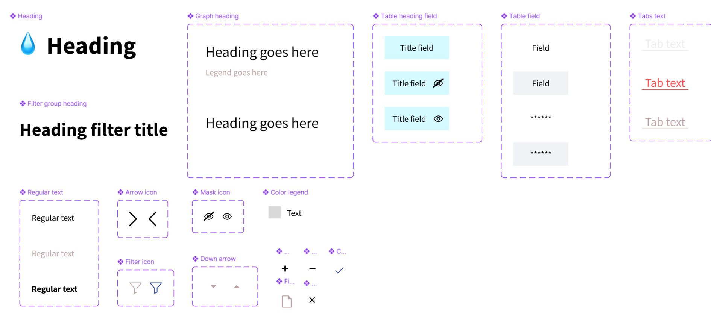

- **Título (Heading):** Serve como elemento principal de identificação de seções ou páginas. Este átomo é crucial para a organização visual e a hierarquia dentro da interface.
- **Texto Regular (Regular Text):** Utilizado para a maior parte do conteúdo textual, como descrições, informações de campos, e instruções.
- **Texto de Abas (Tabs Text):** Identifica cada aba dentro de um componente de navegação tipo aba, permitindo alternar entre diferentes vistas ou subseções.
- **Campo de Título da Tabela (Table Heading Field):** Rotula colunas em tabelas, fornecendo contexto sobre os dados apresentados.
- **Campo de Tabela (Table Field):** Exibe dados específicos dentro de uma tabela, essencial para apresentar arrays de dados de forma organizada.
- **Ícones (Arrow, Mask Icons):** Usados para indicar direção, ação ou ocultar/revelar elementos dentro da interface.
- **Ícones de Filtro (Filter Icons):** Permitir que os usuários apliquem filtros aos dados ou conteúdos apresentados, como filtrar listas ou tabelas de acordo com certos critérios.
- **Legendas de Cores (Color Legend):** Fornecer referências visuais para mapear elementos gráficos como gráficos e mapas a um significado ou categoria específica.
- **Cabeçalhos de Filtro e Gráfico (Heading Filter Title, Graph Heading):** Titular seções específicas dentro da interface que contêm filtros ou gráficos.

### 2. Moléculas

Moléculas são conjuntos de átomos que funcionam juntos como uma unidade. No projeto, moléculas como campos de formulário com rótulos, caixas de seleção combinadas com textos explicativos e barras de pesquisa com botões são exemplos. Cada molécula é projetada para ser funcional enquanto mantém a estética definida pelo design system.

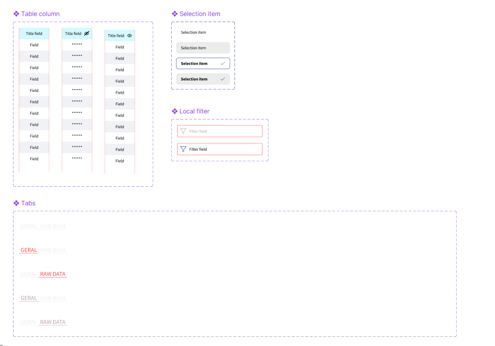

- **Item de Seleção (Selection Item)**
    - **Composição**: Constituído por um campo de seleção individual que pode ser marcado ou desmarcado.
    - **Função**: Utilizado para seleções simples dentro de listas ou formulários, facilitando ações como a inclusão ou exclusão de categorias nos filtros de dados.
    - **Uso no projeto**: Importante para interfaces onde múltiplas opções podem ser escolhidas sem a necessidade de um menu dropdown, como seleções rápidas de atributos em filtros avançados.
- **Filtro Local (Local Filter)**
    - **Composição**: Combina um campo de texto para inserção livre com um ícone de filtro, possibilitando buscas diretas por palavras-chave.
    - **Função**: Permite buscas rápidas dentro de uma página ou componente, filtrando tabelas ou listas com base no texto inserido.
    - **Uso no projeto**: Essencial para pesquisas rápidas em grandes conjuntos de dados ou tabelas, como buscar por localidades ou endereços específicos no dashboard.
- **Coluna de Tabela (Table Column)**
    - **Composição**: Inclui um título de coluna e múltiplos campos de dados, podendo também incorporar ícones para ações como hidden de dados.
    - **Função**: Organiza e apresenta dados em formato tabular, permitindo a visualização clara e estruturada de informações detalhadas.
    - **Uso no projeto**: Utilizada extensivamente nas páginas de detalhamento de consumo e análise de fraudes, onde dados precisam ser comparados e analisados de maneira mais profunda.
- **Tabs (Abas)**
    - **Composição**: Grupo de títulos de abas que quando selecionados, exibem diferentes conteúdos relacionados.
    - **Função**: Facilita a organização de conteúdos em categorias distintas sem a necessidade de navegação adicional, mantendo o usuário na mesma página.
    - **Uso no projeto**: Ideal para alternar entre diferentes tipos de dados ou perspectivas no dashboard, como mudar entre dados brutos e análises gráficas.

### 3. Organismos

Organismos são grupos de moléculas que formam partes mais complexas da interface. Esses organismos são fundamentais para a funcionalidade de páginas específicas e são projetados para suportar a interatividade do usuário.

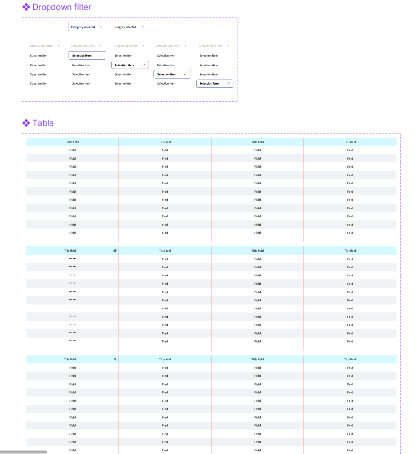

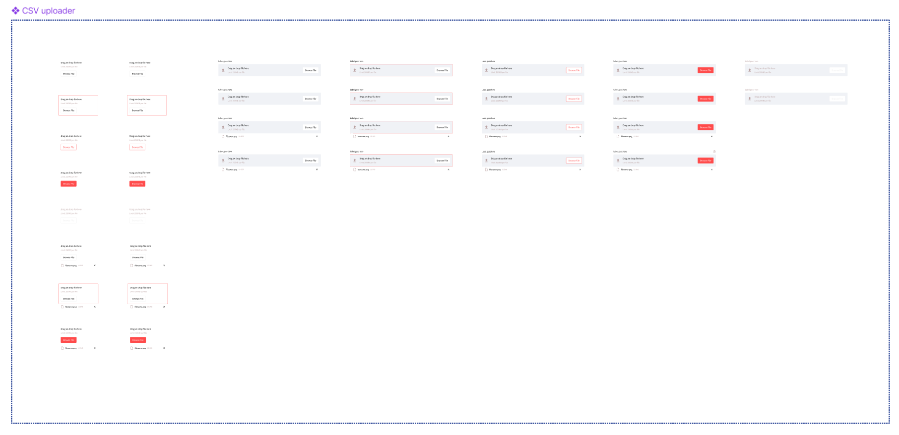

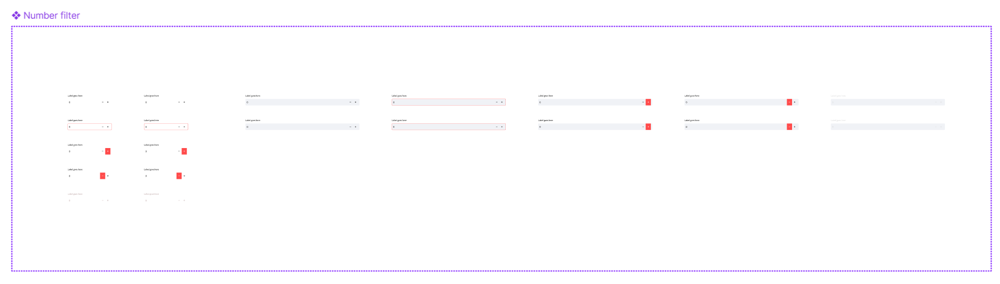

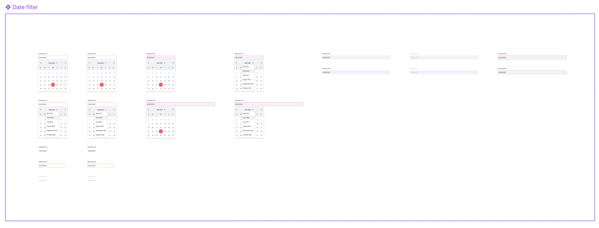

- **Organismo de Filtro Dropdown**
    - **Composição**: Combina várias instâncias do filtro dropdown, cada um com categorias e itens selecionáveis.
    - **Função**: Este organismo permite aos usuários aplicar múltiplos filtros simultaneamente para refinar os dados exibidos na tabela ou em outras visualizações de dados. Ele suporta a seleção de categorias.
    - **Uso no projeto**: É essencial para permitir que os operadores façam uma triagem eficaz dos dados, isolando casos potenciais de fraude sobre uma categoria específica para análise mais detalhada.
- **Organismo de Tabela**
    - **Composição**: Inclui múltiplas colunas de tabela, cada uma com um cabeçalho e múltiplos campos de dados. Também incorpora ícones para ações como hidden dos dados, adicionando interatividade à visualização tabular.
    - **Função**: Este organismo é usado para apresentar grandes volumes de dados de forma organizada, permitindo aos usuários visualizar, ordenar e manipular informações conforme necessário.
    - **Uso no projeto**: Fundamental para exibir dados de consumo, localidade e resultados de análises preditivas. A tabela oferece uma visão compreensiva que ajuda na identificação de padrões atípicos ou irregularidades no consumo.
- **Organismo CSV Uploader**
    - **Composição**: Inclui múltiplas instâncias de campos de upload de arquivos, permitindo aos usuários carregar arquivos CSV de várias fontes ou categorias. Cada campo de upload é acompanhado por botões que permitem navegar e selecionar arquivos, bem como opções para remover ou substituir arquivos carregados.
    - **Função:** Este organismo permite o carregamento simultâneo de um arquivo CSV por vez, que pode conter dados essenciais para a análise, como registros de consumo, informações de clientes (localidade e matricula) e dados históricos de uso.
    - **Uso no Projeto** É crucial para a inicialização e atualização contínua do sistema de detecção de fraudes, permitindo que os operadores atualizem facilmente o banco de dados com novos dados conforme se tornam disponíveis, garantindo que o modelo de detecção de fraudes esteja sempre trabalhando com as informações mais atualizadas.
- **Organismo Data Filter**
    - **Composição**: Contém várias instâncias de seletores de data, permitindo aos usuários definir faixas de datas para a análise de dados. Cada seletor de data permite escolher uma data de início e uma data de término, facilitando a delimitação do período de análise.
    - **Função:** Facilita a filtragem de dados baseada em períodos específicos, o que é essencial para análises temporais de padrões de consumo ou detecção de anomalias em determinadas épocas.
    - **Uso no Projeto**: Fundamental para análises focadas em períodos específicos, como a investigação de picos de consumo durante eventos específicos ou a avaliação de padrões sazonais de uso, de acordo com o objetivo do usuário.
- **Organismo Number Filter**
    - **Composição:** Compreende múltiplas instâncias de campos de entrada para números, onde os usuários podem definir valores mínimos e máximos para certos parâmetros.
    - **Função:** Permite a filtragem refinada de dados com base em critérios numéricos específicos, restrito ao range da predição de fraude.
    - **Uso no Projeto:**  Essencial para identificar e isolar registros que caem fora dos parâmetros normais estabelecidos, ajudando na rápida identificação de desvios que podem indicar fraude.

### 4. Templates

Templates são estruturas que organizam organismos em um layout coeso, formando o design básico de páginas sem conteúdo específico. No protótipo, templates foram usados para criar padrões de layout que são preenchidos com dados reais durante a implementação.

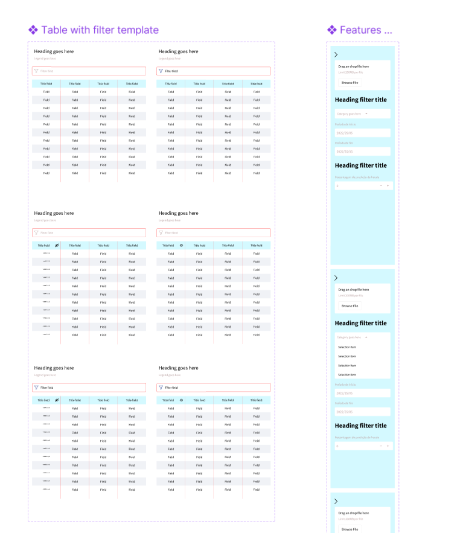

- **Template Table with Filter Template**
    - **Composição:** Este template integra vários componentes:
        - **Cabeçalhos**: Títulos explicativos que definem o contexto da informação exibida nas tabelas.
        - **Filtros de Tabela**: Incorpora filtros de texto e número que permitem aos usuários refinar os dados apresentados nas tabelas.
        - **Tabelas de Dados**: Múltiplas tabelas são dispostas para exibir uma grande quantidade de dados organizados, facilitando análises comparativas ou detalhadas.
    - **Função:** Ideal para visualizar e manipular grandes conjuntos de dados, com suporte para filtragem avançada para análise direcionada, além de permitir que os usuários comparem facilmente dados de várias fontes ou categorias simultaneamente, crucial para a identificação de padrões ou discrepâncias e para análises aprofundadas.
    - **Uso no Projeto:**  Utilizado para analisar dados de consumo de água, detectar possíveis fraudes por ordem decrescente de probabilidade e monitorar a eficácia de medidas preventivas. Fornece uma base para dashboards de monitoramento e relatórios detalhados, permitindo aos gestores e técnicos a identificação mais rápida da granularidade da fraude.
- **Template Features**
    - **Composição:** Este template é mais voltado para funcionalidades interativas e gestão de entrada de dados, incluindo:
        - **Barras Laterais de Funcionalidades**: Espaços dedicados para a adição de novos dados pelo upload de arquivos.
        - **Filtros de Cabeçalho**: Permite a aplicação de filtros categorizados para refinar as visualizações e análises disponíveis na interface.
    - **Função:** Maximiza a interação do usuário com o sistema, permitindo uma personalização fácil e rápida da informação apresentada ou das operações realizadas.
    - **Uso no Projeto:** Gestão dos dados a serem inputados no modelo de deep learning para identificação de fraudes e customização dos dados a serem analisados por parte do usuário

Para a visualização do Atomic Design acesse [aqui](https://www.figma.com/design/F2em6utEvkmr49MG5eBKUJ/UX?node-id=88-3452&t=5eepxZxa08keomGm-1).

## 5. Guia de Estilos
Um guia de estilo é um documento que define e padroniza os elementos visuais e serve como uma referência central para garantir que todas as criações visuais mantenham consistência e coesão.

#### Elementos principais de um guia de estilo:
- Cores: A paleta de cores especifica as tonalidades primárias, secundárias e de apoio que podem ser utilizadas.

- Tipografia: Define as fontes tipográficas que serão usadas, especificando o tipo de fonte, tamanhos, pesos e espaçamentos apropriados para títulos, subtítulos, corpo de texto e outros elementos.

- Ícones: Estabelece o estilo e os tipos de ícones que devem ser utilizados, garantindo que sigam o mesmo traço visual e propósito, criando uma comunicação visual clara e intuitiva.

- Seletores: Descrevem como botões, links, menus e outros componentes interativos devem ser estilizados e comportados, incluindo variações de hover, foco e estados ativos, para assegurar uma experiência de usuário consistente e agradável.

Todo o estilo visual da aplicação está parametrizado em “Local Variables” do Figma, facilitando a flexibilidade e consistência no design. Isso assegura que qualquer alteração ou expansão possa ser aplicada uniformemente em toda a interface.

### 5.1 Cores

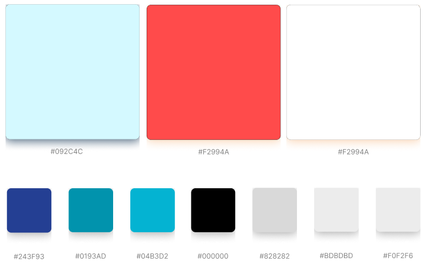

### 5.2 Tipografia

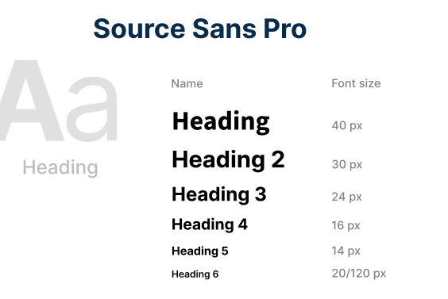

### 5.3 Ícones

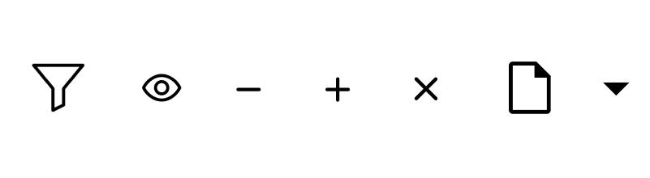

### 5.4 Seletores

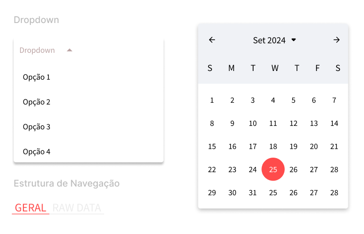

## 5. Páginas

Páginas são instâncias de templates preenchidos com informações específicas para fornecer aos usuários finais a interface completa. Cada página foi cuidadosamente projetada para suportar uma função específica dentro do sistema, como visualização de dados de consumo, análise de fraudes e filtragem dos dados. As páginas foram projetadas para suportar a visualização em desktop e em dispositivos mobile.

1. Desktop

### Página geral

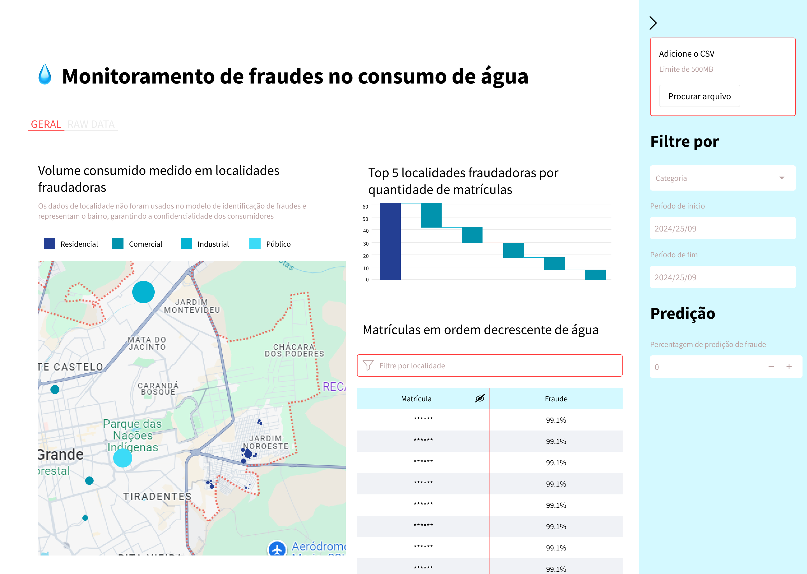

Esta página serve como um painel interativo de monitoramento que destaca áreas críticas de preocupação e padrões de consumo em diferentes localidades. Ela utiliza uma combinação de gráficos, mapas e tabelas para apresentar dados de maneira compreensível e acessível, destacando rapidamente pelo meio do mapa e gráfico as principais áreas de atenção, com uma tabela reduzida mais granular com as matrículas a serem analisadas rapidamente.

**Componentes Principais**

- **Mapa Interativo**: Exibe localidades com consumo medido e identifica áreas com incidências elevadas de fraudes. O mapa é uma ferramenta crucial para visualizar a distribuição geográfica das fraudes e entender como elas se correlacionam com fatores, além de destacar logo de cara as principais áreas de atenção
- **Gráficos de Barras**: A partir de uma cascata, demonstra a quantidade total de matrículas fraudadoras, seguido pelo cascateamento das top 5 localidades com maior quantidade desses casos suspeitos,  priorizando regiões para investigações detalhadas.
- **Tabelas de Dados**: Listam matrículas em ordem decrescente de consumo de água, vinculando diretamente ao nível de fraude estimado, o que permite ações rápidas e focadas.
- **Filtros**: Permitindo uma filtragem detalhada por categoria, período, nível da predição e localidade. Os filtros localizados na barra lateral são feitos antes dos dados serem inputados no modelo, enquanto o filtro de localidade se restringe apenas à tabela.

Esta página é essencial para que gestores e operadores possam monitorar eficazmente as tendências de consumo e responder prontamente a indícios de fraude, utilizando dados históricos e atuais para ajustar estratégias de fiscalização e intervenção.

### **Página de Dados Brutos (Raw Data)**

Proporciona uma visão detalhada dos dados brutos coletados, oferecendo uma plataforma para análises mais profundas e específicas por parte dos analistas e técnicos.

**Componentes Principais**

- **Funcionalidade de Upload de CSV**: Facilita a atualização e incorporação de novos dados ao modelo de deep learning.
- **Tabela Detalhada**: Exibe matrícula, fraude estimada, localidade e consumo medido, oferecendo uma visualização mais profunda para compreensão do comportamento fraudulento daqueles dados inseridos.

Essencial para análises aprofundadas e investigações detalhadas de casos individuais, a página de dados brutos suporta a função de análise forense dentro da empresa, ajudando a identificar e confirmar casos de fraude.

### Mobile

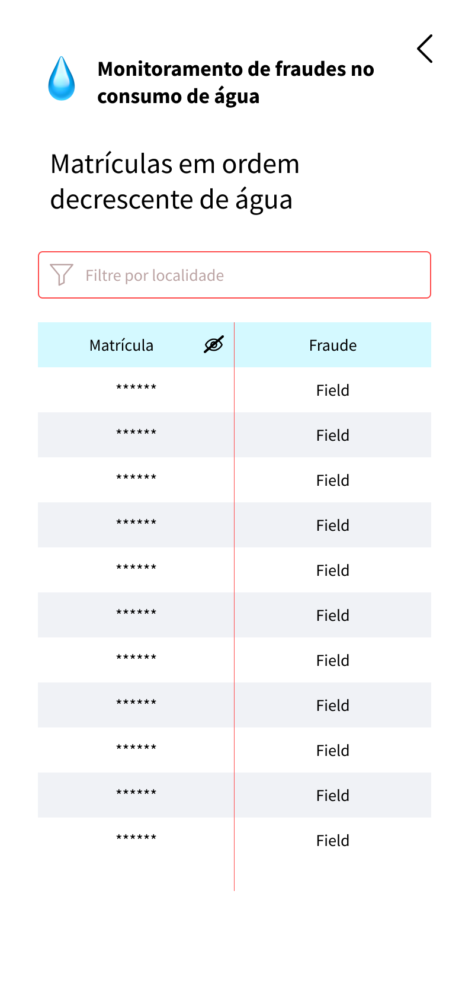

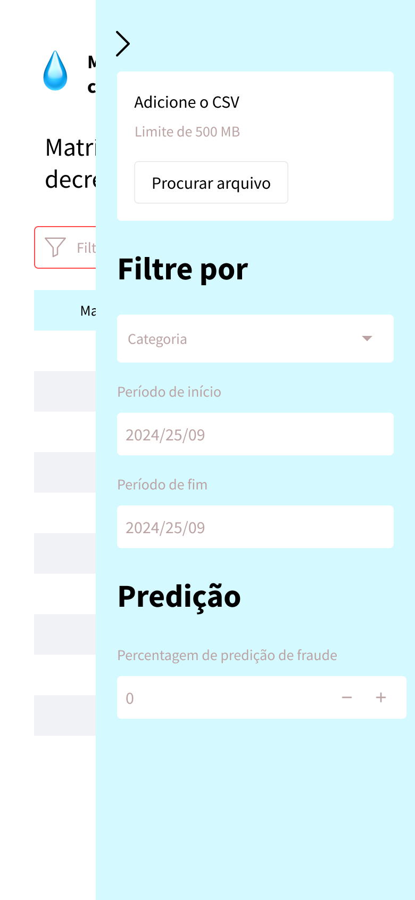

A visualização mobile se assemelha à pagina de Raw Data do desktop, junto aos filtros da página Geral, mas com uma visão simplificada. O mobile foi prototipado para um uso mais pontual e específico, no caso de agentes de campo verificarem a localidade das matrículas que estão sendo verificadas.

Para visualizar o [fluxo de iteratividade possível por um usuário](https://www.figma.com/design/F2em6utEvkmr49MG5eBKUJ/UX?node-id=195-1876&t=5eepxZxa08keomGm-1) e [navegar pelo protótipo](https://www.figma.com/proto/F2em6utEvkmr49MG5eBKUJ/UX?page-id=195%3A1876&node-id=156-3511&node-type=frame&viewport=1156%2C-385%2C0.13&t=0wDjutZKCthPYPwH-1&scaling=scale-down&content-scaling=fixed&starting-point-node-id=156%3A3511) acesse os respectivos links.
