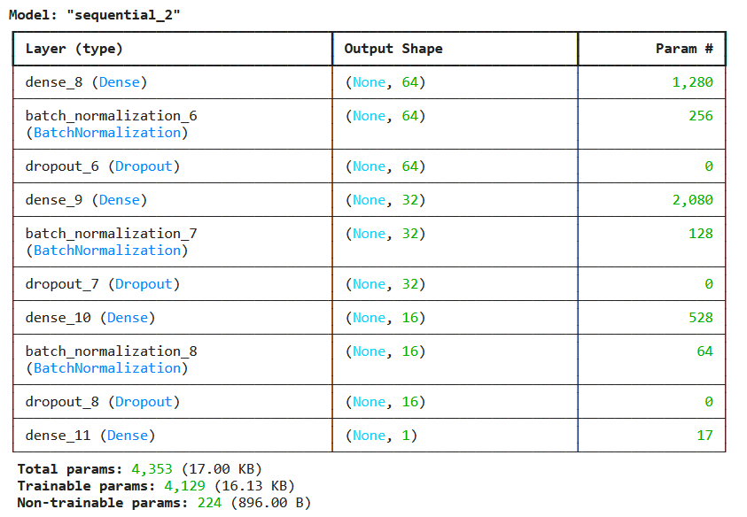
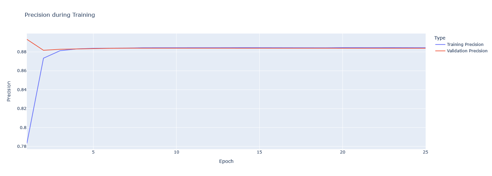
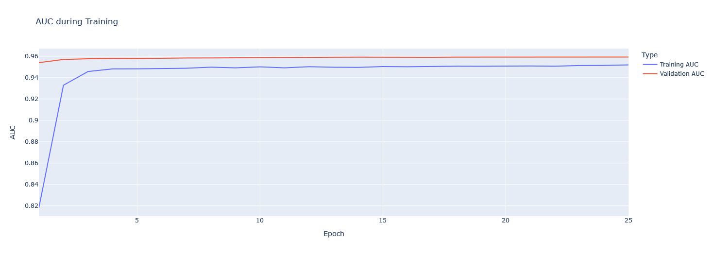
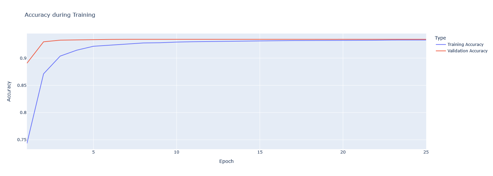
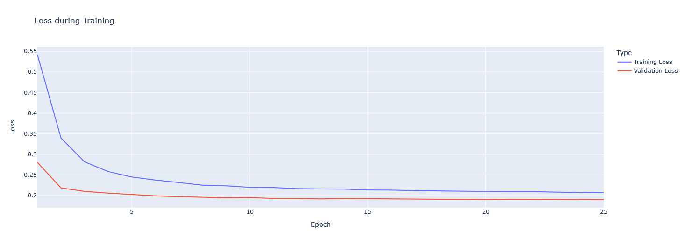

# Relatório de Avaliação de Métricas - Detecção de Fraudes no Consumo de Água para Aegea 💧

Criado em: September 29, 2024 8:22 PM
Tags: Documentação

## 1. Introdução

A fraude no consumo de água é um grande desafio para empresas como a Aegea, impactando tanto sua receita quanto a qualidade do serviço prestado à população. Este projeto busca desenvolver um modelo preditivo de Deep Learning capaz de detectar comportamentos fraudulentos no consumo de água com alta assertividade, minimizando erros e proporcionando maior explicabilidade.

### Contexto

Fraudes no consumo de água afetam a infraestrutura e a receita da empresa, resultando em:

- Danos à rede de distribuição de água.
- Intermitências no abastecimento.
- Perdas financeiras significativas.
- Risco de contaminação da água.

Neste relatório, detalhamos a avaliação de diversas métricas de desempenho do modelo desenvolvido para detectar fraudes, além de fornecer uma análise crítica dos resultados obtidos.

## 2. Funcionamento do Modelo

### 2.1. Pipeline de Tratamento de Dados

Para garantir um modelo eficiente e confiável, desenvolvemos uma pipeline robusta de tratamento de dados que automatiza todo o processo de preparação dos dados de consumo. Abaixo estão os principais passos realizados pela pipeline:

- **Seleção de Colunas**: As colunas mais relevantes foram selecionadas para garantir que apenas dados essenciais sejam utilizados no modelo.
- **Conversão de Tipos de Dados**: Os tipos de dados foram ajustados para assegurar consistência, como transformar colunas de datas e valores numéricos.
- **Padronização de Texto**: Textos presentes em colunas categóricas como "TIPO_LIGACAO" e "CATEGORIA" foram padronizados para manter uniformidade e reduzir variações desnecessárias.
- **Criação de Novas Categorias**: Novas colunas categóricas foram criadas a partir das variáveis econômicas, aplicando funções de categorização para simplificar a interpretação de variáveis contínuas.
- **Agrupamento via Clusters**: Utilizamos técnicas de clusterização para identificar padrões em dados como "DSC_OCORRENCIA" (clusters de texto) e "CONS_MEDIDO" (clusters numéricos), buscando insights mais profundos.
- **Codificação One-Hot**: Variáveis categóricas como "TIPO_LIGACAO" e "CATEGORIA" foram transformadas em variáveis binárias usando one-hot encoding para melhorar a representatividade dos dados.
- **Balanceamento de Classes**: Utilizamos a técnica de RandomUnderSampler para balancear as classes no dataset e evitar o problema de desbalanceamento no modelo.
- **Divisão dos Dados**: O dataset foi dividido em conjuntos de treino e teste, garantindo que os dados de fraude estivessem bem representados em ambos os conjuntos.

### 2.2. Seleção de Variáveis

- **Histórico de Consumo**: Dados de consumo de água registrados ao longo dos últimos meses por matrícula foram utilizados como base para identificar padrões suspeitos.

### 2.3. Arquitetura do Modelo

Para o problema dado anteriormente, a escolha de uma **arquitetura de rede neural profunda** foi feita devido à sua capacidade de capturar padrões não lineares e complexos nos dados. Isso é especialmente importante em cenários onde há muitos fatores que influenciam o comportamento de consumo de água e que podem indicar atividades fraudulentas. Abaixo, cada parte da arquitetura do modelo é explicada:

**Modelo Base: Rede Neural Sequencial**

A arquitetura sequencial foi selecionada por sua simplicidade e eficiência, já que permite uma construção hierárquica de camadas, onde os neurônios de cada camada estão completamente conectados aos neurônios da camada seguinte. Essa abordagem é particularmente útil para problemas de classificação binária, como o de detecção de fraudes, onde queremos estimar se o comportamento de consumo de água de um cliente é fraudulento ou não.

1. **Primeira Camada Densa com 64 Neurônios e Ativação ReLU**
    - A primeira camada é responsável por extrair características iniciais dos dados de entrada. Essa camada densa com 64 neurônios permite captar essas interações iniciais.
    - **Ativação ReLU**: A função ReLU (Rectified Linear Unit) foi escolhida por ser computacionalmente eficiente e por ajudar a resolver problemas de vanishing gradients, comuns em redes neurais profundas. A ReLU também ajuda a manter a não linearidade do modelo, o que é fundamental para capturar padrões complexos nos dados de consumo de água.
    - **Objetivo**: O objetivo dessa camada é processar uma grande quantidade de variáveis e identificar padrões simples e gerais no comportamento de consumo.
2. **Segunda Camada Densa com 32 Neurônios e Ativação ReLU**
    - À medida que avançamos na rede, a quantidade de neurônios diminui, refletindo a transição do processamento de características mais gerais para características mais específicas. A segunda camada com 32 neurônios trabalha em conjunto com a primeira para refinar esses padrões.
    - **Ativação ReLU**: Mais uma vez, a ReLU é utilizada para introduzir a não linearidade necessária e evitar a saturação de gradientes, mantendo o modelo capaz de capturar nuances dos padrões fraudulentos.
    - **Objetivo**: Nesta etapa, a rede já começa a identificar interações mais específicas entre os dados de consumo que podem indicar a presença de fraudes.
3. **Terceira Camada Densa com 16 Neurônios e Ativação ReLU**
    - A terceira camada reduz ainda mais o número de neurônios para 16, preparando a rede para a camada de saída. Essa camada tem a função de refinar ainda mais os padrões identificados anteriormente, distilando as informações mais relevantes para a tomada de decisão final.
    - **Ativação ReLU**: A função ReLU continua sendo importante nesta fase, pois mantém a rede capaz de capturar as complexidades dos dados sem ser afetada por vanishing gradients.
    - **Objetivo**: Ao reduzir gradualmente o número de neurônios, o modelo se concentra nas informações mais relevantes para prever fraudes de maneira precisa.
4. **Camada de Saída com 1 Neurônio e Ativação Sigmoide**
    - A camada de saída contém um único neurônio, refletindo o fato de que estamos lidando com um problema de classificação binária: fraude ou não fraude. A ativação sigmoide foi escolhida para converter as saídas do modelo em uma probabilidade, variando entre 0 (sem fraude) e 1 (fraude).
    - **Ativação Sigmoide**: A função sigmoide é adequada para problemas de classificação binária porque mapeia qualquer valor real em uma probabilidade entre 0 e 1. Isso facilita a interpretação dos resultados pelo usuário final, fornecendo uma estimativa clara da probabilidade de fraude.
    - **Objetivo**: Esta camada finaliza o processo de predição ao fornecer uma probabilidade de fraude, permitindo a tomada de decisão pelas equipes de campo da Aegea.

### Regularização: Dropout com Taxa de 30%

- A regularização foi realizada através de camadas de Dropout com uma taxa de 30%, que foi aplicada após cada camada densa. O Dropout desativa aleatoriamente uma fração dos neurônios durante o treinamento, forçando o modelo a não se apoiar excessivamente em qualquer uma das características aprendidas.
- **Objetivo**: O uso de Dropout é essencial para evitar overfitting, especialmente no problema abordado, em que o conjunto de dados pode ser relativamente pequeno e desbalanceado (com poucos casos de fraude em comparação com o número total de amostras). Ao reduzir a dependência excessiva em certos neurônios, o modelo se torna mais robusto e generaliza melhor para dados desconhecidos.

### Normalização: Batch Normalization

- A Batch Normalization foi utilizada após cada camada densa para normalizar as ativações intermediárias da rede. Isso estabiliza e acelera o processo de treinamento, permitindo que o modelo atinja uma performance melhor com menos épocas.
- **Objetivo**: A normalização das ativações permite que o modelo seja treinado de maneira mais eficiente, prevenindo que os gradientes fiquem muito grandes ou muito pequenos, o que poderia prejudicar a convergência. Além disso, a Batch Normalization ajuda a manter a estabilidade do treinamento mesmo com altas taxas de aprendizado, garantindo uma adaptação rápida do modelo.

### 2.4. Compilação e Treinamento

A etapa de compilação e treinamento do modelo foi projetada para garantir que o modelo alcançasse uma alta precisão, minimizando o risco de overfitting e otimizando o tempo de treinamento. A seguir, detalhamos as escolhas feitas para a função de perda, otimizador, métricas de avaliação e abordagem de treinamento, explicando o raciocínio por trás de cada uma dessas decisões.

**Função de Perda: `binary_crossentropy`**

- A função de perda é responsável por medir a diferença entre as previsões do modelo e os valores reais durante o treinamento. Para este problema de classificação binária (fraude ou não fraude), utilizamos a função de perda **`binary_crossentropy`**.
- **Justificativa**: A **`binary_crossentropy`** é amplamente utilizada em problemas de classificação binária porque mede a entropia entre as previsões do modelo (valores entre 0 e 1) e os rótulos reais (0 ou 1). A função penaliza previsões que estão longe dos valores reais, forçando o modelo a melhorar suas previsões a cada iteração. Isso é particularmente útil em problemas onde a distinção entre duas classes (fraudulento e não fraudulento) precisa ser feita com precisão.
- **Objetivo**: Maximizar a distinção entre comportamentos fraudulentos e não fraudulentos, ajustando o modelo para minimizar a incerteza nas previsões.

**Otimizador: Adam (com taxa de aprendizado de 0.0001)**

- O otimizador controla como o modelo atualiza seus pesos durante o treinamento. Para este modelo, utilizamos o otimizador **Adam** (Adaptive Moment Estimation), que combina as vantagens dos otimizadores **RMSProp** e **Stochastic Gradient Descent (SGD)**, ajustando automaticamente a taxa de aprendizado durante o treinamento.
- **Justificativa**: O **Adam** foi escolhido por ser eficiente em redes neurais profundas, especialmente em cenários onde o espaço de busca de pesos é grande e o volume de dados pode ser desbalanceado. Ele calcula médias móveis dos gradientes e suas segundas derivadas, adaptando a taxa de aprendizado para cada peso individual. A escolha de uma **taxa de aprendizado de 0.0001** foi feita para garantir que o modelo convergisse de maneira estável e sem saltos bruscos, o que é crucial em um problema sensível como a detecção de fraudes, onde pequenos ajustes nos pesos podem resultar em uma melhoria significativa na performance.
- **Objetivo**: Garantir uma convergência estável, evitando oscilações bruscas no treinamento e permitindo uma adaptação precisa aos padrões complexos dos dados.

**Métricas de Avaliação: Acurácia, Precisão, Recall e AUC-ROC**

- Durante o treinamento e a validação do modelo, várias métricas foram monitoradas para garantir que o modelo estava aprendendo de forma equilibrada e eficaz. As principais métricas utilizadas foram:
    - **Acurácia**: Mede a proporção de previsões corretas entre todas as previsões.
    - **Precisão**: Mede a proporção de fraudes corretamente identificadas entre todas as previsões de fraude.
    - **Recall**: Mede a proporção de fraudes reais corretamente identificadas.
    - **AUC-ROC**: Mede a capacidade do modelo de separar as classes (fraude vs. não fraude) ao longo de um intervalo de limiares de decisão.
    
    Cada métrica será abordada mais profundamente nas próximas seções deste relatório.
    

**Treinamento: 25 épocas, batch size de 128 e validação cruzada K-Fold**

- O processo de treinamento foi estruturado para garantir a robustez e a generalização do modelo. O modelo foi treinado por **25 épocas**, com um **tamanho de batch de 128**, o que significa que 128 amostras foram processadas por vez antes da atualização dos pesos. Além disso, foi aplicada **validação cruzada (K-Fold)** para avaliar o desempenho do modelo de forma mais confiável.

### 2.5. Salvamento do Modelo

Após o treinamento, o modelo foi salvo em um arquivo `.pkl` para ser utilizado como um serviço no backend que se conecta ao dashboard. Além disso, o histórico de métricas durante o treinamento foi registrado para análise.

---

## 3. Avaliação das Métricas de Desempenho

A seguir, detalhamos as principais métricas que foram analisadas durante o treinamento e a validação do modelo.

### 3.1. Acurácia (Accuracy)

A acurácia é a métrica que mede o quão bem o modelo consegue prever corretamente as amostras, independentemente de serem fraudes ou não fraudes. Ela fornece uma visão geral do desempenho do modelo.

No gráfico de acurácia, observa-se que o modelo rapidamente alcança uma acurácia elevada tanto no conjunto de treino quanto no de validação, estabilizando em torno de **90%** a partir da 10ª época. Isso indica que o modelo foi eficaz em aprender padrões relevantes logo no início do treinamento.

- **Treinamento**: A acurácia inicial começa em aproximadamente 75% e sobe para 90% em três épocas, mostrando uma boa capacidade de aprendizado. Isso pode ser explicado pelo uso da função de ativação ReLU, que permite que a rede capture padrões não lineares com eficiência, melhorando o desempenho logo nas primeiras iterações.
- **Validação**: A curva de acurácia de validação mostra um desempenho consistente, levemente superior ao de treino em algumas épocas. Essa proximidade entre as curvas de treino e validação sugere que o modelo não está sofrendo de overfitting significativo, o que reforça sua capacidade de generalização para dados não vistos.

Apesar de a acurácia de 90% ser um resultado promissor, é importante ressaltar que, em cenários de classes desbalanceadas como a detecção de fraudes, essa métrica pode ser enganosa. O modelo pode obter alta acurácia ao prever predominantemente a classe majoritária ("não fraude"), o que não significa necessariamente que ele esteja capturando corretamente as fraudes.

---

### 3.2. Precisão (Precision)

A precisão é uma métrica que mede o quão bem o modelo acerta ao prever a classe positiva (no caso, fraudes). Ou seja, ela calcula a proporção de amostras classificadas como fraudes que realmente são fraudes.

O gráfico de precisão mostra uma estabilização da métrica em torno de 88%, tanto para o conjunto de treino quanto para o de validação, a partir da 5ª época. Isso indica que o modelo está sendo eficaz em minimizar falsos positivos (amostras legítimas classificadas erroneamente como fraudes).

- **Treinamento**: A precisão aumenta de 78% para 88% rapidamente nas primeiras épocas, o que demonstra que o modelo foi capaz de aprender padrões importantes que ajudam a reduzir as classificações incorretas de fraudes logo no início do processo de treinamento.
- **Validação**: A curva de precisão no conjunto de validação acompanha de perto a curva de treino, sugerindo que o modelo está generalizando bem e não está superajustado aos dados de treinamento.

Em um cenário como o de detecção de fraudes, manter uma precisão elevada é importante para reduzir o número de falsos positivos, o que pode gerar custos operacionais desnecessários. 

### 3.2. Perda (Loss)

A perda (loss) representa o quão distantes as previsões do modelo estão dos valores reais. A função de perda utilizada foi a `**binary_crossentropy**`, uma escolha apropriada para problemas de classificação binária como o de fraude.

A curva de perda apresenta uma queda rápida nas primeiras épocas e estabiliza após a 20ª época. O comportamento consistente entre a perda de treino e a perda de validação indica que o modelo está generalizando bem, e que não há sinais de overfitting ou underfitting evidentes.

- **Treinamento**: A perda de treinamento começa em valores altos (acima de 0.5) e diminui rapidamente nas primeiras 5 épocas, indicando que o modelo está aprendendo bem com os dados e ajustando seus parâmetros de forma eficiente. Esse comportamento pode ser atribuído ao otimizador Adam, que adapta a taxa de aprendizado durante o treinamento.
- **Validação**: A perda de validação acompanha de perto a perda de treinamento, estabilizando em torno de 0.2. Isso sugere que o modelo tem uma boa capacidade de generalização e não está "memorizando" os dados de treinamento, o que seria um indicativo de overfitting.

A diminuição rápida da perda durante o treinamento e validação demonstra que o modelo foi bem configurado e ajustado para o problema. A ausência de grandes diferenças entre as curvas de perda sugere que o modelo está aprendendo de maneira equilibrada, sem grandes variações entre o desempenho em treino e validação.

A eficiência do treinamento pode ser observada pelo comportamento estável das curvas, o que indica que o uso de Batch ****Normalization e Dropout foi eficaz em manter o treinamento regular e evitar problemas como explodir gradientes ou estagnação.

Uma perda baixa e estável como a observada neste gráfico é crucial para garantir que o modelo seja utilizável em cenários reais, onde o equilíbrio entre a detecção de fraudes e o controle de falsos alarmes é fundamental.

### 3.3. AUC-ROC

A métrica AUC-RO**C** (Área Sob a Curva ROC) avalia a capacidade do modelo de discriminar entre as classes "fraude" e "não fraude" ao longo de diferentes limiares de decisão. Um AUC próximo de 1 indica uma excelente separação entre as classes.

O gráfico de AUC mostra que o modelo atinge um AUC elevado, estabilizando em torno de **0.96** para treino e validação. Isso indica que o modelo tem uma excelente capacidade de separar os comportamentos fraudulentos dos não fraudulentos.

Um AUC elevado, como o obtido aqui, é um forte indicativo de que o modelo está funcionando corretamente ao discriminar fraudes de não fraudes. Isso é especialmente importante quando se trata de decidir o limiar de classificação, uma vez que um AUC elevado permite ajustes finos para minimizar tanto falsos positivos quanto falsos negativos.

O AUC-ROC elevado é um dos melhores indicadores de que o modelo está pronto para ser implementado no mundo real. A curva ROC permite observar o equilíbrio entre a sensibilidade e a especificidade, permitindo ajustes no limiar de decisão conforme necessário para otimizar o desempenho em campo.

---

## 4. Generalização

Os gráficos de perda, acurácia e AUC mostram que o modelo generalizou bem para os dados de validação, sem apresentar grandes discrepâncias entre o desempenho em treino e validação. O uso de validação cruzada K-Fold durante o treinamento também contribuiu para aumentar a confiança na capacidade de generalização do modelo, evitando problemas de overfitting.

A consistência entre as métricas de treino e validação indica que o modelo está apto para ser utilizado em diferentes regiões e contextos operacionais da Aegea, sem necessidade de ajustes significativos. No caso da Aegea, isso significa que o modelo pode ser implementado em diferentes áreas geográficas ou contextos operacionais, sem perda significativa de desempenho. No entanto, é recomendável monitorar o desempenho em tempo real e fazer ajustes finos conforme necessário.

---

## 4. Conclusão

O modelo desenvolvido para a detecção de fraudes no consumo de água se mostrou altamente eficaz, atingindo excelentes resultados em métricas cruciais como acurácia, loss, AUC-ROC e precisão. As curvas de aprendizado confirmam que o modelo foi treinado de forma eficiente, com um treinamento equilibrado e sem sinais de overfitting ou underfitting. O desempenho consistente em treino e validação indica que o modelo é robusto o suficiente para generalizar bem em dados reais e diferentes cenários operacionais da Aegea.

### 4.1 Recomendações

Para garantir que o modelo continue entregando resultados consistentes e aprimorar ainda mais seu desempenho em cenários futuros, sugerimos as seguintes ações:

- **Ajustes Futuros de Hiperparâmetros**: Realizar uma busca mais aprofundada de hiperparâmetros, como a variação da taxa de aprendizado, o número de neurônios nas camadas densas, e a taxa de dropout. Um ajuste mais fino pode melhorar ainda mais a precisão do modelo e sua capacidade de detecção em cenários com mais ruído ou complexidade.
- **Explorar Novas Variáveis Exógenas**: A inclusão de dados adicionais, como indicadores socioeconômicos regionais, variáveis climáticas mais detalhadas ou comportamentais (como sazonalidade no consumo), pode aumentar a capacidade do modelo de capturar padrões mais sutis e melhorar sua taxa de detecção de fraudes.
- **Ajuste do Limiar de Classificação:** Com base nas operações em campo, pode ser necessário ajustar o limiar de classificação de fraudes. Monitorar o impacto dos falsos positivos (inspeções desnecessárias) versus falsos negativos (fraudes não detectadas) pode ajudar a otimizar o equilíbrio entre recall e precisão, permitindo que o modelo seja customizado conforme a demanda operacional da Aegea.

### 4.2 Próximos Passos

Para garantir a eficiência e a aplicabilidade prática do modelo, sugerimos os seguintes próximos passos no processo de implementação:

**1. Aplicação do Modelo no Contexto Real**

- **Integração com o Dashboard Operacional**: O modelo deve ser integrado ao sistema operacional da Aegea por meio de um dashboard interativo. Esse dashboard deve exibir os resultados em tempo real para novos dados, permitindo que as equipes de campo visualizem os clientes com maior probabilidade de fraude, acompanhando as previsões do modelo de forma intuitiva e acionável.

**2. Monitoramento Contínuo e Ajustes Dinâmicos**

- **Avaliação de Desempenho em Produção**: A eficácia do modelo deve ser continuamente monitorada após sua implementação. Relatórios periódicos devem ser gerados para avaliar a taxa de detecção de fraudes e a incidência de falsos positivos. Isso permitirá ajustes no limiar de decisão e, se necessário, a adaptação do modelo a novos padrões de fraude.
- **Acompanhamento de Falsos Positivos e Negativos**: A análise das fraudes reais detectadas versus as predições incorretas ajudará a identificar áreas de melhoria. Ferramentas de monitoramento de performance em produção, como gráficos de curva ROC e matriz de confusão, devem ser incorporadas à rotina de manutenção do modelo.

**3. Retreino e Melhoria Contínua:** O modelo deve ser retreinado periodicamente com novos dados de consumo e fraudes identificadas, garantindo que ele continue a aprender e a se adaptar a novos padrões de fraude que podem surgir. Esse retreino pode ser programado em intervalos trimestrais ou semestrais, dependendo do volume de novos dados.

**4. Aprimoramento da Detecção Regional:** Após a análise de implementação, pode ser identificado que o modelo se comporta de maneira diferente em diversas áreas geográficas. Por exemplo, certos padrões de fraude podem ser mais frequentes em uma região do que em outra. Assim, pode ser necessário desenvolver submodelos específicos para cada região, ou ajustar as variáveis exógenas regionais para melhorar a acurácia em locais com características diferenciadas.

A implementação deste modelo representa uma solução capaz de mitigar fraudes no consumo de água, com a vantagem de ser escalável e flexível para atender às necessidades específicas da Aegea. O uso de um dashboard interativo, integrado com a aplicação do modelo, proporcionará insights valiosos para as equipes de campo, otimizando a detecção e remediação de fraudes. A robustez do modelo, aliada à capacidade de retreino e ajuste dinâmico, garantirá que ele continue a evoluir e a melhorar conforme novos dados sejam coletados.

Com uma implementação contínua, monitoramento atento e ajustes adaptativos, este modelo pode se tornar uma ferramenta essencial para melhorar a eficiência operacional da Aegea, reduzir perdas financeiras e garantir a sustentabilidade dos recursos hídricos.
