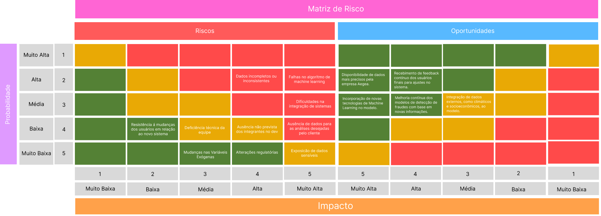
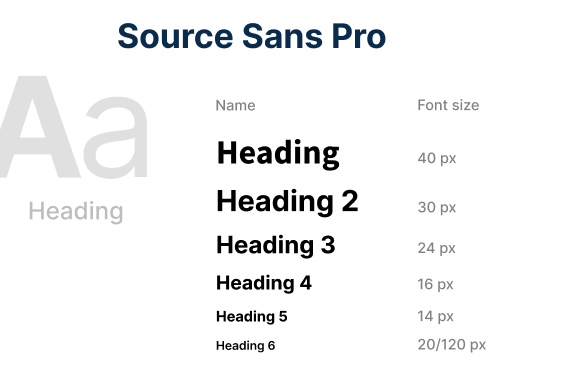

# Documentação Final

Criado em: October 1, 2024 9:24 AM
Tags: Documentação

# Sumário

# 1. Introdução

A Aegea Saneamento e Participações S.A. é a maior empresa privada de saneamento básico do Brasil, atuando em 507 municípios e impactando diretamente a vida de aproximadamente 31 milhões de pessoas. A empresa se destaca por seu compromisso com a inovação e a busca contínua por um futuro sustentável, levando saúde e dignidade às comunidades atendidas.

Entre os desafios enfrentados pela Aegea está a fraude no consumo de água, um problema que afeta não só as receitas da empresa, mas também a qualidade do abastecimento e a integridade da infraestrutura de distribuição. A fraude acontece quando os consumidores manipulam os hidrômetros, realizam ligações clandestinas ou utilizam outros métodos que comprometem a medição correta do consumo. Essas práticas resultam em danos financeiros e riscos para a população, como a possibilidade de contaminação da água e a interrupção no abastecimento.

# 2. Objetivos

O principal objetivo deste projeto é desenvolver um modelo de Deep Learning capaz de prever a probabilidade de fraudes no consumo de água, considerando dados históricos e variáveis exógenas, como índices climáticos, geográficos e macroeconômicos. A solução proposta visa aumentar a assertividade nas ações de fiscalização da Aegea, aprimorando a eficiência das equipes de campo e contribuindo para a redução de perdas financeiras e de qualidade no abastecimento de água.

Com esse modelo preditivo, a Aegea poderá melhorar suas operações, garantir a continuidade do serviço e atuar de maneira preventiva contra fraudes, preservando a saúde financeira da empresa e a qualidade de vida da população atendida.

# 3. Análise do Negócio

A análise de negócios é fundamental para o desenvolvimento de soluções estratégicas que impulsionam o sucesso e a sustentabilidade da organização. No contexto do projeto de detecção de fraudes no consumo de água para a Aegea, essa análise desempenha um papel crucial ao alinhar a tecnologia com as metas de negócios, garantindo que a solução atenda não apenas às demandas técnicas, mas também aos objetivos comerciais e operacionais da empresa.

Nesta seção, abordaremos ferramentas essenciais de análise, como o **Canvas da Proposta de Valor**, para identificar e reforçar o valor entregue aos clientes e usuários finais; a **Matriz de Riscos**, para mapear possíveis ameaças ao projeto e desenvolver estratégias de mitigação; e a **Análise PESTEL**, que explorará os fatores políticos, econômicos, sociais, tecnológicos, ambientais e legais que podem impactar o negócio. Além disso, utilizaremos o **Business Model Canvas** para delinear a estrutura do modelo de negócios e realizaremos uma **Análise Financeira** aprofundada, avaliando o impacto do projeto na visão financeira.

## 3.1. Canvas Proposta de Valor

O Canvas da Proposta de Valor é uma ferramenta que alinha a solução tecnológica às necessidades específicas dos clientes e usuários finais. No contexto do projeto, o Canvas nos permite mapear e entender profundamente as dores, ganhos e atividades dos principais stakeholders, como gestores de operações, equipes de campo e analistas de dados. Através dessa análise, é possível identificar como a solução baseada em deep learning irá mitigar os problemas de detecção de fraudes e oferecer valor agregado, aumentando a precisão nas operações e gerando benefícios tangíveis para a empresa.

Essa ferramenta conecta-se diretamente à estratégia de desenvolvimento de um sistema que não apenas atenda às demandas técnicas, mas também responda aos desafios operacionais e comerciais da Aegea. A criação de valor está diretamente relacionada à capacidade de melhorar a eficiência na identificação de fraudes, reduzir os custos operacionais e aumentar a arrecadação da empresa, respondendo a questões críticas dos stakeholders.

O canvas é dividido em dois lados principais:

**Customer Profile (Perfil do Cliente):**

- **Tarefas (Costumer Jobs):** Representam as atividades que o cliente precisa ou deseja realizar.
- **Dores (Pains):** São as dificuldades, desafios ou riscos que o cliente enfrenta ao tentar realizar essas tarefas.
- **Ganhos (Gains):** Representam os benefícios que o cliente espera ou deseja obter ao realizar suas tarefas.

**Value Proposition (Proposta de Valor):**

- **Produtos e Serviços (Products & Services):** São as soluções que nosso projeto desenvolve, projetadas para atender às necessidades e desejos dos clientes.
- **Aliviadores de Dores (Pain Relievers):** Descrevem como os produtos e serviços eliminam ou reduzem as dores do cliente.
- **Geradores de Ganhos (Gain Creators):** Indicam como os produtos e serviços proporcionam os ganhos desejados pelo cliente.

Segue abaixo o Canvas Proposta de Valor criado para nossa solução:

Por conta da visualização, segue abaixo a descrição do Canvas Proposta de Valor:

| **Customer Job** | **Value Proposition** |
| --- | --- |
| **Gains** | **Gain Creators** |
| - Otimização do processo de fiscalização das fraudes. | - Aumento da capacidade de identificar fraudes, permitindo uma alocação mais precisa de recursos para inspeções de campo. |
| - Resposta mais rápida e eficaz pela facilidade na identificação de possíveis fraudes. | - Melhoria na tomada de decisões por meio de insights acionáveis considerando variáveis externas. |
| - Redução nas taxas de inadimplência devido a ações preventivas mais direcionadas. | - Redução das perdas econômicas que afetam a receita da empresa e a qualidade da distribuição de água. |
| - Aumento da confiança dos stakeholders e clientes na capacidade da empresa de prevenir fraudes. | - Aumento da eficácia das ações preventivas ao identificar fraudes em estágio inicial, resultando em menores taxas de inadimplência. |
| **Pains** | **Pain Relievers** |
| - Altos custos associados à inspeção de clientes devido à dificuldade em identificar fraudes. | - Mais agilidade na identificação de fraudes, reduzindo a necessidade de análises manuais. |
| - Ineficiência dos métodos manuais de detecção de fraudes, que demandam tempo e recursos significativos. | - Melhor alinhamento das equipes de inspeção de campo, permitindo que se concentrem em áreas e indivíduos de alto risco. |
| - Perdas de receita pelo atraso na identificação de atividades fraudulentas. | - Acessibilidade e facilidade de uso para funcionários técnicos e não técnicos na interface. |
| - Altos custos operacionais devido à falta de priorização eficaz de clientes com maior risco de fraude. | - Redução dos altos custos de inspeção através de uma melhor priorização dos clientes com maior risco de fraude. |
| **Customer Jobs** | **Products & Services** |
| - Encaminhar fiscais frequentemente para fiscalização de possíveis fraudes. | - Desenvolvimento de um modelo de Deep Learning para detecção de fraudes no consumo de água, identificando padrões anômalos de consumo. |
| - Realizar manualmente análises para identificação de possíveis fraudes no banco de clientes. | - Criação de uma interface amigável e intuitiva para apresentar os resultados da detecção de fraudes aos usuários finais, tanto técnicos quanto não técnicos. |
| - Gerenciar e realizar cobranças frequentes de clientes inadimplentes. |  |
| - Monitorar continuamente as mudanças nos padrões de consumo para ajustar as estratégias de combate a fraudes. |  |

## 3.2. Matriz de Risco

A Matriz de Riscos é outra ferramenta vital no processo de análise de negócios, focada na identificação e gestão de incertezas que possam comprometer a implementação do projeto. No caso, essa matriz permite mapear possíveis riscos, como falhas no algoritmo de deep learning, integração de sistemas ou até a resistência à mudança por parte dos usuários. Ao avaliar tanto os riscos quanto as oportunidades, é possível preparar o projeto para minimizar impactos negativos e explorar ao máximo as situações favoráveis.

Essa seção conecta-se com o Canvas da Proposta de Valor, já que ao mitigar riscos como a inconsistência de dados ou a falta de integração eficiente, garantimos que a proposta de valor do projeto seja entregue de maneira eficaz. Isso também reforça a confiança dos stakeholders, uma vez que a empresa poderá antecipar e responder rapidamente a desafios.

Para os riscos, criamos uma tabela detalhada que inclui:

- **Descrição do Impacto:** Uma explicação clara sobre como o risco pode afetar o projeto, destacando as áreas que podem ser comprometidas.
- **Responsável pelo Risco:** A pessoa dentro do grupo de projeto que é responsável por monitorar e gerenciar esse risco.
- **Descrição da Ação:** As medidas planejadas ou executadas para mitigar, evitar ou responder ao risco, garantindo que seus impactos sejam minimizados ou eliminados.

Segue abaixo a Matriz de Risco do nosso projeto:

[**Riscos e Oportunidades:**](https://www.figma.com/design/o7wpGqvTrjYckL1r1J3jjM/Matriz-de-Risco-Dona-Chica?node-id=0-1&t=ejNQTNKtb3L3rOBS-1)

**Tabela de plano de ação:**

Por conta da visualização, segue abaixo a descrição da Matriz de Risco:

| **Risco** | **Descrição do Risco** | **Probabilidade** | **Impacto** | **Ação** |
| --- | --- | --- | --- | --- |
| **1 -** Dados incompletos ou inconsistentes | A falta de dados ou dados inconsistentes podem levar a resultados imprecisos na previsão de fraudes, afetando a assertividade do modelo. | Alta - A probabilidade é alta porque a coleta de dados em grande escala e de múltiplas fontes frequentemente resulta em inconsistências. | Muito Alto - O impacto é muito alto porque dados incorretos ou ausentes podem comprometer completamente a eficácia do modelo, resultando em previsões falhas e decisões erradas. | Implementar processos rigorosos de validação e limpeza de dados e realizar auditorias periódicas para garantir a qualidade dos dados utilizados. |
| **2 -** Falhas no algoritmo de machine learning | Bugs ou falhas no algoritmo de ML podem resultar em previsões incorretas, comprometendo a detecção de fraudes e a eficiência das ações de remediação. | Média - A probabilidade é média devido à complexidade envolvida no desenvolvimento e na implementação de algoritmos, o que pode levar a erros. | Muito Alto - O impacto é muito alto, pois falhas no algoritmo afetariam diretamente a capacidade do modelo de detectar fraudes, comprometendo todo o projeto. | Realizar testes rigorosos e validação cruzada do modelo e manter uma equipe técnica especializada para monitorar e corrigir possíveis falhas no algoritmo. |
| **3 -** Dificuldades na integração de sistemas | A integração inadequada ou falhas na comunicação entre diferentes sistemas podem gerar inconsistências nos dados e comprometer a eficácia do modelo | Média - A probabilidade é média, dado que a integração entre diferentes sistemas sempre apresenta desafios técnicos. | Alto - O impacto é alto porque falhas na integração podem resultar em inconsistências nos dados e na eficácia do modelo, prejudicando a operação. | Realizar testes de integração antes do lançamento para garantir que todos os sistemas estejam corretamente conectados e funcionem de forma harmoniosa. |
| **4 -** Resistência á mudanças dos usuários em relação ao novo sistema | A resistência dos usuários de negócio e técnicos em adotar o novo sistema pode atrasar a implementação e reduzir a eficácia do projeto. | Baixa - A probabilidade é baixa, pois treinamentos e envolvimento dos usuários podem mitigar a resistência. | Baixa - O impacto é baixo porque, mesmo que haja resistência, ela pode ser superada com o tempo e com estratégias de gerenciamento de mudanças. | Promover treinamentos e workshops para os usuários e envolver os stakeholders no processo de desenvolvimento para garantir alinhamento e aceitação. |
| **5 -** Deficiência técnica da equipe | A falta de conhecimento ou experiência em áreas técnicas críticas pode impactar negativamente a qualidade e a eficácia do projeto, gerando erros e retrabalho. | Média - A probabilidade é média, dado que a falta de habilidades técnicas específicas pode surgir ao longo do projeto. | Médio - O impacto é médio porque a deficiência técnica pode levar a erros e retrabalho, impactando o cronograma e a qualidade, mas não necessariamente comprometendo o projeto como um todo. | Investir em treinamentos e capacitações específicos para os membros da equipe. |
| **6 -** Ausência de dados para as análises desejadas pelo cliente | A ausência imprevista de membros da equipe pode causar atrasos nas atividades, comprometendo o cronograma e a entrega das etapas do projeto. | Média - A probabilidade é média, pois nem sempre os dados solicitados estão disponíveis ou acessíveis. | Muito Alto - O impacto é muito alto, uma vez que a falta de dados críticos pode limitar significativamente a capacidade do modelo de atender às expectativas do cliente. | Comunicação clara e notificação antecipada em caso de ausência + adaptação do horário do membro que terá faltas para que suas atividades sejam cumpridas dentro do prazo. |
| **7 -** Ausência de dados para as análises desejadas pelo cliente | A falta de dados específicos necessários para as análises solicitadas pelo cliente pode limitar a capacidade do modelo de atender às expectativas do projeto. | Baixa - A probabilidade é baixa, já que mudanças significativas em variáveis como clima ou economia não são frequentes. | Baixa - O impacto é baixo, pois essas mudanças podem ser ajustadas dentro do modelo com atualizações e ajustes periódicos. | Trabalhar com o cliente para identificar dados alternativos que possam ser utilizados. Considerar a possibilidade de coleta de novos dados ou a utilização de métodos estatísticos |
| **8 -** Mudanças nas Variáveis Exógenas | Mudanças inesperadas em variáveis macroeconômicas, climáticas ou geográficas podem afetar a precisão do modelo de previsão de fraudes | Muito Baixa - A probabilidade é muito baixa, pois alterações regulatórias não ocorrem frequentemente. | Baixa - O impacto é baixo, já que, embora possam exigir ajustes no modelo, não causariam uma interrupção significativa no projeto. | Atualizar regularmente o modelo com novos dados e ajustar os parâmetros do modelo conforme necessário. |
| **9 -** Alterações regulatórias | Mudanças nas regulamentações do setor de saneamento podem exigir ajustes no modelo ou nas práticas de detecção de fraudes | Média - A probabilidade é média, pois sempre há riscos associados ao manuseio de dados sensíveis, especialmente em grandes projetos. | Muito Alto - O impacto é muito alto, pois a exposição de dados sensíveis pode levar a graves consequências legais e danos à reputação da empresa. | Manter uma equipe de conformidade para monitorar e interpretar mudanças regulatórias e ajustar o modelo e as práticas de detecção conforme necessário para cumprir as novas regras. |
| **10 -** Exposicão de dados sensíveis | A exposição de dados sensíveis pode resultar em problemas ao projeto e ao parceiro | Muito Baixa - A probabilidade é muito baixa devido à implementação de rigorosas práticas de segurança e controles de acesso, minimizando a chance de exposição. | Muito Alto - O impacto é muito alto porque, caso ocorra a exposição, as consequências podem incluir graves problemas legais, danos à reputação e perda de confiança dos clientes e parceiros. | Assegurar que os dados sejam armazenados e tratados em ambientes seguros, limitando o acesso a pessoas autorizadas e evitar a publicação de dados em plataformas públicas ou não seguras. |

## 3.3. Business Model Canvas

O Business Model Canvas oferece uma visão estratégica do modelo de negócios da solução proposta, detalhando segmentos de clientes, proposta de valor, canais de entrega, fontes de receita, e outros componentes-chave. No projeto para a Aegea, ele auxilia a estruturar como a tecnologia de detecção de fraudes será implementada, quem serão os usuários impactados e como essa solução trará retorno financeiro à empresa. A interconexão entre os diferentes segmentos – gestores, operadores de campo, analistas de dados e executivos – permite que o projeto seja desenhado de maneira holística.

Esta seção garante que as soluções para as dores dos clientes sejam sustentáveis e que os riscos associados à implementação sejam mitigados. O Business Model Canvas detalha como os benefícios previstos serão entregues e como a solução poderá ser monetizada, proporcionando um retorno financeiro tangível para a Aegea, visto que a abordagem manual e reativa descrita nas seções anteriores, e detalhada mais profundamente na seção de Análise da Experiência do Usuário, para a detecção de fraudes por parte da Aegea tem se mostrado insuficiente, criando a necessidade de uma solução baseada em deep learning, que promete detecção mais precisa e proativa.

**Segmentos de Clientes (Customer Segments)**:

- **Aegea**: Concessionária de saneamento e principal cliente da solução.
- **Gestores de operações**: Usuários diretos da solução, que utilizam os insights fornecidos para decisões estratégicas sobre alocação de recursos e melhorias operacionais.
- **Equipes de campo**: Operadores que recebem informações em tempo real para otimizar as operações de fiscalização, focando em áreas de maior risco e priorizando inspeções.
- **Analistas de dados**: Profissionais que realizam a análise contínua dos padrões de consumo e monitoram a performance do modelo, ajustando as estratégias conforme necessário.
- **Executivos e acionistas**: Beneficiados diretamente pelo impacto positivo nos resultados financeiros, com a recuperação de receitas e melhoria da eficiência operacional, assegurando um melhor retorno sobre o investimento (ROI).
- **Equipe comercial**: Envolvida na recuperação de inadimplências e no ajuste de contas, resultando em uma maior precisão no faturamento e uma melhor relação com os consumidores.

**Proposta de Valor (Value Proposition)**:

*“Previsão proativa e eficiente de fraudes no consumo de água utilizando deep learning, que melhora a arrecadação, otimiza a alocação de recursos e reduz custos operacionais, garantindo maior precisão e eficácia na detecção de fraudes.”*

O modelo de deep learning, foco que viabiliza a proposta de valor, será treinado com um grande volume de dados históricos e climáticos, permitindo detectar padrões anômalos com base em flutuações inesperadas de consumo, oferecendo alertas mais assertivos e reduzindo a dependência de fiscalização manual.

**Canais (Channels)**:

- **Plataforma web (dashboards interativos)**: Gestores, analistas e equipes de campo utilizam dashboards interativos para visualizar relatórios, gráficos e padrões de fraudes detectadas, facilitando o acompanhamento em tempo real.
- **Integração com sistemas internos da Aegea**: Como **Azure** e **Databricks**, permitindo a integração com os dados existentes da empresa e uma implementação sem interrupções.

**Relacionamento com Clientes (Customer Relationships)**:

- **Capacitação e treinamentos contínuos**: Treinamentos para as equipes técnicas e operacionais, assegurando que todos saibam interpretar e agir com base nos insights fornecidos.
- **Suporte técnico especializado**: Garantia de que a solução esteja sempre atualizada e funcional, com acompanhamento contínuo de especialistas.
- **Feedback contínuo**: Coleta de sugestões dos usuários para garantir melhorias constantes na plataforma, atendendo às novas demandas operacionais.

**Fontes de Receita (Revenue Streams)**:

- **Licenciamento da solução de machine learning**: Modelo de assinatura recorrente (mensal ou anual) que permite a utilização da plataforma pela Aegea.
- **Consultoria para personalização do modelo**: Serviços adicionais para ajustes da solução de acordo com as particularidades regionais e operacionais da Aegea, como consumo energético, demografia e condições climáticas.
- **Manutenção e suporte técnico contínuo**: Serviços premium que incluem atualizações, refinamento dos algoritmos e monitoramento da performance do modelo.
- **Recuperação de receitas por detecção de fraudes**: A solução aumenta diretamente a receita da Aegea ao detectar fraudes e permitir a recuperação de receitas perdidas, reduzindo significativamente o impacto das perdas.

**Recursos-Chave (Key Resources)**:

- **Dados históricos de consumo de água e variáveis exógenas**: Incluindo dados climáticos e econômicos, que são essenciais para o treinamento do modelo preditivo de fraudes.
- **Equipe especializada em machine learning e ciência de dados**: Equipe responsável por desenvolver, monitorar e ajustar o modelo preditivo, além de garantir a qualidade das previsões.
- **Infraestrutura de TI**: Sistemas que suportam o armazenamento e processamento de grandes volumes de dados em tempo real, utilizando GPUs e servidores em nuvem.
- **Infraestrutura de cloud computing**: Plataformas como **Azure** e **Databricks** que garantem a escalabilidade e segurança dos dados.

**Atividades-Chave (Key Activities)**:

- **Desenvolvimento contínuo do modelo preditivo de deep learning**: Incorporação de novas variáveis e ajustes nos algoritmos para garantir maior precisão nas detecções.
- **Integração de dados externos**: Utilização de dados climáticos, econômicos e outros fatores externos para melhorar a capacidade de previsão de fraudes.
- **Treinamento e suporte técnico**: Garantia de que os usuários finais entendam como interpretar as previsões e tomar decisões baseadas nos insights gerados.
- **Manutenção e evolução da interface de usuário**: Criação de uma interface intuitiva e eficiente para melhorar a experiência de uso e garantir fácil acesso às informações críticas.

**Parcerias Principais (Key Partnerships)**:

- **Aegea**: Parceira estratégica, fornecedora dos dados históricos e operacionais necessários para o desenvolvimento da solução.
- **Fornecedores de infraestrutura de TI**: Como **Microsoft Azure** e **Databricks**, que garantem a infraestrutura de processamento e armazenamento dos dados.
- **Consultores especializados em saneamento e fraudes**: Garantem que o modelo seja adequado às práticas do setor e esteja em conformidade com as normas regulatórias.

**Estrutura de Custos (Cost Structure)**:

- **Infraestrutura de cloud computing**: Custos relacionados ao uso de servidores, armazenamento em nuvem e processamento de dados em larga escala (GPUs).
- **Equipe de TI e cientistas de dados**: Custos associados ao desenvolvimento, manutenção e refinamento do modelo preditivo.
- **Manutenção de equipamentos de processamento (GPU)**: Investimentos contínuos na manutenção e atualização de hardware necessário para processar os dados em tempo real.
- **Equipe de treinamento e suporte técnico**: Custos relacionados à capacitação das equipes que utilizarão a plataforma e ao suporte técnico contínuo.

A solução proposta para a Aegea tem o potencial de transformar a maneira como a empresa lida com o desafio das fraudes no consumo de água, adotando uma abordagem proativa e baseada em deep learning para otimizar a detecção de comportamentos anômalos. Essa estratégia não apenas melhora a eficiência operacional, mas também maximiza a recuperação de receitas perdidas, proporcionando um impacto significativo nos resultados financeiros da empresa.

Indústrias como as de energia e gás já estão aplicando tecnologias de inteligência artificial para resolver problemas complexos, como a previsão de consumo, a detecção de fraudes e o gerenciamento inteligente de recursos. Por exemplo, empresas de energia utilizam algoritmos de deep learning para prever padrões de demanda, detectar irregularidades no fornecimento e otimizar o consumo, enquanto companhias de gás utilizam soluções de IA para monitorar redes de distribuição e identificar vazamentos. Esses casos de sucesso reforçam a viabilidade e inovação da abordagem proposta para o setor de saneamento, mostrando que a tecnologia não apenas é aplicável, mas já está trazendo resultados tangíveis em outros setores essenciais.

Ao adotar essa solução de IA, a Aegea estará à frente da inovação no setor de saneamento, posicionando-se como líder no uso de tecnologias avançadas para a sustentabilidade e eficiência. Com essa iniciativa, a empresa garantirá uma gestão mais inteligente e sustentável de seus recursos, assegurando a qualidade dos serviços prestados e fortalecendo sua posição no mercado. A combinação de eficiência, redução de custos operacionais e recuperação de receitas colocará a Aegea em um novo patamar de inovação tecnológica e responsabilidade social, criando valor tanto para a empresa quanto para a sociedade.

## 3.4. Análise PESTEL

A Análise PESTEL complementa as ferramentas anteriores ao fornecer uma avaliação dos fatores externos que podem impactar o projeto. Através da análise dos fatores Políticos, Econômicos, Sociais, Tecnológicos, Ambientais e Legais, identifica-se os possíveis desafios e oportunidades que podem afetar o ambiente em que a Aegea opera. Por exemplo, mudanças nas regulamentações do setor de saneamento, a evolução tecnológica ou variações econômicas podem influenciar a implementação da solução de detecção de fraudes.

A análise ajuda a prever e mitigar fatores externos que possam afetar o sucesso da solução. Além disso, ela pode influenciar decisões estratégicas sobre canais de distribuição, parcerias-chave e fontes de receita, garantindo que o modelo de negócios seja robusto e adaptável às mudanças do mercado.

### 3.4.1. Fator político

**Qual é o cronograma provável das mudanças legislativas propostas?**

**Benefício:** O ambiente político no Brasil oferece uma série de oportunidades para empresas como a Aegea, especialmente com a implementação do Novo Marco Legal do Saneamento (Lei nº 14.026/2020), que estabelece metas ambiciosas para universalizar o acesso ao saneamento até 2033. Isso, aliado à crescente demanda por tecnologias inovadoras no setor, cria um cenário favorável para a implementação de soluções de detecção de fraudes baseadas em inteligência artificial. Ao se alinhar com essas políticas públicas, a Aegea pode posicionar-se como uma líder na inovação tecnológica no setor de saneamento, garantindo acesso a incentivos fiscais, financiamentos públicos e parcerias estratégicas.

1. **Oportunidades:**
    1. **Integração com Políticas Públicas:** A Aegea pode alinhar seu projeto de detecção de fraudes com as metas definidas no Novo Marco Legal do Saneamento (Lei nº 14.026/2020). Ao implementar soluções que aumentem a eficiência operacional e melhorem o controle sobre o consumo de água, a empresa pode não só atender às exigências da legislação, mas também acelerar o processo de universalização dos serviços de saneamento.
        
        Caso o governo brasileiro conceda incentivos fiscais e linhas de financiamento especiais para empresas que adotam tecnologias inovadoras e se comprometem com as metas de universalização, a Aegea pode aproveitar para reduzir os custos do projeto e facilitar sua implementação, além de melhorar sua reputação como uma empresa engajada com a inovação e a sustentabilidade.
        
        Além de incentivos fiscais, há a possibilidade de obter financiamentos públicos, como do BNDES ou outros programas que apoiam a inovação no setor de saneamento. O uso de tecnologias como IA para detecção de fraudes pode ser considerado um projeto de inovação com impacto direto na eficiência e sustentabilidade do setor.
        
    2. **Parcerias Público-Privadas (PPP):** são uma excelente oportunidade para que a Aegea expanda o uso de sua tecnologia de detecção de fraudes em áreas com maior necessidade de infraestrutura de saneamento. Parcerias com governos locais ou estatais podem viabilizar a implementação em maior escala, especialmente em regiões que necessitam de soluções urgentes para melhorar o abastecimento e reduzir perdas de água. Além disso, permitem que a Aegea divida os custos e compartilhe os riscos com parceiros públicos, tornando o projeto financeiramente mais viável e aumentando sua visibilidade e impacto social, garantindo que a tecnologia seja integrada ao planejamento estratégico das políticas de saneamento, obtendo benefícios econômicos e institucionais a longo prazo.
    3. **Influência nas Políticas Públicas:** posicionando-se como um agente ativo no debate sobre políticas públicas ao participar de associações de saneamento e fóruns de inovação. Ao desempenhar um papel de liderança nessas discussões, a empresa pode influenciar a criação de políticas que favoreçam a implementação de novas tecnologias no setor de saneamento, moldando o ambiente regulatório para melhor atender às suas necessidades e oportunidades, também fortalecendo sua reputação e credibilidade no mercado.

**Ameaças:** Mudanças no cenário político, como transições de governo, podem trazer alterações nas prioridades legislativas ou até atrasos na implementação de políticas que afetam o saneamento. Além disso, a possível redução de incentivos fiscais ou mudanças nas regulamentações comerciais pode impactar negativamente o projeto.

1. **Mitigação de Riscos:**
    1. **Monitoramento Contínuo de Políticas Públicas:** ao criar uma equipe dedicada ao monitoramento legislativo, é possível acompanhar continuamente as mudanças nas políticas públicas e regulamentações comerciais que possam afetar o projeto. Essa equipe deve manter a empresa informada sobre as alterações no cenário político, antecipar mudanças e ajustar suas estratégias rapidamente para garantir que o projeto permaneça alinhado com as prioridades governamentais.
    2. **Participação Ativa em Fóruns e Associações:** para influenciar diretamente as políticas públicas que impactam seu setor. Ao se envolver diretamente nessas discussões, a empresa pode moldar políticas que favoreçam a inovação e a adoção de tecnologias disruptivas no setor de saneamento. Além disso, participar ativamente dessas discussões cria relacionamentos estratégicos com legisladores, reguladores e outras empresas do setor, fortalecendo a posição da Aegea e aumentando sua capacidade de defender seus interesses em tempos de mudanças políticas.

**Impacto Potencial:** **Positivo** – Um ambiente político favorável ao saneamento básico e à inovação tecnológica pode garantir que a Aegea obtenha acesso a incentivos fiscais e financiamentos, consolidando sua posição como líder no setor.

**Nível do Impacto:** **Alto** – A Aegea pode obter vantagens competitivas significativas ao se alinhar com as metas governamentais e colaborar diretamente com as políticas públicas de saneamento e inovação. Políticas complementares podem facilitar novos investimentos no setor e abrir portas para parcerias estratégicas.

**Probabilidade de Ocorrência:** **Alta** – O Novo Marco Legal já está em vigor, com metas claras para a universalização dos serviços de água e esgoto. No entanto, o cenário político brasileiro é volátil, e novas administrações podem mudar as prioridades legislativas, aumentando o risco de atrasos ou reestruturações nas políticas de incentivos.

### 3.4.2. Fator Econômico

**Como a taxa SELIC e a inflação estão afetando o ambiente econômico?**

**Benefício:** O ambiente econômico atual, marcado pela redução da taxa SELIC, apresenta condições favoráveis para a Aegea financiar projetos inovadores, como a solução de detecção de fraudes. Além disso, as condições econômicas também criam oportunidades para atração de investidores privados. No entanto, a inflação e as possíveis variações na taxa de juros podem representar desafios, afetando os custos operacionais e de financiamento.

1. **Oportunidades:**
    1. **Financiamento com Taxas Baixas:** A queda da taxa SELIC oferece uma oportunidade clara para que a Aegea financie seu projeto com custos de capital mais baixos. Com o custo do crédito mais acessível, a empresa pode optar por linhas de financiamento a juros favoráveis para o desenvolvimento e implementação da tecnologia de detecção de fraudes. Isso torna o projeto mais financeiramente viável e aumenta o retorno sobre o investimento (ROI). Além disso, a Aegea pode aproveitar para refinanciar dívidas existentes a taxas mais baixas, melhorando sua saúde financeira e liberando capital para investimentos futuros.
    2. **Parcerias com Investidores Privados:** O cenário econômico favorável também pode atrair investidores privados, como venture capital ou private equity, que estão interessados em empresas inovadoras que utilizam tecnologia avançada, como IA. Ao explorar essas parcerias, a Aegea pode garantir uma diversificação nas fontes de capital, permitindo que o projeto se beneficie de múltiplas frentes de financiamento. Além disso, investidores estratégicos podem trazer expertise e conexões, acelerando o crescimento e a escalabilidade da solução de IA.
        
        
        O interesse de investidores também pode ser potencializado pela crescente demanda por soluções sustentáveis e de eficiência no uso de recursos hídricos, o que alinharia o projeto com tendências globais de investimento em inovação e sustentabilidade.
        
    3. **Crescimento Econômico a Médio Prazo:** Projeções de crescimento econômico no Brasil sugerem uma estabilização após a pandemia, o que pode gerar aumento da demanda por serviços de saneamento e ampliação da base de consumidores da Aegea. Um cenário de crescimento econômico pode favorecer novos contratos de saneamento e a expansão das operações da empresa, o que, em combinação com o projeto de detecção de fraudes, pode resultar em ganhos de eficiência e receita.

**Ameaças:** Uma inflação alta pode pressionar o Banco Central a aumentar a taxa SELIC para controlar o aumento dos preços, o que encareceria os custos de financiamento e poderia reduzir o poder de compra dos consumidores. Isso também afetaria a capacidade da Aegea de captar recursos e aumentar os custos operacionais, já que a elevação nos preços de insumos e serviços impacta diretamente a estrutura de custos da empresa.

1. **Mitigação de Riscos:**
    1. **Planejamento Financeiro Robusto:** Para mitigar os impactos potenciais da inflação e das variações na taxa SELIC, a Aegea deve implementar um planejamento financeiro robusto que leve em consideração diferentes cenários econômicos. Isso inclui simulações de inflação, cenários de alta de juros e análises de impacto sobre os custos de financiamento e operacionais. A empresa pode definir contingências financeiras, como aumentar a reserva de caixa ou reduzir temporariamente investimentos em áreas não prioritárias, para garantir a continuidade do projeto em cenários adversos.
        
        Por fim, o planejamento deve incluir estratégias de diversificação de investimentos e controle de custos, garantindo flexibilidade para responder rapidamente às mudanças econômicas.
        
    2. **Fixação de Taxas de Juros**: A Aegea pode optar por fixar taxas de juros em contratos de financiamento de longo prazo, evitando a exposição a variações bruscas nos custos financeiros decorrentes de elevações da SELIC. Isso pode ser feito por meio de contratos de hedge ou negociação de empréstimos a taxas fixas, o que proporcionaria maior previsibilidade orçamentária e garantiria que o projeto de IA siga seu cronograma de implementação sem ser impactado por flutuações econômicas.
    3. **Estratégias de Proteção contra a Inflação:** A empresa pode adotar contratos com cláusulas de reajuste que protejam a Aegea de aumentos de custos devido à inflação. Além disso, negociar fornecimentos de longo prazo com preços fixos para insumos críticos (como energia e servidores) pode ser uma maneira de manter os custos sob controle. Também é possível reduzir a dependência de insumos sujeitos a inflação, investindo em tecnologias que aumentem a eficiência interna, pode mitigar os impactos da inflação e melhorar a competitividade da empresa.

**Impacto Potencial:** **Negativo** – Um aumento significativo da inflação ou da taxa de juros pode comprometer a execução financeira do projeto, elevando os custos de capital e dificultando o financiamento.

**Nível do Impacto:** **Médio a Alto** – A depender da intensidade da inflação e da resposta do Banco Central, os custos operacionais e de financiamento podem crescer significativamente, prejudicando o cronograma do projeto e sua viabilidade financeira.

**Probabilidade de Ocorrência:** **Média** – Embora a inflação esteja controlada, há riscos externos, como **flutuações cambiais** e **preços de commodities**, que podem impactar o cenário econômico. Uma mudança abrupta nos preços globais ou na economia interna pode aumentar a probabilidade de elevações nas taxas de juros.

### 3.4.3. Fator Social

**Quais são as tendências do mercado de trabalho e atitudes em relação ao trabalho que você pode observar?**

**Benefício:** A área de Tecnologia da Informação (TI) no Brasil está em rápida expansão, com previsão de gerar quase 420 mil vagas até 2025. Esse crescimento representa uma oportunidade para empresas como a Aegea atrair novos talentos e incorporar inovações tecnológicas em seus projetos. Além disso, as mudanças demográficas e os hábitos de consumo podem impactar diretamente a demanda e a forma como a Aegea lida com o fornecimento e controle de água.

1. **Oportunidades:**
    1. **Atração de Talentos do Setor de TI**: Com a crescente demanda por profissionais de tecnologia no Brasil, a Aegea pode se posicionar como uma empresa inovadora, atraindo talentos de TI que desejam trabalhar em projetos desafiadores e de impacto social.
        - A Aegea pode, ainda, criar programas de recrutamento especializados, parcerias com universidades e centros de formação tecnológica, e participar de eventos de tecnologia para garantir a atração dos melhores profissionais do setor. Oferecendo pacotes competitivos e oportunidades de crescimento, a empresa pode competir no mercado por talentos de alta qualidade.
    2. **Mudanças Demográficas e Crescimento da Classe Média**: Aumento da classe média e envelhecimento da população no Brasil podem impactar o consumo de água e a demanda por serviços de saneamento. À medida que a classe média cresce, o consumo de bens e serviços, incluindo água, tende a aumentar, exigindo uma maior atenção ao controle de fraudes e eficiência no uso de recursos.
        
        
        A Aegea pode aproveitar esse crescimento demográfico ao focar em serviços personalizados para áreas mais populosas e oferecer soluções que atendam às necessidades de diferentes faixas etárias. Por exemplo, pessoas idosas podem precisar de serviços mais acessíveis e fáceis de usar, enquanto uma classe média mais conectada pode demandar **serviços digitais e automatizados**.
        
    3. **Mudanças nos Hábitos de Consumo e Conscientização Ambiental**: Há uma tendência crescente entre os consumidores brasileiros de valorizarem práticas de sustentabilidade e uso consciente da água. A conscientização sobre o desperdício e a importância de preservar recursos naturais pode ser uma oportunidade para a Aegea promover seus esforços tecnológicos para reduzir perdas e combater fraudes.
        
        
        Ao capitalizar essa mudança nos hábitos de consumo, a Aegea pode educar e engajar consumidores por meio de campanhas de conscientização ambiental, gamificação de consumo de água (ex.: monitoramento via app com recompensas por redução de consumo), e promover sua atuação como uma empresa ambientalmente responsável.
        
    4. **Programas de Inclusão Social e Diversidade**: A empresa pode desenvolver projetos de capacitação de profissionais para fomentar diversidade e inclusão em seus quadros, especialmente em TI, que tradicionalmente tem baixa representatividade. Isso, além de contribuir para a sociedade, pode aumentar a visibilidade da marca Aegea e seu compromisso com causas sociais.

**Ameaça:** A escassez de mão de obra especializada pode representar uma ameaça ao projeto, dificultando a contratação de profissionais competentes e possivelmente aumentando os custos operacionais devido à alta competição por talentos no mercado. Além disso, mudanças demográficas, como o envelhecimento populacional, podem aumentar a demanda por serviços básicos de saneamento em regiões com maior concentração de idosos, tornando a gestão mais complexa.

1. **Mitigação de Riscos:**
    1. **Desenvolvimento de Talentos Internos**: Para mitigar a escassez de profissionais qualificados no mercado de TI, a Aegea pode investir em treinamento e capacitação interna. Ao criar um pipeline de talentos internos, a empresa reduz sua dependência do mercado externo e prepara sua equipe para desafios futuros.
    2. **Adaptação às Mudanças Demográficas**: A Aegea pode mitigar os impactos de uma população envelhecida e da crescente classe média adaptando seus serviços para diferentes perfis de clientes. Desenvolver uma interface intuitiva para idosos e expandir os serviços digitais para uma população mais conectada pode garantir que a empresa atenda a todos os segmentos da sociedade.
        
        
        A empresa pode, por exemplo, investir em educação digital e programas de conscientização sobre o uso eficiente da água, adequados para diferentes faixas etárias e perfis econômicos.
        
    3. **Utilização de Trabalho Remoto e Freelancers**: Uma forma eficaz de mitigar a escassez de talentos em TI é adotar trabalho remoto e utilizar freelancers especializados em tecnologia. Isso permite à Aegea acessar uma base mais ampla de profissionais qualificados, não limitada geograficamente.

**Impacto Potencial:** **Negativo** – A falta de profissionais de TI pode gerar atrasos no desenvolvimento e aumentar os custos. Além disso, se a empresa não se adaptar às mudanças demográficas e nos hábitos de consumo, pode perder relevância entre os consumidores.

**Nível do Impacto:** **Alto** – A dependência de mão de obra especializada é crítica para o sucesso do projeto. A adaptação a novas demandas de consumo e demografia também será essencial para manter a eficiência e relevância dos serviços.

**Probabilidade de Ocorrência:** **Alta** – A competição por talentos qualificados é alta e supera a oferta disponível. As mudanças demográficas também são uma realidade a longo prazo, exigindo ajustes constantes nas operações e serviços.

### 3.4.4. Fator Tecnológico

**Alguns dos seus concorrentes têm acesso a novas tecnologias que poderiam redefinir seus produtos?**

**Benefício:** A evolução das tecnologias emergentes, como inteligência artificial (IA), internet das coisas (IoT) e big data, tem transformado setores como saneamento, energia e infraestrutura, criando oportunidades para que empresas inovadoras assumam posições de liderança. No caso da Aegea, a adoção dessas tecnologias oferece a chance de não apenas acompanhar os concorrentes, mas também liderar a transformação digital no setor de saneamento, aumentando a eficiência operacional, detectando fraudes em tempo real e otimizando o uso de recursos hídricos.

1. **Oportunidades:**
    1. **Incorporação de Tecnologias Emergentes:** A Aegea pode fortalecer suas operações ao adotar modelos avançados de IA e machine learning para melhorar a precisão na detecção de fraudes no consumo de água. Além disso, o uso de modelos preditivos pode ajudar a empresa a prever e mitigar fraudes antes que ocorram, reduzindo significativamente perdas financeiras.
        
        Também é possível realizar a  integração da IoT aos sistemas da Aegea permitirá monitorar remotamente o consumo de água em tempo real, fornecendo dados contínuos sobre o comportamento dos consumidores e ajudando a identificar padrões anômalos com mais rapidez e precisão.
        
    2. **Investimento em Pesquisa e Desenvolvimento (P&D):**
        - **Foco em Inovação Tecnológica Proprietária:** expandindo seus esforços em pesquisa e desenvolvimento (P&D), pode criar soluções tecnológicas proprietárias que possam não apenas diferenciá-la no mercado, mas também ser licenciadas para outras concessionárias de saneamento. Ao investir em tecnologias exclusivas, como novos métodos de detecção de fraudes ou algoritmos específicos de análise de dados, a empresa pode criar uma vantagem competitiva sustentável.
        O foco em P&D também pode atrair novos parceiros e investidores interessados em apoiar iniciativas de inovação no setor de saneamento. Esses parceiros podem oferecer expertise adicional, recursos financeiros e até oportunidades para expansão internacional da tecnologia.
    3. **Transformação Digital e Integração com Outras Indústrias:** pode se beneficiar ao integrar tecnologias de outros setores, como blockchain para segurança de dados, o que garantiria maior transparência e segurança na gestão de contratos e no controle de fraudes.
        
        A transformação digital em conjunto com tecnologias emergentes também oferece oportunidades de colaboração com empresas de energia e gás, que enfrentam desafios semelhantes e estão adotando IA e IoT para monitorar redes e prever falhas.
        

**Ameaças:** Os concorrentes que adotarem essas tecnologias mais rapidamente podem redefinir os padrões da indústria, ganhando uma vantagem competitiva significativa em termos de eficiência e redução de perdas. Se a Aegea não acompanhar o ritmo dessas inovações, corre o risco de ficar obsoleta, perdendo participação de mercado e relevância.

1. **Mitigação de Riscos:**
    1. **Realização de Análises de Viabilidade:** antes de adotar novas tecnologias, a Aegea deve conduzir análises detalhadas de viabilidade e retorno sobre investimento (ROI) para garantir que as novas soluções tragam benefícios tangíveis e um impacto positivo nas operações. Essas análises devem incluir uma avaliação dos custos iniciais, como a aquisição de hardware e software, e os custos contínuos de manutenção e atualização tecnológica.
        
        Além disso, as análises devem avaliar o impacto dessas tecnologias na estrutura organizacional da empresa, considerando possíveis readequações na equipe e nos processos de negócio para maximizar o potencial das novas tecnologias.
        
    2. **Capacitação Contínua da Equipe:** é essencial investir na capacitação contínua de seus colaboradores. Isso inclui treinamento técnico para engenheiros, analistas de dados e outros profissionais que estarão diretamente envolvidos com a implementação e operação das soluções de IA, IoT e big data.
    3. **Monitoramento Contínuo de Concorrentes e Tecnologias:** estabelecer um monitoramento contínuo do mercado para acompanhar os movimentos dos concorrentes e as inovações tecnológicas emergentes no setor. Isso inclui a criação de uma equipe de inovação dedicada a avaliar novas tecnologias e fornecer recomendações sobre quando e como adotar soluções disruptivas para manter a competitividade.

**Impacto Potencial:** **Negativo** – A Aegea corre o risco de perder participação de mercado se não acompanhar os concorrentes na adoção de novas tecnologias. Empresas que conseguirem implementar inovações tecnológicas mais rapidamente terão vantagens competitivas que podem ser difíceis de superar.

**Nível do Impacto:** **Alto** – A adoção de tecnologias emergentes é um fator crítico para a competitividade no setor de saneamento, especialmente em relação à detecção de fraudes, controle de consumo de água e eficiência operacional.

**Probabilidade de Ocorrência:** **Alta** – A evolução tecnológica no setor está acontecendo em ritmo acelerado, e empresas que não inovarem podem rapidamente perder relevância. A rápida adoção de IA, IoT e big data por concorrentes é uma ameaça real, o que exige que a Aegea mantenha uma estratégia de inovação constante.

### 3.4.5. Fator Legal

**Algumas mudanças tributárias podem afetar seu negócio, positiva ou negativamente?**

**Benefício:** A reforma tributária aprovada em julho de 2023 tem como objetivo simplificar o sistema tributário brasileiro, consolidando impostos e reduzindo a burocracia associada ao cumprimento de obrigações fiscais. Para empresas como a Aegea, essa simplificação representa uma oportunidade de melhorar a eficiência administrativa, além de criar condições mais favoráveis para o planejamento financeiro. A reforma pode liberar recursos que, anteriormente, eram alocados para a gestão fiscal, permitindo que a empresa invista em inovação tecnológica e expansão operacional.

1. **Oportunidades:**
    1. **Benefícios da Reforma Tributária:** A unificação de impostos e a simplificação do sistema tributário prometem reduzir significativamente a carga administrativa associada ao cumprimento das obrigações fiscais da Aegea. Isso pode resultar em uma diminuição de custos operacionais, já que a empresa poderá concentrar menos recursos no gerenciamento de impostos e mais em atividades estratégicas, como o desenvolvimento de novos projetos tecnológicos.
        
        Com uma estrutura tributária mais simples e previsível, a Aegea poderá realizar um planejamento financeiro mais eficaz, otimizando seus investimentos. Isso pode resultar em uma melhor alocação de recursos para inovação, como o projeto de IA para detecção de fraudes, ajudando a melhorar a eficiência e a competitividade no setor de saneamento.
        
        A reforma também pode incluir incentivos fiscais específicos para empresas que adotam novas tecnologias ou que contribuem para a sustentabilidade ambiental, como a Aegea. O uso de IA para reduzir fraudes e melhorar o controle do consumo de água é uma medida que se alinha diretamente aos objetivos ambientais e de eficiência do governo, o que pode resultar em reduções tributárias ou benefícios fiscais adicionais.
        
    2. **Aproveitamento de Incentivos à Inovação:** A Aegea pode se beneficiar da Lei do Bem, que concede incentivos fiscais a empresas que investem em pesquisa e desenvolvimento (P&D), especialmente em projetos voltados para inovações tecnológicas. Integrar o projeto de IA para detecção de fraudes aos programas de P&D pode resultar em significativa redução de custos de desenvolvimento, aumentando o retorno sobre o investimento (ROI) e tornando o projeto ainda mais viável.
        
        Além de incentivos fiscais, a Aegea pode explorar linhas de financiamento públicas e privadas voltadas para inovação tecnológica e projetos sustentáveis, que podem ser facilitadas pela reforma tributária. Com um sistema fiscal mais simples e com o apoio de leis de incentivo, a empresa pode obter financiamentos de baixo custo para expandir o projeto de IA e outras inovações tecnológicas, garantindo maior escalabilidade e impacto.
        

**Ameaças:** Apesar dos benefícios, a unificação de impostos e a redefinição de alíquotas podem impactar negativamente alguns setores. Caso o setor de saneamento básico seja afetado por um aumento na carga tributária ou pela eliminação de incentivos fiscais específicos, a Aegea pode enfrentar maiores custos operacionais. Isso pode reduzir a margem para investimentos em inovação e dificultar a implementação de projetos tecnológicos, como o de detecção de fraudes.

1. **Mitigação de Riscos:**
    1. **Monitoramento de Regulamentações:** deve manter uma **equipe jurídica dedicada** ao **monitoramento contínuo** de mudanças nas regulamentações, especialmente no que se refere a **tributação**, **saúde e segurança no trabalho**, e **propriedade intelectual**. Isso garantirá que a empresa esteja sempre **em conformidade com as novas leis**, evitando **sanções**, **multas** e outros problemas que possam comprometer o andamento de seus projetos.
    2. **Análise de Impacto Fiscal:** realizar análises periódicas de impacto fiscal para identificar como as novas regras podem afetar suas operações. Essas análises devem incluir projeções detalhadas sobre os impactos da tributação em diferentes cenários, permitindo que a empresa se prepare para potenciais aumentos de custos ou mudanças nos benefícios fiscais.
        
        A realização de cenários fiscais alternativos também permitirá à Aegea ajustar seu planejamento financeiro com rapidez e precisão, garantindo que a empresa mantenha sua viabilidade financeira e capacidade de investimento em inovação, independentemente das mudanças tributárias.
        
    3. **Revisão e Otimização da Estrutura Tributária:** revisar sua estrutura tributária e explorar novas oportunidades de otimização fiscal que a reforma possa oferecer. Isso pode incluir o aproveitamento de regimes especiais de tributação, a renegociação de contratos com fornecedores, ou a exploração de incentivos fiscais locais em diferentes regiões do Brasil.
        
        A empresa também pode otimizar sua estratégia tributária ao realocar investimentos ou explorar novas fontes de receita que estejam sujeitas a cargas tributárias mais favoráveis, garantindo maior flexibilidade e eficiência no uso de seus recursos.
        

**Impacto Potencial:** **Negativo** – Um possível aumento da carga tributária no setor de saneamento básico pode prejudicar a viabilidade financeira do projeto de IA, além de comprometer a capacidade da Aegea de expandir suas operações e investir em novas tecnologias.

**Nível do Impacto:** **Médio** – Ainda não está totalmente claro como o setor de saneamento será afetado pelas mudanças na tributação. No entanto, o impacto pode ser significativo, especialmente se as alíquotas forem aumentadas ou os incentivos fiscais forem eliminados.

**Probabilidade de Ocorrência:** **Média** – A implementação completa da reforma tributária ainda está em discussão, e as possíveis mudanças nas alíquotas e incentivos fiscais dependem de futuras definições. No entanto, há riscos de que o setor de saneamento básico seja afetado por essas mudanças.

### 3.4.6. Fator Ambiental

**Quais são os impactos ambientais associados aos processos de produção da sua empresa e quais medidas estão sendo tomadas para mitigá-los?**

**Benefício:** O fortalecimento da imagem da Aegea ao apoiar políticas de preservação hídrica e práticas sustentáveis, impulsionado por novas regulamentações ambientais. A adoção de tecnologias que reduzem perdas no consumo de água e aumentam a eficiência dos recursos hídricos pode posicionar a Aegea como uma referência em sustentabilidade. Além disso, uma estratégia ambiental robusta pode atrair investidores socialmente responsáveis, melhorando o perfil ESG (ambiental, social e de governança) da empresa.

1. **Oportunidades:**
    1. **Comunicação dos Benefícios Ambientais:** comunicar ativamente os benefícios ambientais de suas inovações tecnológicas, especialmente aquelas voltadas para a detecção de fraudes no consumo de água, que ajudam a evitar desperdícios e a promover o uso mais eficiente dos recursos hídricos. Isso pode melhorar sua reputação junto ao público e atrair investidores focados em sustentabilidade, além de aumentar a confiança dos clientes e parceiros comerciais.
    Campanhas de marketing voltadas para sustentabilidade também podem fortalecer a percepção pública de que a Aegea está comprometida com a preservação dos recursos naturais. Ao reforçar sua imagem como uma empresa ambientalmente responsável, a Aegea pode se destacar em um mercado onde a sustentabilidade é cada vez mais valorizada.
2. **Certificações e Padrões Ambientais:** como a ISO 14001, que promove a gestão ambiental, a Aegea pode aumentar sua credibilidade junto aos consumidores, parceiros e investidores. Essas certificações são uma maneira de demonstrar formalmente o comprometimento da empresa com a sustentabilidade, facilitando a entrada em novos mercados e a atração de investimentos internacionais, especialmente de fundos de investimento focados em ESG.
    
    Certificações ambientais também podem permitir à Aegea obter vantagens competitivas ao se posicionar como líder na adoção de práticas sustentáveis no setor de saneamento, o que pode resultar em novas oportunidades de parcerias e colaborações com governos e empresas que priorizam fornecedores com práticas responsáveis.
    

**Ameaças:** Fraudes no consumo de água podem aumentar durante períodos de escassez hídrica, especialmente em regiões mais afetadas por mudanças climáticas, conforme destacado pelo relatório da ONU. Quando há falta de água, consumidores podem recorrer a práticas fraudulentas para garantir acesso ao recurso, o que pode dificultar a detecção de fraudes pelo sistema da Aegea e aumentar a carga sobre suas operações de fiscalização.

1. **Mitigação de Riscos:**
    1. **Conformidade com Regulamentações Ambientais:** garantir que todas as inovações tecnológicas, especialmente o sistema de IA para detecção de fraudes, estejam em conformidade com as regulamentações ambientais vigentes, minimizando os riscos de sanções ou interrupções operacionais. Isso inclui minimizar o impacto ambiental da implementação tecnológica, considerando o consumo de energia e a eficiência dos sistemas.
    Para reforçar essa conformidade, a Aegea pode desenvolver uma auditoria ambiental interna que monitore o impacto ambiental das operações da empresa e verifique a adequação às exigências legais. Isso não só assegura o cumprimento das regras ambientais, mas também melhora a imagem pública da empresa e reduz a probabilidade de penalidades.
    2. **Programas de Conscientização e Responsabilidade Social:** implementar programas de conscientização voltados para a educação ambiental e o uso consciente da água, a fim de reduzir a motivação para fraudes durante períodos de escassez hídrica. Esses programas podem ser promovidos em parceria com ONGs, escolas e governos locais, criando um impacto social positivo e aumentando a conscientização sobre a importância da conservação dos recursos hídricos.

**Impacto Potencial: Negativo** – A escassez hídrica pode sobrecarregar os sistemas de detecção de fraudes, exigindo investimentos adicionais em infraestrutura tecnológica para aumentar a capacidade e a robustez do sistema de IA. A falta de água, exacerbada pelas mudanças climáticas, pode levar a mais fraudes e, portanto, maiores custos operacionais.

**Nível do Impacto: Alto** – A escassez de recursos hídricos é uma questão crítica global, especialmente no Brasil, onde o setor de saneamento enfrenta desafios adicionais devido às mudanças climáticas. A capacidade da Aegea de detectar e mitigar fraudes será essencial para garantir a sustentabilidade de suas operações.

**Probabilidade de Ocorrência: Alta** – As mudanças climáticas e o aumento da pressão sobre os recursos hídricos já estão sendo observados, e a tendência é que esses desafios aumentem, especialmente em áreas que enfrentam estiagens prolongadas e maior demanda por água. Isso pode levar a um aumento nas fraudes e pressionar ainda mais o sistema de detecção da Aegea.

A análise dos fatores políticos, econômicos, sociais, tecnológicos, legais e ambientais, considerando as ameaças e oportunidades específicas, reforça a importância de uma abordagem estratégica e adaptável para o sucesso do projeto de inteligência artificial na Aegea. Economicamente, o potencial de retorno sobre o investimento e a melhoria na eficiência operacional justificam o projeto. 

Tecnologicamente, embora haja desafios como necessidade de infraestrutura e rápida evolução, estratégias adequadas podem garantir o sucesso. Socialmente, apesar de obstáculos como desigualdades e atitudes culturais, ações de conscientização e engajamento comunitário podem mitigar riscos. Os fatores ambientais reforçam a importância do projeto na conservação dos recursos hídricos. Ao abordar esses aspectos de forma proativa, a Aegea está bem posicionada para implementar uma solução eficaz, contribuindo para a gestão sustentável da água e fortalecendo sua posição no setor.

## 3.5. Análise financeira

A Análise Financeira é crucial para avaliar a viabilidade econômica do projeto e seu impacto no faturamento da Aegea. Com a detecção proativa de fraudes e a consequente recuperação de receitas, espera-se que a solução aumente diretamente a lucratividade da empresa, além de reduzir os custos associados às inspeções manuais. A análise financeira permite quantificar esses benefícios e assegurar que a implementação do sistema trará o retorno esperado sobre o investimento.

# 4. Análise da Experiência do Usuário

A análise do usuário desempenha um papel essencial na criação de soluções tecnológicas que realmente atendam às necessidades e expectativas dos usuários finais. Em nosso projeto de detecção de fraudes no consumo de água para a Aegea, essa etapa se torna ainda mais relevante, pois a eficácia da solução depende diretamente de como diferentes perfis de usuários, como analistas de dados e agentes de campo, interagem com o sistema. A compreensão detalhada dessas interações é fundamental para garantir uma aplicação funcional, intuitiva e eficaz.

## 4.1. Personas

As personas são representações fictícias e generalizadas dos perfis de usuários que interagirão com a solução. Baseadas em dados e pesquisas qualitativas e quantitativas, elas ajudam a equipe de desenvolvimento a entender e empatizar com as motivações, comportamentos e necessidades dos usuários. No contexto do projeto, as personas são especialmente importantes para garantir que o sistema atenda tanto às expectativas técnicas dos analistas de dados, que interpretarão os resultados preditivos, quanto às necessidades operacionais dos agentes de campo, que utilizarão esses insights para combater fraudes.

A criação de personas guia o design e o desenvolvimento de uma interface adequada, garantindo que o produto final seja eficiente e fácil de usar, melhorando a experiência e maximizando o valor entregue aos diferentes stakeholders. Com esse entendimento, a solução poderá ser ajustada de maneira precisa às reais demandas dos usuários, tornando-se uma ferramenta eficaz no combate às fraudes.

### 4.1.1. Augusto

A persona de **Augusto**, representante do setor comercial da Aegea, oferece uma visão clara de um dos principais usuários do sistema de detecção de fraudes no consumo de água. Sua principal preocupação é garantir que o faturamento da empresa reflita com precisão o consumo real dos clientes, minimizando as perdas financeiras causadas por fraudes. Além disso, Augusto está interessado em melhorar a eficiência operacional, reduzindo a dependência dos agentes de campo e aumentando a automação dos processos de detecção.

A partir da persona de Augusto, pode-se destacra a importância de desenvolver uma solução que atenda tanto às necessidades de análise de dados quanto às operações diárias. Ele precisa de uma ferramenta que ofereça insights acionáveis, capaz de interpretar dados complexos e correlacionar variáveis como inadimplência e fatores macroeconômicos, facilitando a tomada de decisões. A solução ideal para Augusto envolve uma interface intuitiva, que permita a visualização de padrões de fraude de forma acessível e que integre diferentes fontes de dados.

Além disso, A automação da detecção de fraudes é essencial para reduzir a carga manual sobre os agentes de campo, fundamental para melhorar a eficiência operacional, junto a um modelo de Deep Learning altamente assertivo, com mínima taxa de falsos negativos (fraudes não detectadas), garantindo que a Aegea consiga maximizar sua recuperação de receitas.

Por fim, interpreta-se que a persona de Augusto evidencia a necessidade de uma solução que otimize processos operacionais, melhore a acurácia na detecção de fraudes e forneça uma interface intuitiva para suportar a tomada de decisões rápidas e embasadas.

### 4.1.2.  João

A persona de **João**, um agente de campo da Aegea, tem uma conexão direta e significativa com o projeto. Como alguém que lida diretamente com a verificação de hidrômetros, identificação de fraudes, e manutenção da infraestrutura de distribuição de água, João é um dos usuários que mais depende da eficácia do sistema proposto. Seu trabalho envolve lidar com dados em tempo real e tomar decisões rápidas e embasadas, o que torna suas frustrações e necessidades essenciais para a construção de uma solução eficiente.

Dessa maneira a solução deve ser direcionada a atender as necessidades específicas de João, que envolvem ferramentas móveis para acessar dados de consumo e histórico em tempo real, possibilitando uma atuação mais eficiente no campo. Além disso, a automatização dos registros de inspeções e a integração desses dados ao sistema central são fundamentais para otimizar o fluxo de trabalho. A interface do sistema deve ser simples e intuitiva, garantindo agilidade e facilidade nas operações, mesmo em condições adversas.

## 4.2. Antipersonas

Assim como as personas nos ajudam a entender quem são os usuários principais do sistema, as **antipersonas** servem para identificar perfis de usuários que, em vez de ajudarem no sucesso da solução, podem representar comportamentos ou necessidades que não queremos ou não podemos atender. Neste projeto, isso é especialmente importante para evitar que o sistema favoreça ou deixe de atender adequadamente a certos tipos de comportamento fraudulento.

As antipersonas são construídas a partir de comportamentos indesejados e dificuldades associadas a grupos específicos, como usuários que tentam burlar o sistema, tirar vantagem da tecnologia para cometer fraudes ou encontrar brechas para subverter o objetivo da solução. Esse entendimento é essencial para que possamos ajustar o modelo e a solução de forma a mitigar riscos e prevenir esses comportamentos.

No contexto do projeto de detecção de fraudes no consumo de água para a Aegea, as antipersonas nos ajudam a identificar padrões de fraude que o sistema precisa ser capaz de detectar, mesmo quando disfarçados por manipulações complexas ou inovadoras. Elas também nos permitem avaliar os pontos fracos do sistema para evitar que potenciais fraudadores explorem essas vulnerabilidades.

A seguir, apresentamos as antipersonas criadas para orientar o desenvolvimento da solução, com foco nas práticas e motivações que queremos combater:

### 4.2.1. Mariana

A antipersona de **Mariana** representa um perfil de usuário que tenta manipular o sistema para reduzir seus custos de água sem diminuir seu consumo. Seu objetivo é encontrar maneiras de burlar o hidrômetro ou manipular o sistema de maneira a pagar menos, utilizando práticas como o uso de ímãs ou alterações clandestinas no medidor de água.

Mariana não vê problemas éticos em fraudar o sistema, já que enfrenta dificuldades financeiras e acredita que isso é uma forma de "nivelar" suas contas. Suas necessidades envolvem encontrar maneiras de se esquivar das inspeções e evitar ser detectada pelas ferramentas de monitoramento da Aegea.

A existência de antipersonas como Mariana reforça a importância de desenvolvermos uma solução que não só identifique padrões de consumo anômalos, mas que também considere a incorporação de variáveis externas, como dados de inspeção anteriores, comportamento histórico de consumo e anomalias tecnológicas no funcionamento dos hidrômetros. Ao identificar padrões e comportamentos como os de Mariana, o sistema poderá ser ajustado para garantir a detecção precisa de fraudes, independentemente da complexidade das manipulações utilizadas.

## 4.3 Jornada do Usuário

A jornada do usuário é uma ferramenta essencial para identificar como a solução tecnológica será utilizada pelos principais usuários e onde ela pode agregar valor em suas atividades diárias. No contexto do projeto de detecção de fraudes no consumo de água para a Aegea, a jornada de Augusto nos permite visualizar, de forma estruturada, todas as etapas que percorre ao interagir com o sistema atual e como a nova solução pode ser integrada para otimizar suas operações.

A jornada detalha as fases, ações, pensamentos, sentimentos e touchpoints que o usuário experimenta durante o processo de detecção de fraudes. Esse mapeamento ajuda a destacar oportunidades onde a solução baseada em Deep Learning pode se encaixar, automatizando tarefas repetitivas, melhorando a acurácia e fornecendo insights mais precisos.

No caso de Augusto, a jornada apresentada reflete suas ações atuais, antes da implementação da nova solução tecnológica. Isso é fundamental, pois permite identificar onde a solução pode trazer melhorias, automatizando processos e facilitando a tomada de decisões. A análise dessa jornada não só mapeia o cenário atual, mas também sugere um cenário ideal, onde a solução proposta pode eliminar pontos de frustração e aumentar a eficiência de suas atividades.

Essa jornada não apenas ilustra o fluxo de trabalho de Augusto, mas também aponta para a necessidade de explicabilidade do modelo de detecção de fraudes. Ao integrar uma tecnologia preditiva, a solução deve garantir que Augusto e outros usuários possam entender as razões por trás das predições feitas pelo sistema, minimizando a necessidade de análise e verificação manual e aumentando a confiança na solução.

- **Fases da Jornada**: Identificam as etapas principais do processo, desde a detecção inicial de anomalias até a revisão dos resultados. Cada fase da jornada atual de Augusto evidencia um ponto onde a solução pode ser aplicada para melhorar a eficiência e a precisão.
- **Ações**: Descrevem as atividades específicas que Augusto realiza em cada fase. A solução pode reduzir o trabalho manual nessas etapas, como na análise de relatórios e verificação de anomalias, através de automação e visualização de dados em tempo real.
- **Pensamentos e Sentimentos**: A jornada também captura os pensamentos de Augusto sobre a precisão e eficácia de suas ações e os sentimentos gerados por suas tarefas. Esses insights são fundamentais para garantir que a solução proposta reduza incertezas e frustrações, proporcionando uma experiência mais confiável e satisfatória.
- **Oportunidades**: Apontam áreas de melhoria, como a implementação de novas ferramentas preditivas e sistemas de monitoramento, que aumentarão a eficiência e a precisão na detecção de fraudes.
- **Touchpoints**: Mapeiam os pontos de interação de Augusto com os sistemas da Aegea, destacando as oportunidades para melhorar a interface e a integração das ferramentas que ele utiliza diariamente.

Com a implementação da solução preditiva de fraudes, espera-se que a jornada de Augusto seja simplificada. A tecnologia ajudará a automatizar a identificação de anomalias, reduzir a necessidade de verificação manual e fornecer dados mais precisos e rápidos para a tomada de decisões. O foco na explicabilidade do modelo é crucial para garantir que Augusto compreenda as previsões feitas pela ferramenta e possa utilizá-las de forma eficaz para proteger o faturamento e qualidade do serviço prestado da Aegea.

## 4.4 User Stories

As User Stories desempenham um papel essencial no desenvolvimento da solução de Deep Learning para a Aegea, garantindo que as funcionalidades atendam às necessidades tanto dos operadores, como Augusto, quanto de outros stakeholders. Alinhadas com os princípios de Privacy by Design, essas histórias asseguram que a proteção dos dados dos consumidores seja considerada desde o início.

Com a implementação da solução, espera-se que a jornada dos operadores seja simplificada, reduzindo verificações manuais e fornecendo dados mais precisos para decisões rápidas. Além disso, o foco na explicabilidade do modelo permitirá que todos os usuários compreendam as previsões e confiem na eficácia da ferramenta para proteger o faturamento e melhorar a qualidade do serviço.

Privacy by Design (Privacidade desde a Concepção) é uma abordagem essencial para este projeto, dado o uso extensivo de dados pessoais dos consumidores na modelagem e detecção de fraudes. Este conceito é fundamentado em sete princípios que guiam a construção de sistemas que respeitam a privacidade dos usuários desde o início, garantindo que a proteção de dados seja integrada em todos os processos e tecnologias. Abaixo, uma breve explicação dos princípios de Privacy by Design:

1. **Proativo, não Reativo; Preventivo, não Corretivo:** Foca na antecipação e prevenção de problemas de privacidade antes que eles aconteçam, ao invés de remediá-los após ocorrerem.
2. **Privacidade como Configuração Padrão:** Garante que, por padrão, os dados pessoais dos usuários estejam protegidos sem a necessidade de ações adicionais por parte dos usuários.
3. **Privacidade Incorporada ao Design:** A privacidade deve ser uma parte integrante do design e da arquitetura dos sistemas, não um add-on ou uma consideração secundária.
4. **Funcionalidade Completa — Ganho Duplo:** Concilia privacidade com outros objetivos do sistema, maximizando todos os interesses sem comprometer a segurança dos dados.
5. **Segurança de Extremo a Extremo — Proteção ao Longo do Ciclo de Vida:** Assegura que os dados sejam protegidos em todo o ciclo de vida da informação, desde a coleta até a destruição final.
6. **Visibilidade e Transparência:** Todas as práticas envolvendo dados devem ser abertas e verificáveis para garantir que as partes interessadas confiem no tratamento dos dados.
7. **Respeito pela Privacidade do Usuário — Centralidade do Usuário:** Assegura que os interesses dos usuários estejam sempre no centro das preocupações de privacidade, fornecendo controles robustos sobre seus dados.

Para garantir a implementação eficaz do direito ao esquecimento, diversas técnicas podem ser aplicadas. A anonimização e a pseudonimização dos dados são fundamentais, pois permitem que, quando necessário, as informações pessoais dos consumidores sejam completamente removidas ou transformadas de forma que não possam ser reidentificadas. A anonimização envolve a modificação dos dados de modo que não seja possível rastrear ou identificar o indivíduo a quem eles pertencem, garantindo assim a proteção da privacidade dos usuários. Por outro lado, a pseudonimização mantém algumas características dos dados originais, mas utiliza identificadores que não permitem a identificação direta do consumidor, a menos que sejam combinados com informações adicionais.

Essas abordagens não apenas ajudam a cumprir com as exigências legais relacionadas à proteção de dados, mas também promovem uma cultura de respeito à privacidade dentro da organização.

No projeto da Aegea, a aplicação desses princípios é vital para garantir que as práticas de detecção de fraudes não comprometam a privacidade dos consumidores. Cada user story é desenvolvida com esses princípios em mente, assegurando que a solução final não só atenda às necessidades funcionais e de negócios, mas também respeite e proteja os dados pessoais dos usuários de acordo com os mais altos padrões de privacidade. Abaixo, as user stories específicas foram criadas para refletir esses objetivos, com critérios de aceitação que integram os princípios de **Privacy by Design** de forma direta e prática.

| Persona | Descrição | Prioridade | Estimativa de esforço | Critérios de aceitação |
| --- | --- | --- | --- | --- |
| Maria | Eu como moradora da área atendida pela Aegea, quero ter controle sobre os meus dados pessoais utilizados pelo sistema, para garantir minha privacidade como cliente.
 | Média - Essencial para a conformidade com regulamentações de privacidade e para o controle do usuário sobre seus dados, mas não crítica para a operação básica. | Médio - Requer desenvolvimento de interfaces e lógica de controle de dados, com complexidade moderada. | 1. **Transparência dos Dados:**
**Teste Aceito:** O sistema exibe uma lista clara e acessível dos dados pessoais utilizados pelo modelo alinhado ao princípio de **Visibilidade e Transparência**.
**Teste Rejeitado:**  A lista não é exibida ou está incompleta, violando o princípio de **Visibilidade e Transparência**.

2. **Controle sobre os Dados:**
**Teste Aceito:** O cliente pode contestar a utilização de seus dados através do contato do atendimento da Aegea e receber confirmação em até 24 horas, conforme o princípio de **Respeito pela Privacidade do Usuário — Centralidade do Usuário**.
**Teste Rejeitado:** O cliente não possui meios claros para contestar a utilização de seus dados pessoais, contrariando o princípio de **Respeito pela Privacidade do Usuário — Centralidade do Usuário**, limitando o poder do usuário sobre suas informações.

3. **Não Utilização de Dados Sensíveis:**
**Teste Aceito:** O modelo rejeita automaticamente dados sensíveis como a localização detalhada, exibindo uma mensagem ao usuário, conforme o princípio de **Privacidade como Configuração Padrão**.
**Teste Rejeitado:** O sistema aceita dados sensíveis sem alerta, desrespeitando o princípio de **Privacidade como Configuração Padrão**.

4. **Desassociação de Matrícula e Pessoa Física:**
**Teste Aceito:** O resultado fornecido pelo modelo não associa matrícula a clientes, protegendo a identidade do indivíduo conforme o princípio de **Segurança de Extremo a Extremo — Proteção ao Longo do Ciclo de Vida**, garantindo que os dados sejam utilizados de forma que preserve a privacidade do usuário.
**Teste Rejeitado:** O resultado permite associar a matrícula a uma pessoa física, infringindo o princípio de **Segurança de Extremo a Extremo — Proteção ao Longo do Ciclo de Vida**, comprometendo a privacidade dos dados do usuário.

5. **Direito ao Esquecimento:**
**Teste Aceito:** O cliente consegue solicitar a exclusão de seus dados pessoais pela Aegea, garantindo o **Respeito pela Privacidade do Usuário — Centralidade do Usuário** como parte do Privacy by Design, permitindo que o usuário exerça controle total sobre a permanência de seus dados na plataforma.
**Teste Rejeitado:** O cliente não encontra uma opção clara para solicitar a exclusão de seus dados pessoais, violando o princípio de **Respeito pela Privacidade do Usuário — Centralidade do Usuário,** deixando o usuário sem a capacidade de remover suas informações do modelo. |
| Augusto | Eu, como gestor comercial responsável por evitar casos de fraudes, quero obter uma lista com os clientes com maior potencial de fraude, para melhorar a efetividade do processo de investigação de fraudes da empresa.
 | Alta - Fundamental para a eficácia na identificação de fraudes, impactando diretamente no desenvolvimento bem sucedido da solução. | Médio - Exige integração com o modelo de fraude e a criação de interfaces de visualização, mas é tecnicamente viável. | 1. **Cobertura de Dados:**
**Teste Aceito:** O sistema utiliza toda a base de dados de forma segura e em conformidade com as práticas de Privacy by Design, garantindo que os dados sejam processados de acordo com os princípios de **Privacidade como Configuração Padrão** e **Segurança de Extremo a Extremo**, sem comprometer a privacidade dos clientes.
**Teste Rejeitado:** O sistema não considera toda a base de dados ou utiliza dados de forma que compromete a privacidade dos clientes, violando os princípios de **Privacidade como Configuração Padrão** e **Segurança de Extremo a Extremo**.

2. **Visualização em Tabela:**
**Teste Aceito:** A lista de clientes é exibida com dados sensíveis escondidos por padrão, conforme o princípio de **Privacidade como Configuração Padrão**.
**Teste Rejeitado:** A lista exibe dados sensíveis sem ocultação inicial, violando a **Privacidade como Configuração Padrão**.

3. **Ordenação Decrescente:**
**Teste Aceito:** A lista é apresentada em ordem decrescente de probabilidade de fraude, garantindo que a exibição dos dados respeite a **Privacidade como Configuração Padrão** e **Segurança de Extremo a Extremo** dos clientes, conforme os princípios de Privacy by Design.
**Teste Rejeitado:** A lista compromete a privacidade dos clientes ao não ordenar corretamente ou exibir dados de forma inadequada, violando os princípios de **Privacidade como Configuração Padrão** e **Segurança de Extremo a Extremo**.

4. **Coerência dos Dados:**
**Teste Aceito:** O output reflete precisamente os dados de entrada e as previsões, conforme o princípio de **Visibilidade e Transparência**.
**Teste Rejeitado:** Há discrepâncias entre os dados de entrada e o output, violando a **Visibilidade e Transparência**.

5. **Exibição de Localidade e Consumo:**
**Teste Aceito:** A lista apresenta localidade e dados de consumo inicialmente escondidos, assegurando a **Privacidade como Configuração Padrão** das informações sensíveis dos clientes.
**Teste Rejeitado:** As informações de localidade e consumo são apresentadas de forma direta, desrespeitando a **Privacidade como Configuração Padrão** |
| Augusto | Eu como gestor comercial, responsável por evitar casos de fraudes, quero poder inserir os dados sobre um registro específico, para possibilitar uma análise individual de um registro.
 | Média - Importante para análises detalhadas, mas não essencial para o sucesso da solução. | Alto - Complexidade elevada devido à personalização de inputs e garantia de segurança dos dados. | 1. **Input Personalizado:**
**Teste Aceito:** O sistema permite ao usuário inserir manualmente todas as features necessárias, assegurando que os dados inseridos sejam minimizados e tratados conforme o princípio de **Privacidade como Configuração Padrão**, garantindo que apenas os dados essenciais sejam coletados.
**Teste Rejeitado:** O sistema permite a inserção de dados de forma que comprometa a privacidade ou viole o princípio de **Privacidade como Configuração Padrão**, coletando informações desnecessárias ou sensíveis.

2. **Output de Probabilidade de Fraude:**
**Teste Aceito:** Após a inserção dos dados, o sistema exibe a probabilidade de fraude de forma clara, garantindo **Visibilidade e Transparência** e que os dados exibidos respeitem os princípios de **Segurança de Extremo a Extremo** e **Confidencialidade**.
**Teste Rejeitado:** O sistema retorna a probabilidade de fraude sem considerar a privacidade dos dados exibidos, violando os princípios de **Visibilidade e Transparência** e **Segurança de Extremo a Extremo**.

3. **Feedback de Erros:**
**Teste Aceito:** O sistema exibe uma mensagem de erro clara, indicando o campo a ser corrigido, alinhado ao princípio de **Segurança de Extremo a Extremo**.
**Teste Rejeitado:** O sistema fornece feedback sem garantir a privacidade dos dados ou informa os erros de maneira genérica ou que não indicam o campo específico, comprometendo os princípios de **Segurança de Extremo a Extremo** e **Confidencialidade**.

4. **Edição dos Dados:**
**Teste Aceito:** O sistema permite ao usuário revisar e editar os dados antes de confirmar a análise, assegurando que a **Integridade dos Dados** seja mantida e que a privacidade seja preservada conforme os princípios de **Privacidade Incorporada ao Design** e **Segurança de Extremo a Extremo**.
**Teste Rejeitado:** O sistema não permite a edição dos dados, podendo comprometer a **Integridade dos Dados** e a **Confidencialidade**, deixando os dados expostos ou incorretos.

5. **Segurança dos Dados:**
**Teste Aceito:** O sistema protege os dados com criptografia e registra todas as tentativas de acesso, conforme o princípio de **Segurança de Extremo a Extremo**.
**Teste Rejeitado:** O sistema não possui medidas de segurança adequadas, expondo os dados a riscos de acessos não autorizados, violando os princípios de **Segurança de Extremo a Extremo** e **Confidencialidade**. |
| Augusto | Eu como gestor comercial da Aegea, quero acessar uma tela que apresente os principais dados da empresa  através de gráficos claros e diretos, incluindo porcentagens de fraude e o nível de consumo fraudulento, segmentado por local, para me permitir compreender os principais indicadores relacionados à fraude.
 | Média - Importante para análise estratégica, mas não implica no insucesso da solução. | Alto - Requer desenvolvimento de gráficos interativos e responsivos, além de garantir segurança e anonimização. | 1. **Atualização dos Gráficos:**
**Teste Aceito:** O sistema atualiza os gráficos de acordo com os últimos dados inseridos, assegurando que os dados sejam processados e exibidos de forma segura, em conformidade com os princípios de **Segurança de Extremo a Extremo** e **Minimização de Dados**.
**Teste Rejeitado:** O sistema não reflete os últimos dados inseridos pelo usuário ou compromete a privacidade dos dados, violando os princípios de **Segurança de Extremo a Extremo** e **Minimização de Dados**.

2. **Clareza das Informações:**
**Teste Aceito:** As informações estão organizadas e claras, facilitando a compreensão dos big numbers e gráficos, enquanto garantem que os dados sensíveis sejam apresentados de forma anônima e conforme os princípios de **Visibilidade e Transparência** e **Minimização de Dados**.
**Teste Rejeitado:** As informações são dispostas de forma que compromete a privacidade, apresentando dados sensíveis sem anonimização ou desrespeitando os princípios de **Visibilidade e Transparência** e **Minimização de Dados**.

3. **Interatividade dos Gráficos:**
**Teste Aceito:** A plataforma de visualização é intuitiva e melhora a análise dos dados, respeitando os princípios de **Confidencialidade** e **Segurança de Extremo a Extremo**, garantindo que o acesso e a manipulação dos dados sejam seguros e controlados.
**Teste Rejeitado:** A plataforma de visualização comprometem a privacidade ao permitir manipulações inseguras ou dificultam o uso, contrariando os princípios de **Confidencialidade** e **Segurança de Extremo a Extremo**.

4. **Responsividade da Interface:**
**Teste Aceito:** A interface se adapta de maneira fluida a diferentes tamanhos de tela, mantendo a funcionalidade e legibilidade tanto em dispositivos móveis quanto em desktops, assegurando que os dados sejam exibidos de forma segura e em conformidade com os princípios de **Funcionalidade Completa — Ganho Duplo** e **Segurança de Extremo a Extremo**.
**Teste Rejeitado:** A interface não se adapta corretamente a diferentes dispositivos, resultando em problemas de usabilidade que comprometem a experiência do usuário, ou não garante a segurança dos dados durante a exibição em diferentes plataformas, violando os princípios de **Funcionalidade Completa — Ganho Duplo** e **Segurança de Extremo a Extremo**.

5. **Desempenho no Carregamento dos Gráficos:**
**Teste Aceito:** Os gráficos carregam rapidamente, mesmo com grandes volumes de dados, garantindo que a experiência do usuário seja fluida e que os dados sejam processados de acordo com os princípios de **Privacidade Incorporada ao Design**.
**Teste Rejeitado:** Os gráficos demoram consideravelmente para carregar, afetando negativamente a experiência do usuário e possivelmente comprometendo a eficiência de processamento, contrariando os princípios de **Privacidade Incorporada ao Design**. |
| Augusto | Eu como gestor comercial da Aegea, quero que os dados sobre o consumo e fraudes referentes à rede de distribuição de água, sejam analisados por uma rede neural, para que seja possível utilizar os dados coletados para prevenção e combate de fraudes na rede.
 | Alta - Essencial para a eficácia na detecção e prevenção de fraudes. | Alto - Implementação complexa devido ao uso de redes neurais e necessidade de garantir segurança e conformidade com a privacidade. | 1. **Input dos Dados de Parceiros:**
**Teste Aceito:** O sistema aceita os dados de parceiros e os utiliza apenas para o modelo, respeitando a **Privacidade como Configuração Padrão.**
**Teste Rejeitado:** O sistema solicita dados externos desnecessários ou utiliza dados para fins não autorizados, violando os princípios de **Privacidade como Configuração Padrão**.

2. **Explicabilidade do Modelo:**
**Teste Aceito:** O modelo fornece de forma clara todas as features utilizadas no treinamento, assegurando **Visibilidade e Transparência** e permitindo que os usuários entendam como seus dados são processados, em conformidade com o Privacy by Design.
**Teste Rejeitado:** O modelo omite as features utilizadas, comprometendo a **Visibilidade e Transparência** e dificultando a compreensão do uso dos dados, em desacordo com o Privacy by Design.

3. **Classificação de Múltiplas Linhas:**
**Teste Aceito:** O modelo aceita inputs de múltiplas linhas e realiza a classificação para cada uma, garantindo a **IFuncionalidade Completa — Ganho Duplo** e assegurando que os dados sejam tratados consistentemente.
**Teste Rejeitado:** O modelo não aceita ou não classifica inputs de múltiplas linhas, comprometendo a **Funcionalidade Completa — Ganho Duplo** e potencialmente gerando resultados inconsistentes.

4. **Pipeline de Dados:**
**Teste Aceito:** Os dados fornecidos devem ser processados por um pipeline que garante que eles sejam corretamente tratados e formatados respeitando o **princípio de Privacidade como Configuração Padrão.**
- **Teste Rejeitado:** A solução não oferece uma pipeline de tratamento de dados, resultando em dados potencialmente inadequados ou expostos, comprometendo a **Privacidade como Configuração Padrão**.

5. **Garantia de Segurança dos Dados Processados:**
**Teste Aceito:** O sistema implementa medidas de segurança robustas para proteger os dados processados durante a análise, conforme os princípios de **Segurança de Extremo a Extremo** - **Proteção ao Longo do Ciclo de Vida**.
**Teste Rejeitado:** O sistema não possui medidas de segurança adequadas, expondo os dados processados a riscos de acessos não autorizados, violando os princípios de **Segurança de Extremo a Extremo** - **Proteção ao Longo do Ciclo de Vida**. |

## 4.5 Wireframes

Na criação de produtos digitais, os wireframes desempenham um papel crucial ao fornecer uma representação visual e estrutural do layout de uma interface antes que ela seja completamente desenvolvida. Eles são ferramentas essenciais no processo de design, permitindo que a equipe de desenvolvimento e os stakeholders visualizem a organização dos elementos na página e a fluidez da experiência do usuário. No entanto, à medida que a conscientização sobre a privacidade dos dados se torna cada vez mais importante, é fundamental que os wireframes não apenas foquem na usabilidade e funcionalidade, mas também incorporem os princípios de Privacy by Design desde as fases iniciais do projeto.

Ao aplicar conceitos de Privacy by Design aos wireframes, garantimos que a privacidade seja integrada ao design e à arquitetura do sistema desde o começo. Isso envolve a antecipação e prevenção de problemas de privacidade, configurando a privacidade como padrão, garantindo a segurança dos dados em todo o ciclo de vida e colocando a privacidade do usuário no centro das decisões de design.

Como demonstrado no tópico anterior, as user stories são uma forma poderosa de capturar os requisitos do usuário de maneira simples e focada nas necessidades reais. Quando essas user stories são fundamentadas nos princípios de Privacy by Design, elas garantem que o produto final respeite e proteja os dados dos usuários de forma proativa. Por exemplo, uma user story que exija que os dados sejam exibidos de maneira clara e transparente no sistema se reflete diretamente no wireframe, onde a apresentação de dados é projetada para ser intuitiva e segura, seguindo o princípio de Visibilidade e Transparência.

Além disso, ao definir os wireframes com base em user stories que exigem minimização de dados e segurança de extremo a extremo, o layout e as interações do usuário são cuidadosamente planejados para evitar a coleta e exibição desnecessária de informações sensíveis. Elementos como campos de input, gráficos, e áreas de exibição de dados são deliberadamente projetados para proteger a privacidade, refletindo diretamente as preocupações de segurança descritas nas user stories.

Os wireframes foram incremetados no processo de desenvolvimento de acordo com as necessidades de visualização explicitadas pelos stakeholders e ao longo da compreensão sobre a aplicação dos princípios de Privacy by Design.

### Versão 1

Versão 1 do wireframe - página “geral”

Versão 1 do wireframe - página “raw data”

A página "Geral" foi projetada para fornecer uma visão abrangente das informações críticas relacionadas ao consumo e possíveis fraudes. Os principais componentes incluem:

- **Gráfico de Volume Consumido em Localidades Fraudadoras:** Localizado à esquerda da página, este gráfico utiliza bolhas de diferentes tamanhos para representar o volume de consumo em diferentes localidades identificadas como potencialmente fraudulentas. A escolha por gráficos de bolhas foi feita para permitir uma comparação visual rápida e fácil, onde o tamanho da bolha facilita a identificação de áreas com maior consumo.
- **Top 5 Localidades Fraudadoras por Nível de Consumo:** Posicionado à direita, o gráfico de waterfall ilustra a contribuição de cada localidade para o consumo total, destacando as principais localidades com maior impacto. A escolha desse gráfico se deve à sua capacidade de apresentar dados de maneira cumulativa, permitindo uma análise clara e intuitiva sobre como cada localidade contribui para o problema.
- **Tabela de Matrícula por % de Fraude:** Abaixo dos gráficos, a tabela apresenta uma lista ordenada das matrículas com maior probabilidade de fraude. Essa tabela é essencial para direcionar as ações dos gestores, facilitando a priorização dos casos mais críticos para investigação.
- **Calculadora de Features:** Esta ferramenta, localizada à direita, permite que os usuários filtrem os dados antes de aplicá-los ao modelo de detecção de fraudes. A calculadora foi incluída para dar aos usuários maior controle sobre os dados analisados, permitindo que personalizem a análise conforme suas necessidades específicas e evitando a inclusão de informações irrelevantes.

A página "Raw Data" foi projetada para apresentar os dados brutos de maneira organizada e acessível:

- **Tabela de Dados Brutos:** Esta tabela exibe informações detalhadas sobre matrícula, identificação de fraude, localidade e consumo. O layout foi simplificado para permitir fácil exportação dos dados e uma análise mais detalhada. A visualização é direta, focada na clareza e eficiência.

Os tipos de visualização de dados foram escolhidos de acordo com as respostas que queremos obter com cada gráfico:

- **Gráfico de Bolhas:** Escolhido para representar visualmente volumes complexos, este gráfico permite uma análise imediata das áreas mais problemáticas.
- **Gráfico de Waterfall:** Ideal para mostrar a contribuição de cada localidade para o problema geral, este gráfico auxilia os gestores a entenderem a gravidade de cada área.
- **Tabela Detalhada:** Apresenta informações em ordem decrescente de risco, facilitando a priorização das investigações.

A partir da evolução das user stories, os wireframes foram atualizados, agora na plataforma Figma, para integrar os princípios do Privacy by Design, já pensando na Privacidade Integrada ao Design, garantindo a aplicação desses princípios antes do desenvolvimento da plataforma visual.

### Versão 2

Versão 2 do Wireframe - página “Geral” 

Versão 2 do Wirefame - página “Raw data”

Nesta segunda versão do wireframe junto à evolução das user stories, ele foi atualizado para não apenas para atender às necessidades operacionais como a primeira versão, mas também para garantir que a privacidade dos usuários seja priorizada em todas as etapas do processo:

1. **Disclaimer no Gráfico de Volume Consumido Medido em Localidades Fraudadoras:** Este disclaimer foi inserido para esclarecer aos usuários que, embora o gráfico mostre dados relacionados ao volume de consumo em localidades identificadas como fraudadoras, as informações de localidade do consumidor não foram utilizadas no treinamento do modelo de deep learning. Isso reduz o risco de viés e assegura que a privacidade do consumidor seja mantida, informando ainda que os dados de localidade são abrangidos apenas em nível de rua, o que aumenta a proteção da privacidade, aderindo ao princípio de **Visibilidade e Transparência** ao garantir que os usuários tenham uma compreensão clara de como os dados estão sendo utilizados e protegidos. Também incorpora o princípio de **Proativo, não Reativo; Preventivo, não Corretivo**, antecipando possíveis preocupações com a privacidade antes que elas surjam.
2. **Hidding dos Dados:** Para proteger as informações sensíveis dos usuários, como os dados de matrícula, o wireframe implementa uma funcionalidade onde esses dados estão “escondidos” por padrão. O usuário precisa clicar em um botão com ícone de olho para visualizar esses dados, garantindo que as informações pessoais não sejam expostas de maneira desnecessária. Esta funcionalidade exemplifica o princípio de **Privacidade como Configuração Padrão**, assegurando que os dados pessoais dos usuários sejam automaticamente protegidos sem a necessidade de ações adicionais por parte do usuário.

A versão mobile da aplicação foi projetada para atender às necessidades dos usuários, proporcionando uma experiência fluida e intuitiva. Esta versão permite que os usuários acessem informações críticas e realizem ações relevantes diretamente de seus dispositivos móveis, garantindo que dados importantes estejam sempre disponíveis.

Os principais recursos da versão mobile incluem:

- **Acesso Rápido a Informações:** Os usuários podem visualizar informações essenciais sobre consumo e fraudes diretamente na tela inicial, assegurando que dados cruciais estejam sempre à mão.
- **Filtros e Personalização:** Os usuários têm a capacidade de filtrar dados e personalizar suas visualizações, facilitando a análise de informações específicas de maneira prática. Isso se traduz em um controle maior sobre os dados apresentados, permitindo que os usuários se concentrem nas áreas de maior relevância.
- **Interface Responsiva:** A interface mobile é otimizada para diferentes tamanhos de tela, garantindo que a usabilidade seja mantida independentemente do dispositivo utilizado. Os elementos de navegação são simplificados, proporcionando uma experiência de usuário mais fluida.

Na seção sobre o protótipo de alta fidelidade, há mais detalhadamente como esses elementos foram incorporados e testados, assegurando que a versão mobile atenda às expectativas e necessidades dos usuários.

Para garantir que a experiência do usuário seja consistente e otimizada em dispositivos móveis, implementamos técnicas avançadas de design responsivo e interação:

1. **Design Responsivo:** Elementos interativos, como botões e campos de entrada, foram dimensionados e espaçados adequadamente para facilitar o toque e evitar cliques acidentais, seguindo as diretrizes de usabilidade móvel.
2. **Navegação Hierárquica:** A estrutura de navegação segue uma hierarquia clara, permitindo que os usuários acessem informações detalhadas de forma progressiva sem sobrecarregar a interface inicial

A integração dos wireframes e das user stories com os princípios de privacidade estabelece uma base sólida para os próximos passos do projeto. À medida que o desenvolvimento do modelo de Deep Learning avança, a estrutura visual e a lógica de proteção de dados, já estabelecidas, atuarão como guias essenciais para a implementação técnica, como o tratamento dos dados para o treinamento do modelo e a modelagem do output final. Essa ligação entre a visualização dos dados e a segurança da informação destaca a importância de criar um sistema robusto e confiável, que não só atenda às necessidades operacionais, mas também garanta a confiança dos consumidores da Aegea na implantação da solução.

Conforme o projeto evolui para as próximas etapas, em que a plataforma visual será desenvolvida e o modelo de Deep Learning será refinado e implementado, a atenção à privacidade dos dados e à usabilidade se mantém como foco principal, seguindo a ideia de **Privacidade Incorporada ao Design**. A documentação atual serve como um registro detalhado das decisões tomadas até este ponto e como um guia para futuras melhorias.

# 4.6 Protótipo de Alta Fidelidade

Dando continuidade à estrutura estabelecida pelos wireframes e user stories, e considerando os princípios de privacidade como alicerce, o desenvolvimento do protótipo navegável marca uma etapa crucial do projeto. Este protótipo, apoiado pelo Design System, oferece uma visualização interativa da plataforma, permitindo testar a experiência do usuário e validar o fluxo de navegação antes da implementação final. O Design System, construído com base na metodologia Atomic Design, traz coesão e eficiência ao decompor a interface em cinco níveis de componentes: átomos, moléculas, organismos, templates e páginas. Essa organização facilita tanto a escalabilidade quanto a manutenção da interface ao longo do projeto.

Com o protótipo navegável, é possível verificar como os princípios de design, a usabilidade e a proteção de dados trabalham juntos para criar uma plataforma segura e intuitiva. Além de validar os aspectos visuais, essa etapa também permite os ajustes na interface conforme o modelo de Deep Learning para detecção de fraudes evolui. A integração de elementos visuais com uma lógica robusta de proteção de dados é essencial para garantir que a solução final atenda tanto às necessidades operacionais quanto às expectativas de segurança e confiança dos consumidores da Aegea.

## 4.6.1. Átomos

Átomos são os blocos de construção fundamentais do design, incluindo elementos como botões, ícones, campos de entrada e etiquetas de texto. No contexto deste projeto, cada átomo foi desenhado para ser reutilizável e estilizado de acordo com as diretrizes do design system para garantir consistência visual. 

- **Título (Heading):** Serve como elemento principal de identificação de seções ou páginas. Este átomo é crucial para a organização visual e a hierarquia dentro da interface.
- **Texto Regular (Regular Text):** Utilizado para a maior parte do conteúdo textual, como descrições, informações de campos, e instruções.
- **Texto de Abas (Tabs Text):** Identifica cada aba dentro de um componente de navegação tipo aba, permitindo alternar entre diferentes vistas ou subseções.
- **Campo de Título da Tabela (Table Heading Field):** Rotula colunas em tabelas, fornecendo contexto sobre os dados apresentados.
- **Campo de Tabela (Table Field):** Exibe dados específicos dentro de uma tabela, essencial para apresentar arrays de dados de forma organizada.
- **Ícones (Arrow, Mask Icons):** Usados para indicar direção, ação ou ocultar/revelar elementos dentro da interface.
- **Ícones de Filtro (Filter Icons):** Permitir que os usuários apliquem filtros aos dados ou conteúdos apresentados, como filtrar listas ou tabelas de acordo com certos critérios.
- **Legendas de Cores (Color Legend):** Fornecer referências visuais para mapear elementos gráficos como gráficos e mapas a um significado ou categoria específica.
- **Cabeçalhos de Filtro e Gráfico (Heading Filter Title, Graph Heading):** Titular seções específicas dentro da interface que contêm filtros ou gráficos.

## 4.6.2. Moléculas

Moléculas são conjuntos de átomos que funcionam juntos como uma unidade funcional. No projeto, moléculas como campos de formulário com rótulos, caixas de seleção combinadas com textos explicativos e barras de pesquisa com botões são exemplos claros dessa estrutura. Cada molécula é composta pelas partes estruturadas como átomos e projetada para ser funcional, garantindo a coesão entre os componentes, conforme definido pelo Design System. O alinhamento visual é uma consequência metodológica da composição dessas unidades, assegurando uma interface consistente e intuitiva.

- **Item de Seleção (Selection Item)**
    - **Composição**: Constituído por um campo de seleção individual que pode ser marcado ou desmarcado.
    - **Função**: Utilizado para seleções simples dentro de listas ou formulários, facilitando ações como a inclusão ou exclusão de categorias nos filtros de dados.
    - **Uso no projeto**: Importante para interfaces onde múltiplas opções podem ser escolhidas sem a necessidade de um menu dropdown, como seleções rápidas de atributos em filtros avançados.
- **Filtro Local (Local Filter)**
    - **Composição**: Combina um campo de texto para inserção livre com um ícone de filtro, possibilitando buscas diretas por palavras-chave.
    - **Função**: Permite buscas rápidas dentro de uma página ou componente, filtrando tabelas ou listas com base no texto inserido.
    - **Uso no projeto**: Essencial para pesquisas rápidas em grandes conjuntos de dados ou tabelas, como buscar por localidades ou endereços específicos no dashboard.
- **Coluna de Tabela (Table Column)**
    - **Composição**: Inclui um título de coluna e múltiplos campos de dados, podendo também incorporar ícones para ações como hidden de dados.
    - **Função**: Organiza e apresenta dados em formato tabular, permitindo a visualização clara e estruturada de informações detalhadas.
    - **Uso no projeto**: Utilizada extensivamente nas páginas de detalhamento de consumo e análise de fraudes, onde dados precisam ser comparados e analisados de maneira mais profunda.
- **Tabs (Abas)**
    - **Composição**: Grupo de títulos de abas que quando selecionados, exibem diferentes conteúdos relacionados.
    - **Função**: Facilita a organização de conteúdos em categorias distintas sem a necessidade de navegação adicional, mantendo o usuário na mesma página.
    - **Uso no projeto**: Ideal para alternar entre diferentes tipos de dados ou perspectivas no dashboard, como mudar entre dados brutos e análises gráficas.

## 4.6.3. Organismos

Organismos são grupos de moléculas que formam partes mais complexas da interface. Esses organismos são fundamentais para a funcionalidade de páginas específicas e são projetados para suportar a interatividade do usuário.

- **Organismo de Filtro Dropdown**
    - **Composição**: Combina várias instâncias do filtro dropdown, cada um com categorias e itens selecionáveis.
    - **Função**: Este organismo permite aos usuários aplicar múltiplos filtros simultaneamente para refinar os dados exibidos na tabela ou em outras visualizações de dados. Ele suporta a seleção de categorias.
    - **Uso no projeto**: É essencial para permitir que os operadores façam uma triagem eficaz dos dados, isolando casos potenciais de fraude sobre uma categoria específica para análise mais detalhada.
- **Organismo de Tabela**
    - **Composição**: Inclui múltiplas colunas de tabela, cada uma com um cabeçalho e múltiplos campos de dados. Também incorpora ícones para ações como hidden dos dados, adicionando interatividade à visualização tabular.
    - **Função**: Este organismo é usado para apresentar grandes volumes de dados de forma organizada, permitindo aos usuários visualizar, ordenar e manipular informações conforme necessário.
    - **Uso no projeto**: Fundamental para exibir dados de consumo, localidade e resultados de análises preditivas. A tabela oferece uma visão compreensiva que ajuda na identificação de padrões atípicos ou irregularidades no consumo.
- **Organismo CSV Uploader**
    - **Composição**: Inclui múltiplas instâncias de campos de upload de arquivos, permitindo aos usuários carregar arquivos CSV de várias fontes ou categorias. Cada campo de upload é acompanhado por botões que permitem navegar e selecionar arquivos, bem como opções para remover ou substituir arquivos carregados.
    - **Função:** Este organismo permite o carregamento simultâneo de um arquivo CSV por vez, que pode conter dados essenciais para a análise, como registros de consumo, informações de clientes (localidade e matricula) e dados históricos de uso.
    - **Uso no Projeto** É crucial para a inicialização e atualização contínua do sistema de detecção de fraudes, permitindo que os operadores atualizem facilmente o banco de dados com novos dados conforme se tornam disponíveis, garantindo que o modelo de detecção de fraudes esteja sempre trabalhando com as informações mais atualizadas.
- **Organismo Data Filter**
    - **Composição**: Contém várias instâncias de seletores de data, permitindo aos usuários definir faixas de datas para a análise de dados. Cada seletor de data permite escolher uma data de início e uma data de término, facilitando a delimitação do período de análise.
    - **Função:** Facilita a filtragem de dados baseada em períodos específicos, o que é essencial para análises temporais de padrões de consumo ou detecção de anomalias em determinadas épocas.
    - **Uso no Projeto**: Fundamental para análises focadas em períodos específicos, como a investigação de picos de consumo durante eventos específicos ou a avaliação de padrões sazonais de uso, de acordo com o objetivo do usuário.
- **Organismo Number Filter**
    - **Composição:** Compreende múltiplas instâncias de campos de entrada para números, onde os usuários podem definir valores mínimos e máximos para certos parâmetros.
    - **Função:** Permite a filtragem refinada de dados com base em critérios numéricos específicos, restrito ao range da predição de fraude.
    - **Uso no Projeto:** Essencial para identificar e isolar registros que caem fora dos parâmetros normais estabelecidos, ajudando na rápida identificação de desvios que podem indicar fraude.

## 4.6.4. Templates

Templates são estruturas que organizam organismos em um layout coeso, formando o design básico de páginas sem conteúdo específico. No protótipo, templates foram usados para criar padrões de layout que são preenchidos com dados reais durante a implementação.

- **Template Table with Filter Template**
    - **Composição:** Este template integra vários componentes:
        - **Cabeçalhos**: Títulos explicativos que definem o contexto da informação exibida nas tabelas.
        - **Filtros de Tabela**: Incorpora filtros de texto e número que permitem aos usuários refinar os dados apresentados nas tabelas.
        - **Tabelas de Dados**: Múltiplas tabelas são dispostas para exibir uma grande quantidade de dados organizados, facilitando análises comparativas ou detalhadas.
    - **Função:** Ideal para visualizar e manipular grandes conjuntos de dados, com suporte para filtragem avançada para análise direcionada, além de permitir que os usuários comparem facilmente dados de várias fontes ou categorias simultaneamente, crucial para a identificação de padrões ou discrepâncias e para análises aprofundadas.
    - **Uso no Projeto:** Utilizado para analisar dados de consumo de água, detectar possíveis fraudes por ordem decrescente de probabilidade e monitorar a eficácia de medidas preventivas. Fornece uma base para dashboards de monitoramento e relatórios detalhados, permitindo aos gestores e técnicos a identificação mais rápida da granularidade da fraude.
- **Template Features**
    - **Composição:** Este template é mais voltado para funcionalidades interativas e gestão de entrada de dados, incluindo:
        - **Barras Laterais de Funcionalidades**: Espaços dedicados para a adição de novos dados pelo upload de arquivos.
        - **Filtros de Cabeçalho**: Permite a aplicação de filtros categorizados para refinar as visualizações e análises disponíveis na interface.
    - **Função:** Maximiza a interação do usuário com o sistema, permitindo uma personalização fácil e rápida da informação apresentada ou das operações realizadas.
    - **Uso no Projeto:** Gestão dos dados a serem inputados no modelo de deep learning para identificação de fraudes e customização dos dados a serem analisados por parte do usuário
    
    ## 4.6.5. Guia de Estilos
    
    Um guia de estilo é um documento que define e padroniza os elementos visuais e serve como uma referência central para garantir que todas as criações visuais mantenham consistência e coesão.
    
    ### Elementos principais de um guia de estilo:
    
    - Cores: A paleta de cores especifica as tonalidades primárias, secundárias e de apoio que podem ser utilizadas.
    - Tipografia: Define as fontes tipográficas que serão usadas, especificando o tipo de fonte, tamanhos, pesos e espaçamentos apropriados para títulos, subtítulos, corpo de texto e outros elementos.
    - Ícones: Estabelece o estilo e os tipos de ícones que devem ser utilizados, garantindo que sigam o mesmo traço visual e propósito, criando uma comunicação visual clara e intuitiva.
    - Seletores: Descrevem como botões, links, menus e outros componentes interativos devem ser estilizados e comportados, incluindo variações de hover, foco e estados ativos, para assegurar uma experiência de usuário consistente e agradável.
    
    Todo o estilo visual da aplicação está parametrizado em “Local Variables” do Figma, facilitando a flexibilidade e consistência no design. Isso assegura que qualquer alteração ou expansão possa ser aplicada uniformemente em toda a interface.
    
    ### 4.6.5.1 Cores
    
    
    
    ### 4.6.5.2 Tipografia
    
    
    
    ### 4.6.5.3 Ícones
    
    
    
    ### 4.6.5.4 **Seletores**
    
    
    

## 4.6.6. Páginas

Páginas são instâncias de templates preenchidos com informações específicas para fornecer aos usuários finais a interface completa. Cada página foi cuidadosamente projetada para suportar uma função específica dentro do sistema, como visualização de dados de consumo, análise de fraudes e filtragem dos dados. As páginas foram projetadas para suportar a visualização em desktop e em dispositivos mobile.

### 4.6.6.1. Desktop

### Página geral

Esta página serve como um painel interativo de monitoramento que destaca áreas críticas de preocupação e padrões de consumo em diferentes localidades. Ela utiliza uma combinação de gráficos, mapas e tabelas para apresentar dados de maneira compreensível e acessível, destacando rapidamente pelo meio do mapa e gráfico as principais áreas de atenção, com uma tabela reduzida mais granular com as matrículas a serem analisadas rapidamente.

**Componentes Principais**

- **Mapa Interativo**: Exibe localidades com consumo medido e identifica áreas com incidências elevadas de fraudes. O mapa é uma ferramenta crucial para visualizar a distribuição geográfica das fraudes e entender como elas se correlacionam com fatores, além de destacar logo de cara as principais áreas de atenção
- **Gráficos de Barras**: A partir de uma cascata, demonstra a quantidade total de matrículas fraudadoras, seguido pelo cascateamento das top 5 localidades com maior quantidade desses casos suspeitos, priorizando regiões para investigações detalhadas.
- **Tabelas de Dados**: Listam matrículas em ordem decrescente de consumo de água, vinculando diretamente ao nível de fraude estimado, o que permite ações rápidas e focadas.
- **Filtros**: Permitindo uma filtragem detalhada por categoria, período, nível da predição e localidade. Os filtros localizados na barra lateral são feitos antes dos dados serem inputados no modelo, enquanto o filtro de localidade se restringe apenas à tabela.

Esta página é essencial para que gestores e operadores possam monitorar eficazmente as tendências de consumo e responder prontamente a indícios de fraude, utilizando dados históricos e atuais para ajustar estratégias de fiscalização e intervenção.

### 4.6.6.1.1 **Página de Dados Brutos (Raw Data)**

Proporciona uma visão detalhada dos dados brutos coletados, oferecendo uma plataforma para análises mais profundas e específicas por parte dos analistas e técnicos.

**Componentes Principais**

- **Funcionalidade de Upload de CSV**: Facilita a atualização e incorporação de novos dados ao modelo de deep learning.
- **Tabela Detalhada**: Exibe matrícula, fraude estimada, localidade e consumo medido, oferecendo uma visualização mais profunda para compreensão do comportamento fraudulento daqueles dados inseridos.

Essencial para análises aprofundadas e investigações detalhadas de casos individuais, a página de dados brutos suporta a função de análise forense dentro da empresa, ajudando a identificar e confirmar casos de fraude.

### 4.6.6.2 Mobile

A visualização mobile se assemelha à pagina de Raw Data do desktop, junto aos filtros da página Geral, mas com uma visão simplificada. O mobile foi prototipado para um uso mais pontual e específico, no caso de agentes de campo verificarem a localidade das matrículas que estão sendo verificadas.

### 4.6.6.1.2 **Explicabilidade**

No nosso projeto, a explicabilidade é representada através dos filtros disponíveis na barra lateral do front-end, permitindo que os usuários visualizem os dados de acordo com a categoria e o período desejado. Isso facilita a compreensão e personalização dos resultados apresentados.

Além disso, a visualização dos dados no mapa interativo, assim como os gráficos de matrículas fraudadoras por rota de leitura, fornece clareza sobre o comportamento dos infratores em diferentes áreas geográficas. Esses elementos já ajudam a dar uma visão transparente sobre como o modelo de machine learning está identificando possíveis infratores.

No entanto, para a entrega final, podemos melhorar ainda mais essa explicabilidade ao adicionar uma aba chamada **"O Modelo"**, onde explicaremos de forma mais detalhada como o modelo de machine learning funciona, como os dados são processados e quais variáveis são mais relevantes para a detecção das fraudes. Isso daria aos usuários uma visão mais completa sobre o funcionamento do sistema e aumentaria a confiança no processo de tomada de decisão.

Para visualizar o [fluxo de iteratividade possível por um usuário](https://www.figma.com/design/F2em6utEvkmr49MG5eBKUJ/UX?node-id=195-1876&t=5eepxZxa08keomGm-1) e [navegar pelo protótipo](https://www.figma.com/proto/F2em6utEvkmr49MG5eBKUJ/UX?page-id=195%3A1876&node-id=156-3511&node-type=frame&viewport=1156%2C-385%2C0.13&t=0wDjutZKCthPYPwH-1&scaling=scale-down&content-scaling=fixed&starting-point-node-id=156%3A3511) acesse os respectivos links.

# 4.7 Heurísticas de Nielsen

## 4.7.1 Introdução

As **Heurísticas de Usabilidade de Nielsen** são princípios amplamente aceitos que auxiliam no desenvolvimento de interfaces de usuário intuitivas e eficientes. Elas fornecem diretrizes claras para avaliar e melhorar a usabilidade de sistemas digitais, garantindo que a interação com o usuário seja fluida e livre de frustrações. Aplicar essas heurísticas ajuda a reduzir erros, melhorar a navegação e assegurar que o sistema atenda às expectativas e necessidades do usuário.

Neste documento, analisamos como as heurísticas de Nielsen foram implementadas em nosso projeto, destacando exemplos práticos e identificando áreas que ainda podem ser otimizadas.

## 4.7.2 Visibilidade do Status do Sistema

O sistema deve sempre manter os usuários informados sobre o que está acontecendo, fornecendo feedback apropriado dentro de um tempo razoável.

- **Exemplo:** Uma playlist no YouTube, onde sabemos o status do vídeo (assistido, carregando, etc.).
- **No caso do projeto:** Sinalizamos o status do usuário, ou onde ele está, com uma marcação em vermelho na barra principal da aplicação.

## 4.7.3 Compatibilidade entre o Sistema e o Mundo Real

O sistema deve falar a linguagem dos usuários, com palavras e conceitos familiares, ao invés de termos técnicos. Ele deve seguir convenções do mundo real, apresentando informações de forma natural e lógica.

- **Exemplo:** Ícones universais, como os de "lixeira" ou "envelope" para email.
- **No caso do projeto:** Usamos ícones gerais, como o de upload, que são facilmente compreendidos por qualquer usuário.

## 4.7.4 Controle e Liberdade para o Usuário

Os usuários devem ter "saídas de emergência" para desfazer ações ou abandonar estados indesejados sem complicação.

- **Exemplo:** Um botão "desfazer" ou a opção de cancelar uma ação.
- **No caso do projeto:** No caso de envio incorreto de arquivos CSV, investigamos uma maneira de o sistema ignorar dados inválidos.

## 4.7.5 Consistência e Padronização

O sistema deve seguir padrões para que os usuários não precisem adivinhar se diferentes ações significam a mesma coisa.

- **Exemplo:** O Google aplica padrões de design consistentes em suas plataformas.
- **No caso do projeto:** A consistência entre telas é um objetivo importante, especialmente considerando que o projeto ainda está em fase inicial.

## 4.7.6 Prevenção de Erros

O sistema deve evitar que os erros aconteçam antes que o usuário os cometa.

- **Exemplo:** Sistemas que pedem confirmação antes de deletar arquivos.
- **No caso do projeto:** Podemos adicionar um item que verifique o endereço de arquivos CSV para evitar erros futuros.

## 4.7.7 Reconhecimento em vez de Memorização

A interface deve minimizar a carga de memória do usuário, tornando objetos e ações visíveis.

- **Exemplo:** Sistemas que mostram atalhos já usados anteriormente.
- **No caso do projeto:** A função de upload de Excel implementa esse princípio ao simplificar o processo de reconhecimento.

## 4.7.8 Flexibilidade e Eficiência de Uso

O sistema deve permitir que usuários avançados utilizem atalhos e personalizem suas interações, mas sem comprometer a experiência dos iniciantes.

- **Exemplo:** Atalhos de teclado no Windows.
- **No caso do projeto:** A plataforma foi projetada com foco em usuários leigos, sem a adição de atalhos para usuários experientes.

## 4.7.8 Estética e Design Minimalista

Diálogos devem ser simples e não incluir informações irrelevantes.

- **Exemplo:** O design do Medium, que prioriza o conteúdo e minimiza distrações.
- **No caso do projeto:** Podemos ter falhado ao adicionar informações desnecessárias, e isso pode ser ajustado.

## 4.7.9 Ajude os Usuários a Reconhecer, Diagnosticar e Recuperar-se de Erros

Mensagens de erro devem ser claras, indicar o problema e sugerir soluções.

- **Exemplo:** Campos obrigatórios destacados em vermelho quando deixados em branco.
- **No caso do projeto:** Podemos melhorar ao informar o usuário sobre erros no upload de arquivos CSV incorretos, sugerindo a solução ao invés de apresentar apenas uma mensagem de erro.

## 4.7.10 Ajuda e Documentação

Mesmo que o sistema deva ser intuitivo, a ajuda e a documentação devem estar acessíveis quando necessário.

- **Exemplo:** Jogos que oferecem tutoriais rápidos ou dicas ao longo do jogo.
- **No caso do projeto:** A documentação é eficiente, mas a seção de ajuda pode ser aprimorada.

# 5. Desenvolvimento técnico

## 5.1. Disponibilização do modelo

Aqui, estamos diponibilizando o modelo de detecção de fraudes persistido em um arquivo, como ".pkl", pronto para uso em um ambiente de produção por meio de uma API. É possível analisar o código e verificar as instruções detalhadas sobre como utilizar o modelo e como rodar, a partir dos seguintes links:

- [https://github.com/Inteli-College/2024-2A-T04-SI11-G01/blob/main/src/código fonte/readme.md](https://github.com/Inteli-College/2024-2A-T04-SI11-G01/blob/main/src/c%C3%B3digo%20fonte/readme.md) → Docs de como rodar nossa interface e rodar nossa API;
- [https://github.com/Inteli-College/2024-2A-T04-SI11-G01/tree/main/src/código fonte](https://github.com/Inteli-College/2024-2A-T04-SI11-G01/tree/main/src/c%C3%B3digo%20fonte) → modelo + código fonte da interface.

## 5.2. Notebooks de desenvolvimento

### 5.2.1. Pipeline de pré-processamento

https://github.com/Inteli-College/2024-2A-T04-SI11-G01/blob/main/src/notebooks/pipeline_pre_processamento.ipynb

- Estamos disponibilizamos os processos que fizemos de pipeline de pré-processamento para verificarem como podem utilizar na aplicação dos processos do parceiro;

### 5.2.2. Modelo de Rede Neural

https://github.com/Inteli-College/2024-2A-T04-SI11-G01/blob/main/src/notebooks/modelo_rede_neural.ipynb

- Aqui estamos apresentando o notebook final de construção da rede neural, onde pode ser feito a manutenção para a construção de um novo.

# 6. Referências

- BRASIL. **Lei nº 14.026**, de 15 de julho de 2020. Disponível em: [http://www.planalto.gov.br/ccivil_03/_ato2019-2022/2020/lei/L14026.htm](http://www.planalto.gov.br/ccivil_03/_ato2019-2022/2020/lei/L14026.htm). Acesso em: 9 set. 2024.
- SILVA, J. R. *Desafios na Implementação do Novo Marco do Saneamento no Brasil*. Revista de Políticas Públicas, v. 25, n. 2, 2022.
- BANCO CENTRAL DO BRASIL. *Relatório Focus – Expectativas de Mercado*. Disponível em: [https://www.bcb.gov.br/publicacoes/focus](https://www.bcb.gov.br/publicacoes/focus). Acesso em: 9 set. 2024.
- IBGE. *Índice Nacional de Preços ao Consumidor Amplo (IPCA)*. Disponível em: [https://www.ibge.gov.br/estatisticas/economicas/precos-inflacao/9173-indice-nacional-de-precos-ao-consumidor-amplo.html](https://www.ibge.gov.br/estatisticas/economicas/precos-inflacao/9173-indice-nacional-de-precos-ao-consumidor-amplo.html). Acesso em: 9 set. 2024.
- [Área de TI deve gerar quase 420 mil vagas até 2025, mas faltam profissionais](https://g1.globo.com/jornal-hoje/noticia/2023/03/13/area-de-ti-deve-gerar-quase-420-mil-vagas-ate-2025-mas-faltam-profissionais.ghtml). G1, 13 de março de 2023.
- [Defesa da concorrência e novas tecnologias: minimizando riscos](https://mitsloanreview.com.br/defesa-da-concorrencia-e-novas-tecnologias-minimizando-riscos/). MIT Sloan Review Brasil.
- [Reforma Tributária: o que muda com a aprovação da PEC da reforma tributária na Câmara](https://www.bbc.com/portuguese/articles/czr0jygngymo). BBC News Brasil, 7 de julho de 2023.
- [Veículos elétricos apresentam uma redução de mais de 65% nas emissões de carbono](https://exame.com/esg/veiculos-eletricos-apresentam-uma-reducao-de-mais-de-65-nas-emissoes-de-carbono/). Exame, 2023.
- [Relatório da ONU aponta risco de crise global por escassez de água](https://g1.globo.com/meio-ambiente/noticia/2023/03/21/relatorio-da-onu-aponta-risco-de-crise-global-por-escassez-de-agua.ghtml). G1, 21 de março de 2023.
- ALMEIDA, J. *Design Systems: exemplos práticos*. Alura, 2023. Disponível em: [https://www.alura.com.br/artigos/design-systems-exemplos-praticos](https://www.alura.com.br/artigos/design-systems-exemplos-praticos). Acesso em: 9 set. 2024.
- FELDMAN, E. *What is a Design System?* Design Systems. Disponível em: [https://www.designsystems.com/](https://www.designsystems.com/). Acesso em: 9 set. 2024.
- SILVA, R. *Business Model Canvas: o que é e como aplicar*. Analista de Modelos de Negócios, 2023. Disponível em: [https://analistamodelosdenegocios.com.br/o-que-e-o-business-model-canvas/](https://analistamodelosdenegocios.com.br/o-que-e-o-business-model-canvas/). Acesso em: 9 set. 2024.
- SILVA, A. F.; MORAES, L. C. *A formação do profissional de saúde no contexto da pandemia de COVID-19*. Formação, 2023. Disponível em: [https://revista.fct.unesp.br/index.php/formacao/article/view/701](https://revista.fct.unesp.br/index.php/formacao/article/view/701). Acesso em: 9 set. 2024.
- SILVA, A. F.; MORAES, L. C. *A formação do profissional de saúde no contexto da pandemia de COVID-19*. Formação, 2023. Disponível em: [https://revista.fct.unesp.br/index.php/formacao/article/view/701/724](https://revista.fct.unesp.br/index.php/formacao/article/view/701/724). Acesso em: 9 set. 2024.
- FILHO, M. *Guia completo sobre ROC AUC em Machine Learning*. Disponível em: [https://mariofilho.com/guia-completo-sobre-roc-auc-em-machine-learning/](https://mariofilho.com/guia-completo-sobre-roc-auc-em-machine-learning/). Acesso em: 25 set. 2024.
- GOOGLE DEVELOPERS. *ROC e AUC – Curso de introdução ao Machine Learning*. Disponível em: [https://developers.google.com/machine-learning/crash-course/classification/roc-and-auc?hl=pt-br](https://developers.google.com/machine-learning/crash-course/classification/roc-and-auc?hl=pt-br). Acesso em: 26 set. 2024.